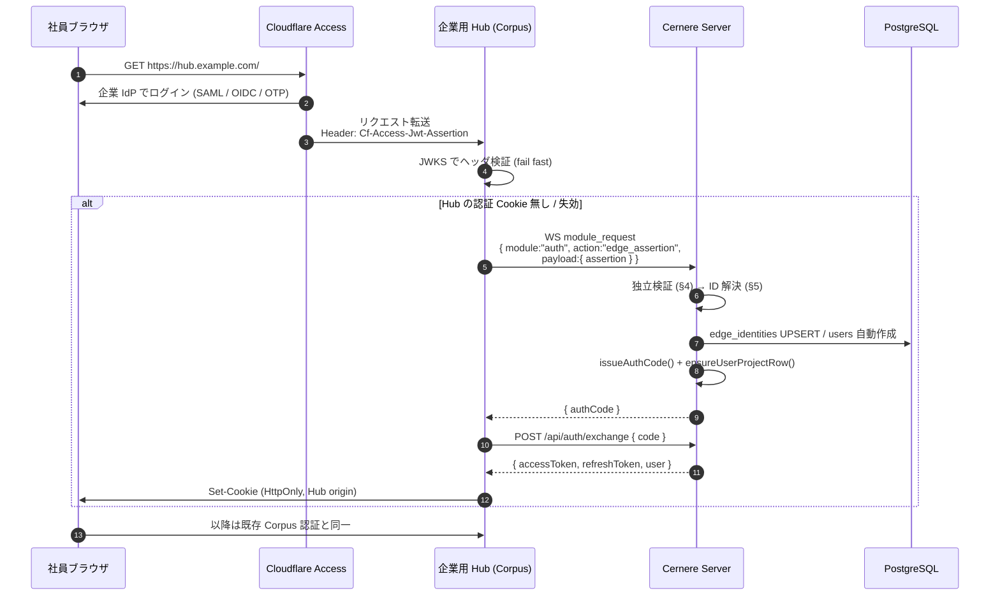
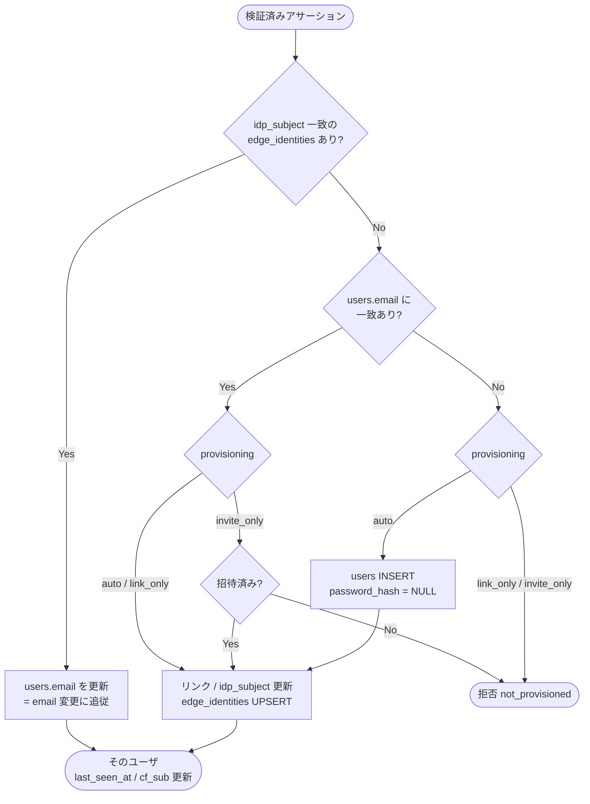

# Edge Assertion Login (Cloudflare Access → Cernere バイパス認証)

**Status: Proposed** (2026-07-26)

Cloudflare Access (以下 CF Access) など **エッジで本人確認を済ませた IdP のアサーション**を
Cernere が検証し、Cernere セッションを発行する認証経路。エンドユーザは企業 SSO で
1 回ログインするだけで、Cernere での再ログインを求められない。

想定利用者は Corpus 派生の **企業用 Hub** (1 Hub = 1 社)。Hub の origin は
Cloudflare Tunnel 経由でのみ到達可能とし、CF Access がその前段で認証する。

> セットアップ手順は [`spec/setup/cf-access-bypass.md`](../setup/cf-access-bypass.md)。
> Cernere を **IdP 側** にする逆向きの構成は [`oidc-provider.md`](oidc-provider.md)
> (CF Access の login method に Cernere を登録する)。両者は排他ではなく、
> CF Access の上流 IdP が Cernere OIDC であっても本経路はそのまま成立する。

---

## 1. 位置づけ

[`interface/auth-flows.md`](../interface/auth-flows.md) の 5 経路に対する 6 番目。

| 経路 | 入力 | 出力 |
|---|---|---|
| edge assertion | 上流エッジの署名済みアサーション (CF Access JWT) | one-time `authCode` |

`authCode` 以降は composite と完全に同じ (`POST /api/auth/exchange` で
access/refresh に交換)。新しいトークン形式は増やさない。

---

## 2. 前提条件 (崩れると本経路は無効)

1. **Hub の origin は CF 経由でしか到達できないこと。** `cloudflared` トンネルのみで
   公開し、インバウンドポートを開けない。直接到達できると `Cf-Access-Jwt-Assertion`
   ヘッダを偽装するだけで任意ユーザに成りすませる。
2. `Cf-Access-Authenticated-User-Email` ヘッダは**信頼しない** (署名が無い)。
   常に JWT アサーションを検証する。
3. Cernere は **Hub の主張ではなく生アサーションを自分で検証**する。
   Hub が侵害されても任意の identity を鋳造できない。
4. Hub ↔ Cernere はサーバ間 (project credential + `/ws/project`)。この経路は CF を通さない。

---

## 3. フロー



Hub にログイン UI は存在しない。CF Access を抜けた時点で認証済みになる。

---

## 4. WS コマンドと検証

REST エンドポイントは生やさない。**project WS (`/ws/project`) 限定**とし、
呼び出せるのは登録済みプロジェクトだけに閉じる。

```jsonc
// request
{ "type": "module_request", "module": "auth", "action": "edge_assertion",
  "payload": {
    "assertion": "<CF Access JWT>",
    "cfAuthorization": "<CF_Authorization クッキーの値>",  // §5.3 の get-identity に使う
    "fingerprint": { /* 任意 */ },
    "ip": "..."
  } }

// response
{ "type": "module_response", "module": "auth", "action": "edge_assertion",
  "payload": {
    "authCode": "<uuid>",
    // Hub 側の認可判断用。 Cernere の system role には昇格させていない (§5.3)
    "groups": [{ "id": "...", "name": "engineering" }]
  } }
```

projectKey は WS セッションから自動付与される (composite の `auth.login` と同じ扱い)。
これにより [`user-project-row.md`](user-project-row.md) の `ensureUserProjectRow()` が効く。

### 検証手順 (fail-closed。 すべて通って初めて成功)

| # | 検査 | 失敗時 `reason` |
|---|---|---|
| 1 | 呼び出し元 projectKey に有効な `edge_idp_bindings` 行があるか | `no_binding` |
| 2 | JWT header の `kid` で team JWKS から公開鍵を引く (§6) | `signature` |
| 3 | 署名検証。 alg は `RS256` のみ許可 (`none` / HS 系は拒否) | `signature` |
| 4 | `iss` が登録 team domain と完全一致 | `issuer` |
| 5 | `aud` に登録済み Application AUD tag を含む (完全一致) | `aud` |
| 6 | `exp` / `iat` / `nbf` (許容スキュー 60 秒) | `expired` |
| 7 | `common_name` を持つ / `sub` が空 = **サービストークン** は拒否 | `service_token` |
| 8 | `email` のドメインが `allowed_email_domains` に含まれる | `domain` |
| 9 | rate limit `edge_assertion:<projectKey>:<sub>` 5 分 30 回 | `rate_limited` |
| 10 | get-identity を実行し、返った `email` がアサーションの `email` と一致すること (§5.3) | `identity_mismatch` |
| 11 | ID 解決 / プロビジョニング可否 (§5) | `not_provisioned` |

成功・失敗とも `operation_logs` に記録する。

**リプレイについて**: CF アサーションはセッション有効期間中は同じ値が使い回される
(one-time ではない)。したがって本経路の防御線は「その `aud` の JWT を鋳造できるのは
CF だけ」+「提示できるのは project 認証済みの Hub だけ」の 2 点であり、
§2-1 (origin が CF 経由限定) が実質的な前提条件になる。

---

## 5. ID 解決とプロビジョニング

### 5.1 何を紐付けキーにするか

**アカウントの正本キーは email。** IdP subject は「email が変わったときに追従する
ための副次インデックス」として併せて持つ。 どちらか一方ではなく両方を保持する。

| キー | 役割 | 由来 |
|---|---|---|
| **email** (正規化済み) | **正本キー**。 アカウントの同一性はこれで決まる | JWT の `email` claim (CF が IdP で検証済み) |
| IdP subject | 副次インデックス。 email 変更時の追従に使う | custom OIDC claim (Google=`sub` / Entra=`oid`)。 **任意** |
| CF の `sub` | 監査・セッション相関のみ | JWT の `sub` claim |

**なぜ email を正本にするか**

1. **IdP 移行に耐える** — Google Workspace → Entra ID のような移行で IdP subject は
   全件別値になる。 subject 主キーだと全アカウントが孤児化する。 email は生き残る。
2. **Cernere のモデルが email 中心** — `users.email` に unique index があり、
   パスキー / Google OAuth で作られた既存アカウントとの突合も email で行う。
   subject 主キーにしても初回リンクは結局 email 照合なので、 実務を担うのは email。
3. **運用が読める** — 棚卸し・退職処理・監査は email の一覧で回る。
   CF や IdP の不透明な UUID は運用上の可読性を持たない。

**CF の `sub` を使わない理由**は変わらない。 CF のドキュメント上 `sub` は
「アカウント内で email ごとに一意」であり、 ユーザの削除→再追加や別組織ログインで
値が変わるため、 永続キーとしての保証が無い。

**IdP subject を併せ持つ理由** — email 単独だと社員のメールアドレス変更
(姓変更・ドメイン統合) が「別人の新規アカウント」になる。 subject を副次インデックスに
持てば、 email が変わっても同一人物として追従できる (§5.2 の解決順)。
custom OIDC claim が設定できない環境では省略してよい (その場合 email 変更は
新規アカウント扱いになる)。 claim 名は binding の `subject_claim` で指定する。

### 5.1.1 email の扱い

- 比較は **小文字化 + 前後空白除去** で正規化する。
- **plus-address (`user+tag@`) やドット違いを同一視しない。** 正規化はケースのみ。
- CF Access が返す `email` は IdP で検証済みのものを使う。 ユーザ入力は一切介在しない。

### 5.1.2 アドレス再利用は「退職時削除」で閉じる

email を正本にすると、 原理的には **退職者のアドレスを新しい人が引き継いだ場合に
前任者のアカウントを掴む**経路が生まれる。 これは CF から見ると「削除→再追加」と
区別がつかないため、 検証だけでは閉じない。

この設計では **退職時に Cernere 側の個人データを削除する** (§5.4) ことで閉じる。
前任者の行が残っていなければ、 同じアドレスで来た人は単に新規ユーザとして作られる。

IdP subject が既知の値と変わった場合は記録だけ行い、 ログインは通す
(CF の `sub` はユーザの削除→再追加で正当に変わるため、 ここで止めると
運用が破綻する)。

### 5.2 解決フロー

解決順は **IdP subject → email → 新規**。 subject を先に見ることで
email 変更に追従し、 email フォールバックがあることで IdP 移行に耐える。

| ケース | 判定 | 動作 |
|---|---|---|
| subject 一致 | 同一人物 | `users.email` を新しい値へ更新 (= **email 変更に追従**) |
| subject 不一致 / 未設定 + email 一致 | 同一人物 | `edge_identities.idp_subject` を更新 (= **IdP 移行に追従**)。 変化は記録 |
| どちらも無し | 新規 | policy に従って作成 or 拒否 |



> email 変更に追従して `users.email` を更新するとき、 **その新しい email が別ユーザに
> 既に使われていたら更新せず拒否**する (`reason:"email_conflict"`)。
> `users.email` は unique index なので、 ここを踏むと制約違反で落ちる。
> 統合が必要なケースなので admin の手当てに回す。

### 5.2.1 自動作成時の値

| 列 | 値 |
|---|---|
| `login` | email ローカル部 (衝突時は連番サフィックス) |
| `displayName` | **email ローカル部 (`@` より前) を暫定値にする** — §5.2.2 |
| `email` | アサーションの `email` (正規化済み) |
| `passwordHash` | `NULL` (パスワードを持たないアカウント) |
| `role` | binding の `default_role` (既定 `general`) |

### 5.2.2 表示名は暫定値 — 後から変更でき、二度と上書きしない

初回作成時の表示名は **email の `@` より前をそのまま入れる**。 IdP の氏名が
取れる環境でも、 まずこの暫定値で成立させる (氏名が取れるかは CF / IdP の設定に
左右され、 そこにログイン成立を依存させない)。

ユーザは後から自由に変更できる。 変更経路は既存の profile 更新
(`profile.update` — project WS の既存 action) をそのまま使う。

`users` に `display_name_source` を持たせ、 上書き可否を判定する:

| 値 | 意味 | ログイン時の扱い |
|---|---|---|
| `provisional` (既定) | email ローカル部の暫定値 | get-identity の `name` が取れたらそれで更新してよい |
| `user` | **ユーザが自分で設定した** | **二度と上書きしない** |
| `idp` | IdP 由来の氏名で自動更新された値 | IdP 側の変更に追従して更新してよい |

get-identity の `name` (§5.3) は `edge_identities.idp_name` に保存し、
表示名の変更 UI で「IdP の氏名を使う」候補として提示できるようにする。

> **`name` は JWT の標準 claim ではない。** CF Access の application token に既定で
> 入るのは `aud` / `email` / `sub` / `iat` / `exp` / `nbf` / `iss` / `type` /
> `identity_nonce` / `country` / `custom` だけ。 だからこそ表示名の初期値を
> email ローカル部に固定し、 氏名取得は「取れたら嬉しい」扱いに留める。

### 5.3 identity 取得 (get-identity) — **既定で実行する**

アサーション検証に成功したら、Cernere は続けて
`https://<team>.cloudflareaccess.com/cdn-cgi/access/get-identity` を呼び、
`user_uuid` / `name` / `groups` を取得する。 これは任意ではなく **基本挙動**とする
(binding の `fetch_identity`、既定 `true`)。

返る主なフィールド:

| フィールド | 用途 |
|---|---|
| `user_uuid` | CF 上のユーザ識別子。 `edge_identities.cf_user_uuid` に保存 (監査用) |
| `name` | 表示名。 `users.display_name` の解決に使う |
| `groups` | IdP グループ (`[{id, name}]`)。 `edge_identities.groups` に保存し、Hub へ返す |
| `email` | アサーションの `email` と照合。 不一致なら拒否 (`reason:"identity_mismatch"`) |
| `idp.type` | `google` / `azureAD` / `onetimepin` 等。 `edge_identities.idp_type` に保存 |
| `amr` | 認証手段。 監査ログに残す |

#### 誰が呼ぶか — Cernere が呼ぶ

**Hub が取得した identity JSON を受け取る形にはしない。** その JSON には署名が無く、
groups が認可に効く以上、Hub 側の細工や事故で権限が湧く経路になるため。

Hub は `auth.edge_assertion` の payload に **`cfAuthorization` (CF_Authorization
クッキーの値) をそのまま転送**し、Cernere が自分で CF へ問い合わせる。
Cernere から見た信頼の根拠は「CF の TLS 応答」であり、Hub の主張ではない
(§2-3 の原則と一致する)。

#### キャッシュ

アサーションの `identity_nonce` は CF が
「a cache key used to get the user's identity」と定義している claim なので、
そのままキャッシュキーに使う。

| キー | 内容 | TTL |
|---|---|---|
| `edge:identity:<identity_nonce>` | get-identity のレスポンス | 600s |

同一セッション中の再ログイン・refresh では CF を叩き直さない。

#### 失敗時 (fail-open は enrichment に限る)

get-identity が失敗した場合、**認証自体は継続**する (subject と email は署名済み
アサーションから取れているため)。 ただし:

- `groups` は **空として扱う** — グループが取れないことで権限が増えてはならない。
  取得失敗時に前回値を流用しない (offboarding 直後の権限残留を防ぐ)
- 表示名は `custom.name` → email ローカル部 にフォールバック
- 失敗は `operation_logs` に記録する

#### グループが要らない場合

グループを使わない構成では **CF / Google 側の追加設定は一切要らない**
(`spec/setup/cf-access-bypass.md` §1.4 をスキップできる。 プレーンな Google IdP でも動く)。
それでも get-identity は既定で有効のままにしておく — `name` は JWT の標準 claim では
ないため、**追加設定ゼロで氏名を取れる唯一の経路**がこれだから。

CF への往復自体を避けたい場合だけ `fetch_identity = false` にする。 その場合:

| | `fetch_identity = true` (既定) | `fetch_identity = false` |
|---|---|---|
| CF 側の設定 | 不要 (グループを使う場合のみ §1.4) | `name` を custom OIDC claim に追加する必要がある |
| ログイン毎の外部通信 | CF へ 1 往復 (`identity_nonce` でキャッシュ) | 無し |
| 表示名 | get-identity の `name` | `custom.name` → email ローカル部 |
| `groups` / `cf_user_uuid` | 取得する | 常に空 |

`fetch_identity = false` のとき、Hub は `cfAuthorization` を送らなくてよい。

#### 表示名への反映

get-identity の `name` は `edge_identities.idp_name` に保存する。
`users.display_name` を上書きするのは `display_name_source` が
`provisional` / `idp` のときだけで、 **ユーザが自分で設定した名前は上書きしない**
(§5.2.2)。

#### 権限への反映

`groups` は Cernere の system role (`admin` / `general`) へ**自動昇格させない**。
IdP のグループ名変更が Cernere の管理権限に直結すると事故が大きいため。

- Cernere は groups を保存し、`auth.edge_assertion` のレスポンスに含めて Hub へ返す。
  Hub 側の認可 (Corpus の admin 判定など) はそれを見て決める
- Cernere の role を groups で決めたい場合は binding の `admin_groups` に
  グループ名を明示列挙したときだけ有効にする (opt-in)

> custom claim は Cookie サイズ制限のため **約 1KB でトリム**される (best-effort)。
> グループ一覧のような大きい属性は custom claim ではなく get-identity で取ること。

> `users.email` には unique index がある。email 一致リンクを先に試さないと
> 自動作成が一意制約で落ちる。順序は必須。

---

### 5.4 退職者データの削除 (purge)

退職者の個人データは **無効化ではなく削除**する。 これにより §5.1.2 の
アドレス再利用問題が根本から消える (前任者の行が無ければ、 同じアドレスで来た人は
単に新規ユーザになる)。

#### 検知

Cernere は退職を能動的に知らない (IdP から消えても Cernere には通知が来ない)。
`edge_identities.last_seen_at` を根拠に **棚卸しリスト**を出し、 admin が判断する。

`edge_idp` module の `stale_identities` action — 指定日数 (既定 90 日) 以上
ログインの無い identity を、 email / 表示名 / 最終ログイン日と共に返す。

#### 削除範囲

| 対象 | 扱い |
|---|---|
| `users` 行 | **削除**。 FK cascade で `refresh_sessions` / `passkeys` / `trusted_devices` / `edge_identities` も消える |
| `project_data_<key>` の行 | **削除** (全 project 横断) |
| `operation_logs` | **残す**。 監査記録のため。 ただし残るのは `user_id` (UUID) だけで、 email や氏名は `users` 削除で消える |

削除は 1 トランザクションで行い、 途中失敗で中途半端な状態を残さない。

#### FK の扱い (削除をブロックする 3 箇所)

`users(id)` を参照する FK のうち **CASCADE でない 3 箇所**は、 そのままでは
`users` 行の削除が外部キー違反で失敗する。 扱いを個別に決める。

| 参照元 | 現状 | 扱い |
|---|---|---|
| `operation_logs.user_id` (005) | `NOT NULL REFERENCES users(id)` | **FK を外し、 列は残す**。 監査行はユーザより長生きするのが正 |
| `project_definitions_history.applied_by` (011) | `REFERENCES users(id)` | 同上 (履歴・監査テーブルのため) |
| `organizations.created_by` (004) | `NOT NULL REFERENCES users(id)` | **FK は外さない。 purge を拒否する** |

```sql
-- migration 037 に含める。 列は落とさない (migration 規約: DROP COLUMN 禁止)
ALTER TABLE operation_logs DROP CONSTRAINT IF EXISTS operation_logs_user_id_fkey;
ALTER TABLE project_definitions_history DROP CONSTRAINT IF EXISTS project_definitions_history_applied_by_fkey;
```

Drizzle schema 側も対応する `.references(() => users.id)` を外す (列は `uuid` +
`notNull` のまま)。 外さないと以後の生成物で FK が復活する。

**組織を持つユーザは purge しない。** `organizations.created_by` は監査行ではなく
生きたドメインオブジェクトへの参照であり、 cascade させると「ユーザを消したら
組織が消えた」という事故になる。 該当がある場合は
`reason:"owns_organizations"` と対象組織 ID を返して拒否し、 admin に所有権の
移譲を先に行わせる (fail-closed)。

> 削除後の `operation_logs.user_id` は **存在しないユーザを指す UUID** になる。
> これは意図した状態で、 「誰が何をしたか」の相関を保ちつつ個人特定可能な情報
> (email・氏名) だけを消すための設計。

#### 実行経路

`edge_idp` module の `purge_user` action (admin 専用)。
**Action authentication (passkey step-up) 必須** — アカウント削除は既存の
step-up 対象と同格 ([`../interface/auth-flows.md`](../interface/auth-flows.md) 共通節)。

誤削除は復旧できないので、 `purge_user` は対象の email を引数で復唱させ、
`stale_identities` が返した `user_id` と突合してから実行する。

## 6. JWKS の取得とキャッシュ

- 取得先: `https://<team>.cloudflareaccess.com/cdn-cgi/access/certs`
- TTL 6 時間キャッシュ。 未知の `kid` を見たときのみ 1 回だけ強制再取得
  (鍵ローテーション追従。 再取得は projectKey 単位で 1 分に 1 回までに制限)
- 取得失敗時はキャッシュで継続。 **キャッシュも無ければ拒否** (fail-closed)

---

## 7. 本人確認 (identity-verification) の扱い

composite の端末チャレンジ (メール 6 桁コード) は本経路では **既定で省略**する。
上流の企業 IdP で MFA 済みであり、二重に社員へコード入力を求める実益が薄いため。

ただし `trusted_devices` への記録は行い、異常検知の材料は残す。
binding 単位で必須化できるよう `require_device_check` を持たせる。

---

## 8. 権限昇格 (step-up) は据え置き

エッジ経由で得たセッションには認証方式マーク (`refresh_sessions.auth_method =
'edge:cf_access'`) を付ける。既存の Action authentication (破壊的操作直前の
passkey User Verification、[`auth-flows.md`](../interface/auth-flows.md) 共通節) は
**そのまま適用**する。

> 日常操作は SSO 一発、危険操作は passkey。
> エッジ認証は「誰か」を保証するが「その端末を今操作しているのが本人か」は保証しないため、
> 資格情報・データ・権限に影響する操作の step-up は外さない。

---

## 9. 失効 (offboarding) の伝播

- CF Access のセッション失効 / IdP 側での無効化 → CF を通れない → Hub に到達できない。
  Hub 経由でしか Cernere トークンを使わない構成なので実害は小さい。
- ただし refresh token は 30 日有効なので、**refresh 時にもアサーションの再提示を必須**とする
  (`POST /api/auth/refresh` ではなく Hub が `auth.edge_assertion` を再実行する)。
  Hub は毎リクエストでヘッダを受け取るため追加コストはゼロ。
  → CF を通れなくなってから最大 60 分 (access token TTL) でセッションが死ぬ。
- `identity_nonce` を保持し CF API で能動的に失効確認する強化は、API トークン運用が
  必要なため **v2 送り** (任意)。
- 退職が確定した分は **削除する** (§5.4)。 セッションの失効だけでなく個人データを
  残さない。

---

## 10. データモデル

migration は **037 以降**を取る (030〜035 は別途整合作業中のため空ける)。

```sql
CREATE TABLE IF NOT EXISTS edge_identities (
  id             uuid PRIMARY KEY,
  provider       text NOT NULL,             -- 'cf_access'
  team_domain    text NOT NULL,             -- '<team>.cloudflareaccess.com'
  email          text NOT NULL,             -- **正本キー** (正規化済み、§5.1)
  idp_subject    text,                      -- 副次インデックス。 email 変更の追従に使う (任意)
  user_id        uuid NOT NULL REFERENCES users(id) ON DELETE CASCADE,
  cf_sub         text,                      -- CF の sub。 監査用 (キーにしない)
  cf_user_uuid   text,                      -- get-identity の user_uuid。 監査用
  idp_type       text,                      -- 'azureAD' / 'google' / 'onetimepin' ...
  idp_name       text,                      -- get-identity の name。 表示名変更の候補として保持 (§5.2.2)
  groups         jsonb NOT NULL DEFAULT '[]', -- get-identity の groups (最終観測値)
  last_seen_at   timestamptz,
  created_at     timestamptz NOT NULL DEFAULT now(),
  UNIQUE (provider, team_domain, email)
);
CREATE INDEX IF NOT EXISTS idx_edge_identities_user ON edge_identities (user_id);
-- subject 先引き (§5.2 の解決順) 用。 NULL 許容なので部分 index
CREATE UNIQUE INDEX IF NOT EXISTS idx_edge_identities_subject
  ON edge_identities (provider, team_domain, idp_subject)
  WHERE idp_subject IS NOT NULL;
-- 棚卸し (§5.4 stale_identities) 用
CREATE INDEX IF NOT EXISTS idx_edge_identities_last_seen ON edge_identities (last_seen_at);

-- 表示名の出所。 'user' はユーザ自身が設定した = 二度と自動上書きしない (§5.2.2)
ALTER TABLE users ADD COLUMN IF NOT EXISTS display_name_source text NOT NULL DEFAULT 'user';

CREATE TABLE IF NOT EXISTS edge_idp_bindings (
  project_key           text PRIMARY KEY,
  provider              text NOT NULL DEFAULT 'cf_access',
  team_domain           text NOT NULL,
  aud_tags              jsonb NOT NULL,     -- ["<application aud tag>", ...]
  subject_claim         text,               -- custom claim 名 (例 'sub' / 'oid')。 任意。 NULL なら email だけで解決する
  allowed_email_domains jsonb NOT NULL,     -- ["example.co.jp"]
  provisioning          text NOT NULL,      -- 'auto' | 'link_only' | 'invite_only'
  default_role          text NOT NULL DEFAULT 'general',
  admin_groups          jsonb NOT NULL DEFAULT '[]', -- 明示列挙したときだけ role=admin へ昇格 (§5.3)
  fetch_identity        boolean NOT NULL DEFAULT true, -- get-identity を呼ぶか (§5.3)

  require_device_check  boolean NOT NULL DEFAULT false,
  is_active             boolean NOT NULL DEFAULT true,
  created_at            timestamptz NOT NULL DEFAULT now()
);

ALTER TABLE refresh_sessions ADD COLUMN IF NOT EXISTS auth_method text;
```

`allowed_email_domains` は **必須** (空配列は起動時/登録時に拒否)。CF 側ポリシーの
設定ミスで社外ユーザが通過しても Cernere で止める二重化のため。

`display_name_source` の既定を `'user'` にしてあるのは、 **既存ユーザの表示名を
migration 直後の初回ログインで上書きしないため**。 本経路で新規作成したユーザだけ
`'provisional'` で作る。

---

## 11. 管理操作

WS module `edge_idp` (admin 専用)。OIDC client 管理 (`oidc_client`) と同型。

| action | 内容 |
|---|---|
| `register` | binding 登録 (project_key / team_domain / aud_tags / allowed_email_domains / provisioning) |
| `list` | 一覧 |
| `update` | aud_tags / allowed_email_domains / provisioning / default_role / subject_claim / admin_groups / fetch_identity の更新 |
| `enable` / `disable` | 有効・無効 |
| `stale_identities` | 指定日数 (既定 90 日) ログインの無い identity を棚卸しリストとして返す (§5.4) |
| `purge_user` | 退職者の個人データを削除 (§5.4)。 **step-up 必須**。 email の復唱を要求する |

binding の変更は **破壊的操作**として Action authentication (passkey step-up) の対象に含める
(OIDC client の redirect URI 変更と同格)。

---

## 12. 実装ファイル (予定)

| 層 | ファイル |
|---|---|
| JWKS 取得/キャッシュ | `server/src/auth/edge-jwks.ts` |
| アサーション検証 + ID 解決 | `server/src/auth/edge-assertion.ts` |
| get-identity 取得 + nonce キャッシュ | `server/src/auth/edge-identity.ts` |
| binding ストア | `server/src/project/edge-bindings.ts` |
| WS 配線 | `server/src/ws/project-dispatch.ts` (`auth.edge_assertion` を 1 case 追加) |
| 管理 module | `server/src/commands.ts` (`edge_idp`) |
| migration | `migrations/037_edge_identities.sql` |

### テスト (最低ライン)

署名不正 / `aud` 不一致 / 期限切れ / サービストークン / ドメイン外 / binding 無効 /
自動作成 / email リンク / 既存リンクの再訪 — の 9 ケース。

加えて subject 決定まわり:

- `subject_claim` 設定時に `custom` へ当該 claim が無ければ email 解決に落ちること
- CF の `sub` が変わっても (削除→再追加のシミュレーション) 同一ユーザに解決されること
- **email 変更**: idp_subject 一致で同一ユーザに解決され、`users.email` が更新されること
- **IdP 移行**: idp_subject が全く別値になっても email 一致で同一ユーザに解決され、
  `idp_subject` が新値へ更新されること
- 追従先の email が既に別ユーザのものだった場合に `email_conflict` で拒否されること
  (unique index 違反で落ちない)

表示名 (§5.2.2):

- 新規作成時の `display_name` が email ローカル部になり、`display_name_source` が
  `provisional` になること
- ユーザが変更した後 (`source='user'`) は、get-identity の `name` が来ても
  **上書きされない**こと
- 既存ユーザ (`source='user'` 既定) が初回ログインしても表示名が変わらないこと

退職者削除 (§5.4):

- `purge_user` で `users` / `edge_identities` / `project_data_<key>` の行が消え、
  `operation_logs` は残ること (残った行の `user_id` は存在しないユーザを指す)
- 組織を作成したユーザの `purge_user` が `owns_organizations` で拒否され、
  **組織が消えていない**こと
- 削除後に同じ email でログインすると **新規ユーザとして作られる**こと
  (前任者のデータを引き継がない)
- step-up proof 無しの `purge_user` が拒否されること

get-identity まわり (§5.3):

- 同一 `identity_nonce` で 2 回呼んでも CF への問い合わせが 1 回で済むこと
- get-identity 失敗時に **認証は成功し、`groups` が空**になること
  (前回値を流用しない = offboarding 直後に権限が残らない)
- get-identity の `email` がアサーションの `email` と食い違う場合に拒否されること
- `admin_groups` 未設定なら、どのグループに属していても `role` が `admin` に
  昇格しないこと

---

## 13. 関連

- [`oidc-provider.md`](oidc-provider.md) — Cernere を IdP にする逆向きの構成
- [`identity-verification.md`](identity-verification.md) — 端末本人確認 (§7 で既定省略)
- [`user-project-row.md`](user-project-row.md) — `ensureUserProjectRow()` の発火点
- [`../interface/auth-flows.md`](../interface/auth-flows.md) — 認証経路一覧
- Corpus 側の受け口 (`CORPUS_AUTH_MODE=edge`) は LUDIARS/Corpus `DESIGN.md` §16
