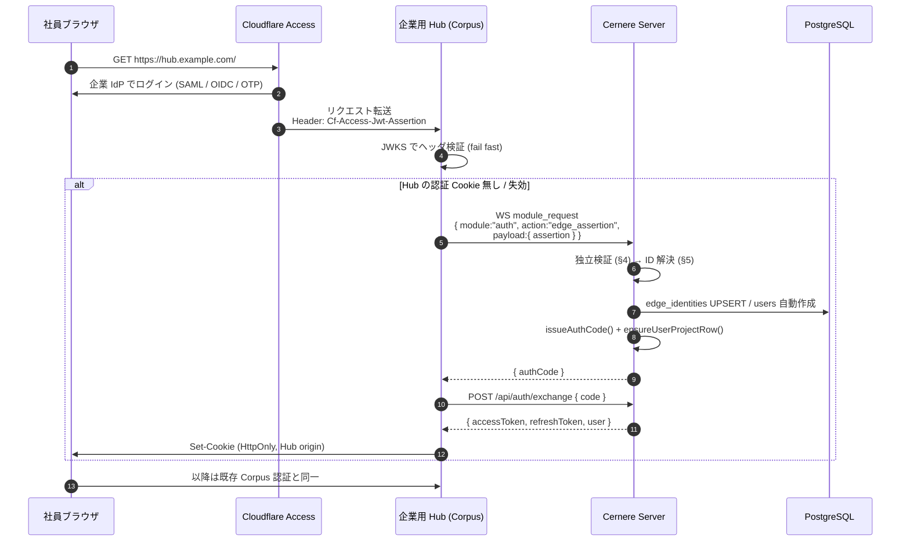

# Edge Assertion Login (Cloudflare Access → Cernere バイパス認証)

**Status: Proposed** (2026-07-26)

Cloudflare Access (以下 CF Access) など **エッジで本人確認を済ませた IdP のアサーション**を
Cernere が検証し、Cernere セッションを発行する認証経路。エンドユーザは企業 SSO で
1 回ログインするだけで、Cernere での再ログインを求められない。

想定利用者は Corpus 派生の **企業用 Hub** (1 Hub = 1 社)。Hub の origin は
Cloudflare Tunnel 経由でのみ到達可能とし、CF Access がその前段で認証する。

> セットアップ手順は [`spec/setup/cf-access-bypass.md`](../setup/cf-access-bypass.md)。
> Cernere を **IdP 側** にする逆向きの構成は [`oidc-provider.md`](oidc-provider.md)
> (CF Access の login method に Cernere を登録する)。両者は排他ではなく、
> CF Access の上流 IdP が Cernere OIDC であっても本経路はそのまま成立する。

---

## 1. 位置づけ

[`interface/auth-flows.md`](../interface/auth-flows.md) の 5 経路に対する 6 番目。

| 経路 | 入力 | 出力 |
|---|---|---|
| edge assertion | 上流エッジの署名済みアサーション (CF Access JWT) | one-time `authCode` |

`authCode` 以降は composite と完全に同じ (`POST /api/auth/exchange` で
access/refresh に交換)。新しいトークン形式は増やさない。

---

## 2. 前提条件 (崩れると本経路は無効)

1. **Hub の origin は CF 経由でしか到達できないこと。** `cloudflared` トンネルのみで
   公開し、インバウンドポートを開けない。直接到達できると `Cf-Access-Jwt-Assertion`
   ヘッダを偽装するだけで任意ユーザに成りすませる。
2. `Cf-Access-Authenticated-User-Email` ヘッダは**信頼しない** (署名が無い)。
   常に JWT アサーションを検証する。
3. Cernere は **Hub の主張ではなく生アサーションを自分で検証**する。
   Hub が侵害されても任意の identity を鋳造できない。
4. Hub ↔ Cernere はサーバ間 (project credential + `/ws/project`)。この経路は CF を通さない。

---

## 3. フロー



Hub にログイン UI は存在しない。CF Access を抜けた時点で認証済みになる。

---

## 4. WS コマンドと検証

REST エンドポイントは生やさない。**project WS (`/ws/project`) 限定**とし、
呼び出せるのは登録済みプロジェクトだけに閉じる。

```jsonc
// request
{ "type": "module_request", "module": "auth", "action": "edge_assertion",
  "payload": {
    "assertion": "<CF Access JWT>",
    "cfAuthorization": "<CF_Authorization クッキーの値>",  // §5.3 の get-identity に使う
    "fingerprint": { /* 任意 */ },
    "ip": "..."
  } }

// response
{ "type": "module_response", "module": "auth", "action": "edge_assertion",
  "payload": {
    "authCode": "<uuid>",
    // Hub 側の認可判断用。 Cernere の system role には昇格させていない (§5.3)
    "groups": [{ "id": "...", "name": "engineering" }]
  } }
```

projectKey は WS セッションから自動付与される (composite の `auth.login` と同じ扱い)。
これにより [`user-project-row.md`](user-project-row.md) の `ensureUserProjectRow()` が効く。

### 検証手順 (fail-closed。 すべて通って初めて成功)

| # | 検査 | 失敗時 `reason` |
|---|---|---|
| 1 | 呼び出し元 projectKey に有効な `edge_idp_bindings` 行があるか | `no_binding` |
| 2 | JWT header の `kid` で team JWKS から公開鍵を引く (§6) | `signature` |
| 3 | 署名検証。 alg は `RS256` のみ許可 (`none` / HS 系は拒否) | `signature` |
| 4 | `iss` が登録 team domain と完全一致 | `issuer` |
| 5 | `aud` に登録済み Application AUD tag を含む (完全一致) | `aud` |
| 6 | `exp` / `iat` / `nbf` (許容スキュー 60 秒) | `expired` |
| 7 | `common_name` を持つ / `sub` が空 = **サービストークン** は拒否 | `service_token` |
| 8 | `email` のドメインが `allowed_email_domains` に含まれる | `domain` |
| 9 | rate limit `edge_assertion:<projectKey>:<sub>` 5 分 30 回 | `rate_limited` |
| 10 | get-identity を実行し、返った `email` がアサーションの `email` と一致すること (§5.3) | `identity_mismatch` |
| 11 | ID 解決 / プロビジョニング可否 (§5) | `not_provisioned` |

成功・失敗とも `operation_logs` に記録する。

**リプレイについて**: CF アサーションはセッション有効期間中は同じ値が使い回される
(one-time ではない)。したがって本経路の防御線は「その `aud` の JWT を鋳造できるのは
CF だけ」+「提示できるのは project 認証済みの Hub だけ」の 2 点であり、
§2-1 (origin が CF 経由限定) が実質的な前提条件になる。

---

## 5. ID 解決とプロビジョニング

### 5.1 何を紐付けキーにするか

**CF の `sub` はキーに使わない。** CF のドキュメント上 `sub` は
「アカウント内で email ごとに一意」であり、ユーザを削除して再追加した場合や
別組織にログインした場合に **値が変わる**。永続キーとしての保証が無い。

| 優先 | キー | 出所 | 備考 |
|---|---|---|---|
| 1 | **上流 IdP の subject** | custom OIDC claim (Google なら `sub`、Entra なら `oid`) | 企業運用の推奨。 IdP 上で不変 |
| 2 | email | JWT の `email` claim | claim 未設定時のフォールバック。 メール変更で別人になる |
| — | CF の `sub` | JWT の `sub` claim | **監査・セッション相関のみ**。 キーにしない |

上流 IdP の subject を得るには、CF の IdP 設定 (Optional configurations) で
その claim を **custom OIDC claim として明示追加**する必要がある
(`spec/setup/cf-access-bypass.md` §1.4)。 どの claim 名を主キーとするかは
binding の `subject_claim` で指定する。

### 5.2 解決フロー

```mermaid
flowchart TD
    A([検証済みアサーション]) --> S[subject を決める<br/>custom[subject_claim] → 無ければ email]
    S --> B{edge_identities に<br/>subject の行あり?}
    B -- Yes --> Z([そのユーザ<br/>last_seen_at / cf_sub 更新])
    B -- No --> C{users.email に<br/>一致あり?}
    C -- Yes --> D{provisioning}
    D -- auto / link_only --> E[リンク<br/>edge_identities INSERT] --> Z
    D -- invite_only --> F{招待済み?}
    F -- Yes --> E
    F -- No --> R([拒否 not_provisioned])
    C -- No --> G{provisioning}
    G -- auto --> H[users INSERT<br/>password_hash = NULL] --> E
    G -- link_only / invite_only --> R
```

自動作成時の値:

| 列 | 値 |
|---|---|
| `login` | email ローカル部 (衝突時は連番サフィックス) |
| `displayName` | get-identity の `name` (§5.3) → `custom.name` → email ローカル部 |
| `email` | アサーションの `email` |
| `passwordHash` | `NULL` (パスワードを持たないアカウント) |
| `role` | binding の `default_role` (既定 `general`) |

> **`name` は JWT の標準 claim ではない。** CF Access の application token に既定で
> 入るのは `aud` / `email` / `sub` / `iat` / `exp` / `nbf` / `iss` / `type` /
> `identity_nonce` / `country` / `custom` だけ。 氏名を使いたければ custom claim の
> 追加か get-identity 参照が要る。

### 5.3 identity 取得 (get-identity) — **既定で実行する**

アサーション検証に成功したら、Cernere は続けて
`https://<team>.cloudflareaccess.com/cdn-cgi/access/get-identity` を呼び、
`user_uuid` / `name` / `groups` を取得する。 これは任意ではなく **基本挙動**とする
(binding の `fetch_identity`、既定 `true`)。

返る主なフィールド:

| フィールド | 用途 |
|---|---|
| `user_uuid` | CF 上のユーザ識別子。 `edge_identities.cf_user_uuid` に保存 (監査用) |
| `name` | 表示名。 `users.display_name` の解決に使う |
| `groups` | IdP グループ (`[{id, name}]`)。 `edge_identities.groups` に保存し、Hub へ返す |
| `email` | アサーションの `email` と照合。 不一致なら拒否 (`reason:"identity_mismatch"`) |
| `idp.type` | `google` / `azureAD` / `onetimepin` 等。 `edge_identities.idp_type` に保存 |
| `amr` | 認証手段。 監査ログに残す |

#### 誰が呼ぶか — Cernere が呼ぶ

**Hub が取得した identity JSON を受け取る形にはしない。** その JSON には署名が無く、
groups が認可に効く以上、Hub 側の細工や事故で権限が湧く経路になるため。

Hub は `auth.edge_assertion` の payload に **`cfAuthorization` (CF_Authorization
クッキーの値) をそのまま転送**し、Cernere が自分で CF へ問い合わせる。
Cernere から見た信頼の根拠は「CF の TLS 応答」であり、Hub の主張ではない
(§2-3 の原則と一致する)。

#### キャッシュ

アサーションの `identity_nonce` は CF が
「a cache key used to get the user's identity」と定義している claim なので、
そのままキャッシュキーに使う。

| キー | 内容 | TTL |
|---|---|---|
| `edge:identity:<identity_nonce>` | get-identity のレスポンス | 600s |

同一セッション中の再ログイン・refresh では CF を叩き直さない。

#### 失敗時 (fail-open は enrichment に限る)

get-identity が失敗した場合、**認証自体は継続**する (subject と email は署名済み
アサーションから取れているため)。 ただし:

- `groups` は **空として扱う** — グループが取れないことで権限が増えてはならない。
  取得失敗時に前回値を流用しない (offboarding 直後の権限残留を防ぐ)
- 表示名は `custom.name` → email ローカル部 にフォールバック
- 失敗は `operation_logs` に記録する

#### グループが要らない場合

グループを使わない構成では **CF / Google 側の追加設定は一切要らない**
(`spec/setup/cf-access-bypass.md` §1.4 をスキップできる。 プレーンな Google IdP でも動く)。
それでも get-identity は既定で有効のままにしておく — `name` は JWT の標準 claim では
ないため、**追加設定ゼロで氏名を取れる唯一の経路**がこれだから。

CF への往復自体を避けたい場合だけ `fetch_identity = false` にする。 その場合:

| | `fetch_identity = true` (既定) | `fetch_identity = false` |
|---|---|---|
| CF 側の設定 | 不要 (グループを使う場合のみ §1.4) | `name` を custom OIDC claim に追加する必要がある |
| ログイン毎の外部通信 | CF へ 1 往復 (`identity_nonce` でキャッシュ) | 無し |
| 表示名 | get-identity の `name` | `custom.name` → email ローカル部 |
| `groups` / `cf_user_uuid` | 取得する | 常に空 |

`fetch_identity = false` のとき、Hub は `cfAuthorization` を送らなくてよい。

#### 権限への反映

`groups` は Cernere の system role (`admin` / `general`) へ**自動昇格させない**。
IdP のグループ名変更が Cernere の管理権限に直結すると事故が大きいため。

- Cernere は groups を保存し、`auth.edge_assertion` のレスポンスに含めて Hub へ返す。
  Hub 側の認可 (Corpus の admin 判定など) はそれを見て決める
- Cernere の role を groups で決めたい場合は binding の `admin_groups` に
  グループ名を明示列挙したときだけ有効にする (opt-in)

> custom claim は Cookie サイズ制限のため **約 1KB でトリム**される (best-effort)。
> グループ一覧のような大きい属性は custom claim ではなく get-identity で取ること。

> `users.email` には unique index がある。email 一致リンクを先に試さないと
> 自動作成が一意制約で落ちる。順序は必須。

---

## 6. JWKS の取得とキャッシュ

- 取得先: `https://<team>.cloudflareaccess.com/cdn-cgi/access/certs`
- TTL 6 時間キャッシュ。 未知の `kid` を見たときのみ 1 回だけ強制再取得
  (鍵ローテーション追従。 再取得は projectKey 単位で 1 分に 1 回までに制限)
- 取得失敗時はキャッシュで継続。 **キャッシュも無ければ拒否** (fail-closed)

---

## 7. 本人確認 (identity-verification) の扱い

composite の端末チャレンジ (メール 6 桁コード) は本経路では **既定で省略**する。
上流の企業 IdP で MFA 済みであり、二重に社員へコード入力を求める実益が薄いため。

ただし `trusted_devices` への記録は行い、異常検知の材料は残す。
binding 単位で必須化できるよう `require_device_check` を持たせる。

---

## 8. 権限昇格 (step-up) は据え置き

エッジ経由で得たセッションには認証方式マーク (`refresh_sessions.auth_method =
'edge:cf_access'`) を付ける。既存の Action authentication (破壊的操作直前の
passkey User Verification、[`auth-flows.md`](../interface/auth-flows.md) 共通節) は
**そのまま適用**する。

> 日常操作は SSO 一発、危険操作は passkey。
> エッジ認証は「誰か」を保証するが「その端末を今操作しているのが本人か」は保証しないため、
> 資格情報・データ・権限に影響する操作の step-up は外さない。

---

## 9. 失効 (offboarding) の伝播

- CF Access のセッション失効 / IdP 側での無効化 → CF を通れない → Hub に到達できない。
  Hub 経由でしか Cernere トークンを使わない構成なので実害は小さい。
- ただし refresh token は 30 日有効なので、**refresh 時にもアサーションの再提示を必須**とする
  (`POST /api/auth/refresh` ではなく Hub が `auth.edge_assertion` を再実行する)。
  Hub は毎リクエストでヘッダを受け取るため追加コストはゼロ。
  → CF を通れなくなってから最大 60 分 (access token TTL) でセッションが死ぬ。
- `identity_nonce` を保持し CF API で能動的に失効確認する強化は、API トークン運用が
  必要なため **v2 送り** (任意)。

---

## 10. データモデル

migration は **037 以降**を取る (030〜035 は別途整合作業中のため空ける)。

```sql
CREATE TABLE IF NOT EXISTS edge_identities (
  id             uuid PRIMARY KEY,
  provider       text NOT NULL,             -- 'cf_access'
  team_domain    text NOT NULL,             -- '<team>.cloudflareaccess.com'
  subject        text NOT NULL,             -- 紐付けキー (§5.1)
  subject_source text NOT NULL,             -- 'idp_claim' | 'email'
  user_id        uuid NOT NULL REFERENCES users(id) ON DELETE CASCADE,
  cf_sub         text,                      -- CF の sub。 監査用 (キーにしない)
  cf_user_uuid   text,                      -- get-identity の user_uuid。 監査用
  email          text,                      -- 最終観測値 (表示・突合用)
  idp_type       text,                      -- 'azureAD' / 'google' / 'onetimepin' ...
  groups         jsonb NOT NULL DEFAULT '[]', -- get-identity の groups (最終観測値)
  last_seen_at   timestamptz,
  created_at     timestamptz NOT NULL DEFAULT now(),
  UNIQUE (provider, team_domain, subject)
);
CREATE INDEX IF NOT EXISTS idx_edge_identities_user ON edge_identities (user_id);

CREATE TABLE IF NOT EXISTS edge_idp_bindings (
  project_key           text PRIMARY KEY,
  provider              text NOT NULL DEFAULT 'cf_access',
  team_domain           text NOT NULL,
  aud_tags              jsonb NOT NULL,     -- ["<application aud tag>", ...]
  subject_claim         text,               -- custom claim 名 (例 'sub' / 'oid')。 NULL なら email を主キーにする
  allowed_email_domains jsonb NOT NULL,     -- ["example.co.jp"]
  provisioning          text NOT NULL,      -- 'auto' | 'link_only' | 'invite_only'
  default_role          text NOT NULL DEFAULT 'general',
  admin_groups          jsonb NOT NULL DEFAULT '[]', -- 明示列挙したときだけ role=admin へ昇格 (§5.3)
  fetch_identity        boolean NOT NULL DEFAULT true, -- get-identity を呼ぶか (§5.3)

  require_device_check  boolean NOT NULL DEFAULT false,
  is_active             boolean NOT NULL DEFAULT true,
  created_at            timestamptz NOT NULL DEFAULT now()
);

ALTER TABLE refresh_sessions ADD COLUMN IF NOT EXISTS auth_method text;
```

`allowed_email_domains` は **必須** (空配列は起動時/登録時に拒否)。CF 側ポリシーの
設定ミスで社外ユーザが通過しても Cernere で止める二重化のため。

---

## 11. 管理操作

WS module `edge_idp` (admin 専用)。OIDC client 管理 (`oidc_client`) と同型。

| action | 内容 |
|---|---|
| `register` | binding 登録 (project_key / team_domain / aud_tags / allowed_email_domains / provisioning) |
| `list` | 一覧 |
| `update` | aud_tags / allowed_email_domains / provisioning / default_role の更新 |
| `enable` / `disable` | 有効・無効 |

binding の変更は **破壊的操作**として Action authentication (passkey step-up) の対象に含める
(OIDC client の redirect URI 変更と同格)。

---

## 12. 実装ファイル (予定)

| 層 | ファイル |
|---|---|
| JWKS 取得/キャッシュ | `server/src/auth/edge-jwks.ts` |
| アサーション検証 + ID 解決 | `server/src/auth/edge-assertion.ts` |
| get-identity 取得 + nonce キャッシュ | `server/src/auth/edge-identity.ts` |
| binding ストア | `server/src/project/edge-bindings.ts` |
| WS 配線 | `server/src/ws/project-dispatch.ts` (`auth.edge_assertion` を 1 case 追加) |
| 管理 module | `server/src/commands.ts` (`edge_idp`) |
| migration | `migrations/037_edge_identities.sql` |

### テスト (最低ライン)

署名不正 / `aud` 不一致 / 期限切れ / サービストークン / ドメイン外 / binding 無効 /
自動作成 / email リンク / 既存リンクの再訪 — の 9 ケース。

加えて subject 決定まわり:

- `subject_claim` 設定時に `custom` へ当該 claim が無ければ email フォールバックに落ちること
- CF の `sub` が変わっても (削除→再追加のシミュレーション) 同一ユーザに解決されること

get-identity まわり (§5.3):

- 同一 `identity_nonce` で 2 回呼んでも CF への問い合わせが 1 回で済むこと
- get-identity 失敗時に **認証は成功し、`groups` が空**になること
  (前回値を流用しない = offboarding 直後に権限が残らない)
- get-identity の `email` がアサーションの `email` と食い違う場合に拒否されること
- `admin_groups` 未設定なら、どのグループに属していても `role` が `admin` に
  昇格しないこと

---

## 13. 関連

- [`oidc-provider.md`](oidc-provider.md) — Cernere を IdP にする逆向きの構成
- [`identity-verification.md`](identity-verification.md) — 端末本人確認 (§7 で既定省略)
- [`user-project-row.md`](user-project-row.md) — `ensureUserProjectRow()` の発火点
- [`../interface/auth-flows.md`](../interface/auth-flows.md) — 認証経路一覧
- Corpus 側の受け口 (`CORPUS_AUTH_MODE=edge`) は LUDIARS/Corpus `DESIGN.md` §16
