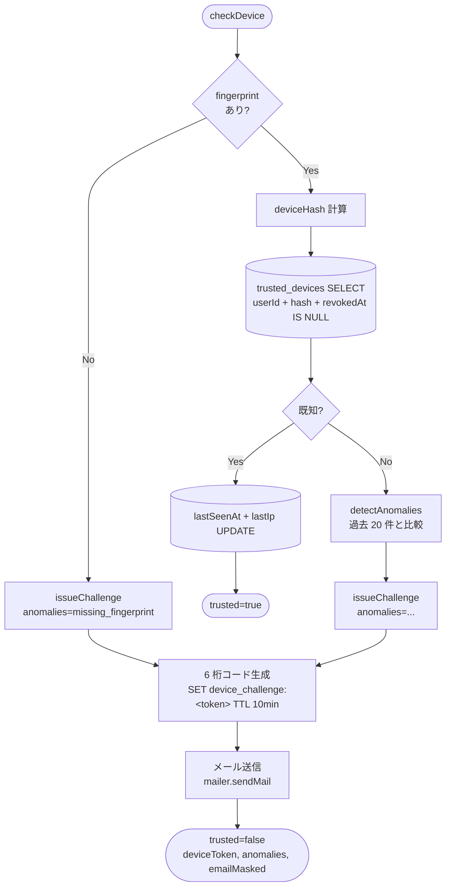
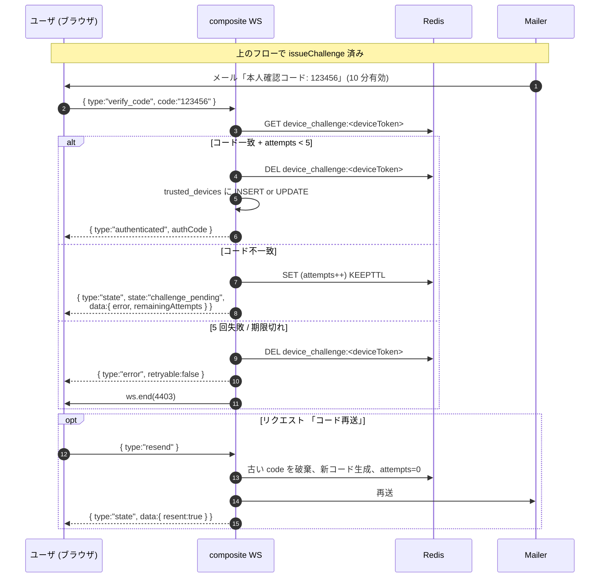

# 本人確認 (Identity Verification)

新しい / 普段と異なるデバイスからのサインインを検知し、メール送信した 6 桁コードで本人確認を行う仕組み。

## 設計方針

- **位置情報 (Geolocation API) は取得しない**。マシン情報 + ブラウザ情報 + 接続元 IP のみで識別する
- 信頼済みデバイスは `trusted_devices` 表で永続化し、次回以降は無確認で通過させる
- 未知のデバイスは Redis に 10 分 TTL の challenge を保存し、メール送信した 6 桁コードと照合

## フィンガープリント

```ts
interface DeviceFingerprint {
  machine?: {
    os: string; platform: string; arch?: string;
    screen: string; timezone: string; language: string;
  };
  browser?: {
    vendor: string; browser: string; version: string;
  };
  // geo は廃止 (旧バージョンとの互換のため型上は無視)
}
```

ハッシュ計算: 上記を正規化 (null フィールドも保持) → JSON シリアライズ (キーソート) → SHA-256 hex。
表示ラベル: `"macOS · Chrome 124"` 形式 (旧 `... · Tokyo, JP` の地名は廃止)。

## チェックフロー



### Anomaly 種別

| 値 | 意味 |
|---|---|
| `new_device` | このユーザの信頼済みデバイス全件と hash 不一致 |
| `new_os` | 過去に観測した OS 集合に含まれない |
| `new_browser` | 過去に観測したブラウザ集合に含まれない |
| `new_ip` | 過去に観測した IP 集合に含まれない |
| `missing_fingerprint` | クライアントから fingerprint が届かなかった |

## チャレンジ応答



## trusted_devices スキーマ

```sql
CREATE TABLE trusted_devices (
    id           UUID PRIMARY KEY,
    user_id      UUID NOT NULL REFERENCES users(id) ON DELETE CASCADE,
    device_hash  TEXT NOT NULL,                    -- SHA-256 hex
    label        TEXT NOT NULL,                    -- "macOS · Chrome 124"
    machine_info JSONB NOT NULL DEFAULT '{}',
    browser_info JSONB NOT NULL DEFAULT '{}',
    geo_info     JSONB NOT NULL DEFAULT '{}',      -- 撤去済みだが互換のため残置 (常に {})
    last_ip      TEXT,
    first_seen_at TIMESTAMPTZ NOT NULL DEFAULT now(),
    last_seen_at  TIMESTAMPTZ NOT NULL DEFAULT now(),
    revoked_at    TIMESTAMPTZ                      -- 信頼取消し用 (NULL = 有効)
);

CREATE UNIQUE INDEX idx_trusted_devices_user_hash_active
    ON trusted_devices (user_id, device_hash)
    WHERE revoked_at IS NULL;
```

`geo_info` カラムは AIFormat の DROP COLUMN 禁止ルールに従い残置するが、新規 INSERT は常に `{}` を入れる。

## メール送信

`server/src/auth/mailer.ts` 経由で SMTP / AWS SES に送信。送信先メールがない (例: GitHub アカウントで非公開メール) 場合はサーバコンソールにフォールバック表示する (テスト容易性)。

## レート / 試行制限

| 制限 | 値 |
|---|---|
| Challenge 有効期間 | 10 分 |
| 1 challenge あたり最大試行回数 | 5 |
| コード長 | 6 桁 (10 進、`crypto.randomInt`) |

## 旧仕様との差分 (2026-04-26)

- ❌ Geolocation API による緯度経度取得 → 撤去
- ❌ 緯度経度を 1 度に丸めた hash 入力 → 削除
- ❌ "Tokyo, JP" の地名ラベル → 削除
- ❌ `new_location` anomaly → 削除
- ✅ machine + browser + IP のみで識別
