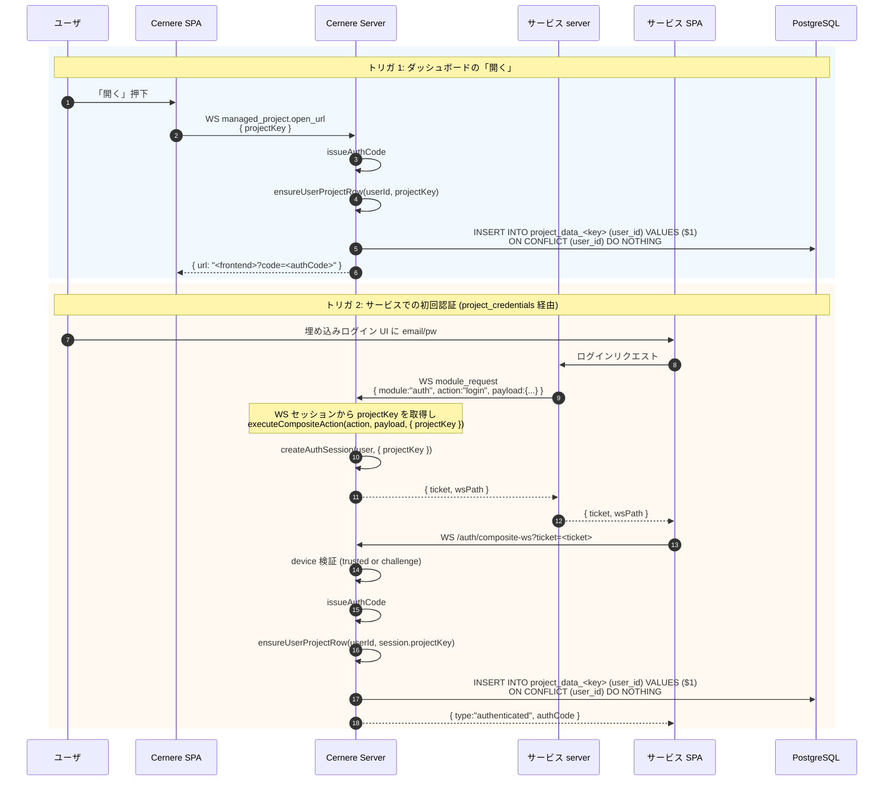

# ユーザ × プロジェクトの初回行確保

ユーザがあるプロジェクトを「使い始めた」瞬間に、Cernere DB の `project_data_<key>` テーブルに空行を 1 件確保する。サービス側がいきなり `get_user_data` を呼んだとき null が返るのではなく、user_id 付きの実体行があるようにするための初期化。

## トリガ

| # | トリガ | 呼び出し関数 | projectKey の特定方法 |
|---|---|---|---|
| 1 | Cernere ダッシュボードで「開く」押下 | `issueProjectOpenUrl(userId, projectKey)` | 引数で渡される |
| 2 | サービス側 SPA から composite 認証 | `composite-auth.ts` の authCode 発行直後 | `auth_session.projectKey` (project_credentials WS から伝搬) |

直接 REST `/api/auth/composite/login` で認証された場合は projectKey が不明なので **何もしない**。
これはエンドユーザがブラウザで Cernere を直接叩いたケースで、特定プロジェクトに紐付かないため。

## シーケンス



## ensureUserProjectRow の実装ガード

```ts
// server/src/project/service.ts
export async function ensureUserProjectRow(userId: string, projectKey: string) {
  // 1. プロジェクトが存在 + active か確認
  const proj = await db.select().from(managed_projects).where(...).limit(1);
  if (proj.length === 0 || !proj[0].isActive) return;          // 不明 / 無効 → no-op

  // 2. user_data スキーマがあるか確認 (active カラム >= 1)
  const def = proj[0].schemaDefinition as ProjectDefinition;
  const hasActive = Object.values(def?.user_data?.columns ?? {})
    .some((c) => !c._deleted);
  if (!hasActive) return;                                       // テーブル不要 → no-op

  // 3. INSERT ON CONFLICT DO NOTHING
  await sql.unsafe(
    `INSERT INTO "${tableName}" (user_id) VALUES ($1) ON CONFLICT (user_id) DO NOTHING`,
    [userId],
  );
}
```

### 安全性

- **冪等**: `ON CONFLICT DO NOTHING` なので何度呼んでも同じ結果
- **失敗を握り潰す**: DB エラーやプロジェクト不在は warn ログに出すのみ。本筋の認証フロー (authCode 発行 + ws.end) を巻き込まない
- **テーブル名サニタイズ**: `safeTableName(projectKey)` で `^[a-z][a-z0-9_]{1,62}$` を強制
- **権限**: `INSERT` のみ。既存行の更新は別経路 (`setUserData`) を経由

## auth_session スキーマ拡張

`AuthSession` に `projectKey?: string` を追加。Redis に JSON シリアライズして保持する。

```ts
// server/src/auth/auth-session.ts
export interface AuthSession {
  ticket: string;
  state: AuthSessionState;
  user: AuthSessionUser;
  deviceToken?: string;
  authCode?: string;
  lastError?: string;
  ip?: string;
  userAgent?: string;
  projectKey?: string;       // ← NEW: project_credentials WS 経路の場合のみ
  createdAt: number;
}
```

## 行が確保されない経路 (=何もしない)

| 経路 | 理由 |
|---|---|
| `POST /api/auth/login` (直接 user login) | プロジェクト未確定 |
| `POST /api/auth/composite/login` (REST) | プロジェクト未確定 |
| OAuth GitHub/Google で composite mode 以外 | 同上 |
| project が `user_data.columns` 未定義 | テーブル自体が存在しない |
| project が `is_active = false` | 廃止済み |

これらのケースでサービス側がデータアクセスする場合は、サービス側の最初の `setUserData` 呼び出しが UPSERT として行を作る (既存挙動)。

## 互換性

既存ユーザに対しても問題ない:
- 既に行があれば `ON CONFLICT DO NOTHING` で何もしない
- 行がない既存ユーザは、次回トリガが回った瞬間に補完される
