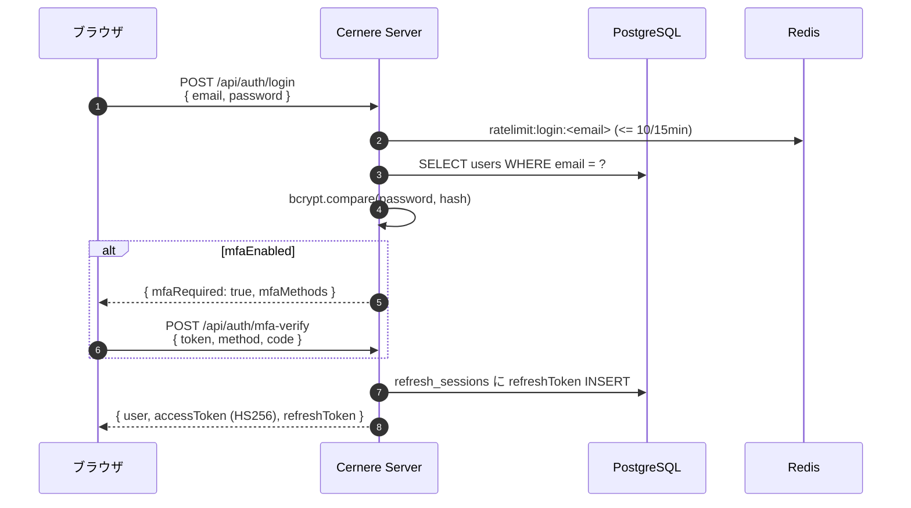
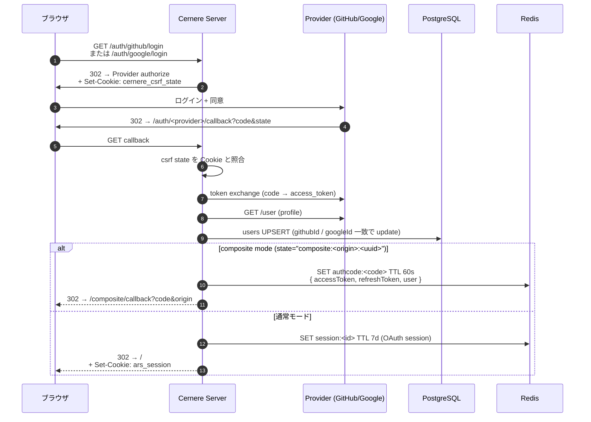
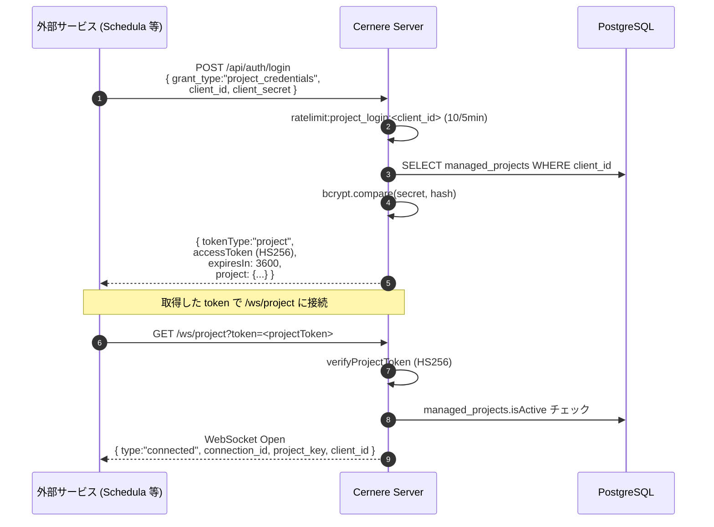
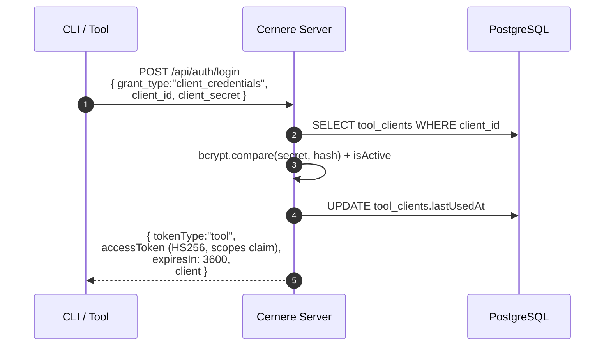
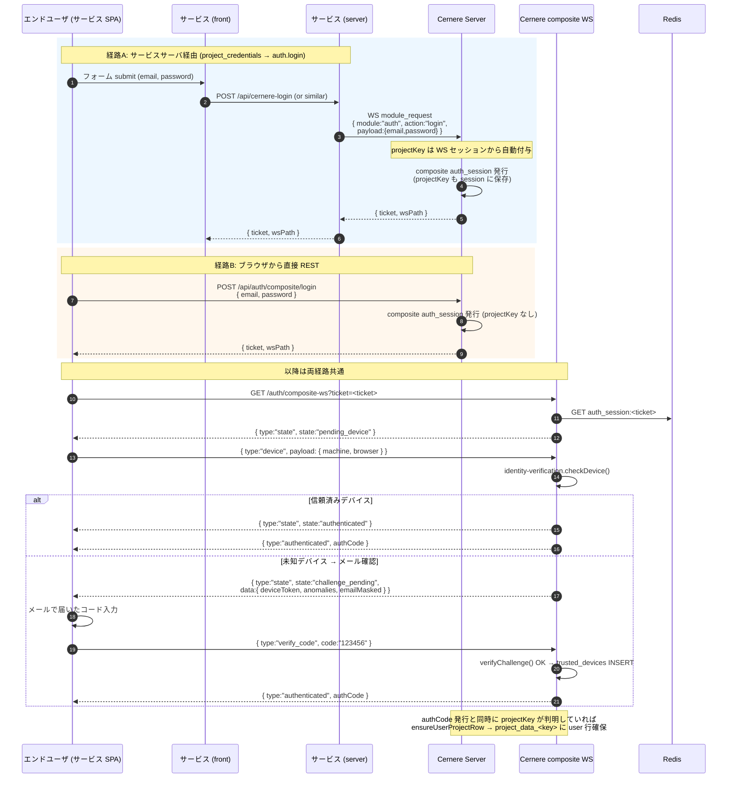
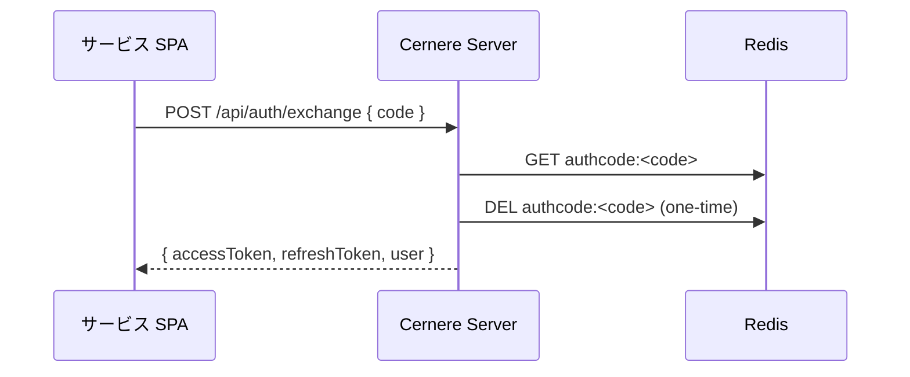
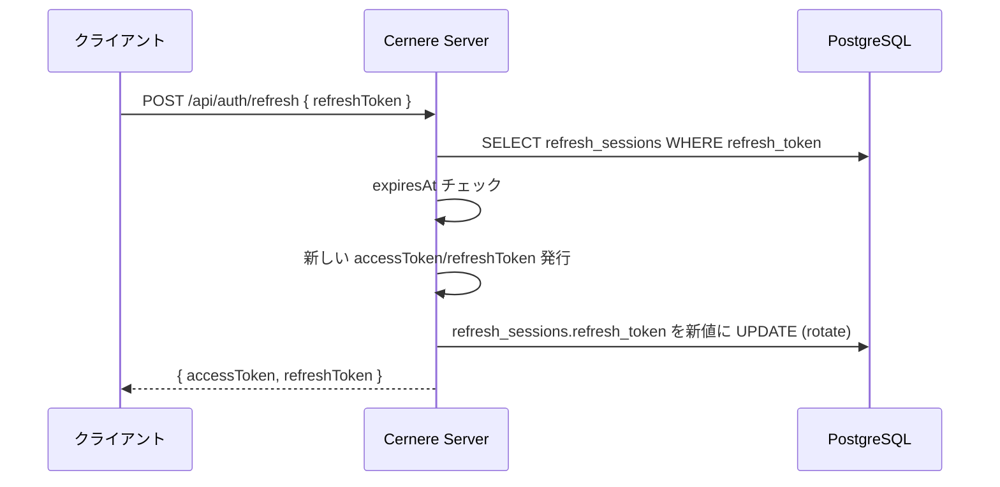
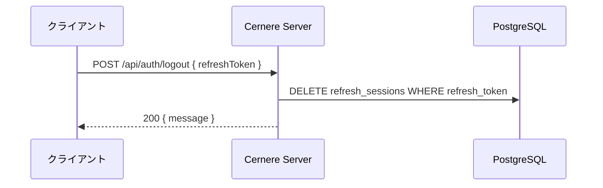

# 認証フロー一覧

Cernere がサポートする 5 種類の認証経路。すべて最終的に **HS256 JWT (`JWT_SECRET`)** で署名される。

> **別経路 — user×project token は PASETO Ed25519**: 「ログイン中ユーザ × 参照先 project」の短命トークン (`POST /api/auth/project-token`) は本表の 5 経路とは別物で、**PASETO Ed25519 (公開鍵署名・`aud` 必須)** で署名する。マスタ `JWT_SECRET` で署名する旧 HS256 フォールバックは、鍵の leaf 横展開と `aud` 無し横断偽造を許すため撤去した。詳細は [../setup/service-registration.md](../setup/service-registration.md) §3。

| 経路 | 入力 | 出力 | 用途 |
|---|---|---|---|
| [user (email/pw)](#1-user-email--password) | email + password | access + refresh | エンドユーザの直接ログイン |
| [user (OAuth)](#2-user-oauth-github--google) | GitHub / Google code | access + refresh | SNS 連携ログイン |
| [project](#3-project-credentials) | client_id + client_secret | project token | サービスのサーバ認証 |
| project launch | launcher project credential | 起動対象project credential | Excubitorによる起動時rotate |
| [tool](#4-tool-client-credentials) | client_id + client_secret | tool token | CLI / API ツール認証 |
| [composite](#5-composite-埋め込みログイン) | email + pw + デバイス本人確認 | one-time authCode | サービス内 SPA 埋め込みログイン |

---

## 1. user (email + password)

- Rate limit: `login:<email>` で 15 分 10 回
- Token: `accessToken` HS256 60 分、`refreshToken` UUID 30 日
- `users.lastLoginAt` を now() に更新

## 2. user (OAuth: GitHub / Google)

- CSRF: state パラメータ + Cookie で二重検証
- Composite mode: PC は `redirect_uri` へ authCode を返し、呼び出し元が state を照合する。
  popup を使うクライアントは authCode を親 SPA に postMessage する

## Passkey アカウント作成

- `POST /api/auth/passkey/signup-begin` は `name` (必須) と `email` (**任意**) を受け取り、
  discoverable credential (`residentKey=required`) の WebAuthn 作成 options と短命 `signupId` を
  返す。パスワードは受け取らない。email 無しなら `users.email = NULL` のまま登録される
  (Windows Hello 等の passkey だけでアカウントが成立する)。
- `POST /api/auth/passkey/signup-finish` は `signupId` と attestation を検証し、User Verification
  成功後にのみ `users(password_hash=NULL)`・`passkeys`・refresh session を同一 transaction で作る。
- 登録・ログインとも User Verification を必須とする。Windows では Windows Hello の生体認証または
  端末 PIN が使われる。
- 既存ユーザーへの passkey 追加は bearer 認証済みの `register-begin` / `register-finish` を使い、
  既存パスワードとの紐付けは行わない。

## Passkey 他デバイス登録 (one-time device link)

email 無しアカウントは新しい端末でログイン手段を持たないため、ログイン済み端末から
one-time リンクを発行して新端末の passkey を追加する
(spec/plan/passkey-default-authentication.md §7.3 registration_grants の簡略形。
スマホも同じ経路で、その端末自身の credential を登録する — パスワードへのフォールバックはしない)。

1. ログイン済み端末: `POST /api/auth/passkey/device-link` (bearer + 既存 passkey 保持者は
   `X-Cernere-Action-Proof` 必須) → `{ url, expiresIn }`。token は 32 byte 乱数で、
   Redis には SHA-256 digest のみを TTL 15 分で保存する。
2. 新端末: URL (`/device-register?token=...`) を開き `POST /api/auth/passkey/device-register-begin`
   → grant を GETDEL (単回消費) し、registration options + `ceremonyId` を返す。
3. 新端末: `POST /api/auth/passkey/device-register-finish` — UV 必須で attestation を検証し、
   passkey 追加 + refresh session 発行 (= その端末はそのままログイン状態になる)。
4. begin 時点で token を消費するため、ceremony 中断時はリンクを再発行する (fail-closed)。
- アカウントリンク: `state="link:<userId>"` で既存ユーザに OAuth ID を後付け追加

## 3. project (client_credentials)

- Token は HS256 (`JWT_SECRET` 共有)。RS256/JWKS は廃止
- `/ws/project` 接続成立時、メモリレジストリに登録 → ダッシュボード「使用中」バッジが点灯
- WS では `module_request`/`module_response` 形式で `managed_project.*`, `managed_relay.*`, `auth.*` コマンドを呼ぶ

## 4. tool (client_credentials)

- `tool_clients.scopes` (JSONB) を JWT claim に含める
- 用途: 自動化スクリプト、E2E テスト、運用ツール

## 5. composite (埋め込みログイン)

外部サービスの SPA に Cernere ログイン UI を埋め込むためのフロー。
プロジェクトサーバ経由 (CORS-free) または 直接 REST の 2 経路。

- `auth_session` Redis TTL: 10 分
- `device_challenge` Redis TTL: 10 分、最大 5 回試行
- `authCode` 発行 → `/api/auth/exchange` で one-time 交換 → `accessToken`/`refreshToken`
- 経路A の `projectKey` は [user-project-row.md](user-project-row.md) の自動 row 初期化に使われる

## 共通: トークン交換 (exchange)

- 60 秒以内に exchange しないと失効
- 一度 exchange したら破棄 (再利用は 401)

## 共通: refresh

- refresh token は使用毎に rotate (使い回し検出のため)
- 期限切れは 401 → ユーザは再ログイン

## 共通: logout

`accessToken` の即時無効化はしない (60 分 TTL で自然失効)。リアルタイム遮断が必要なら WS セッション側を `SessionExpired` に遷移させる ([security_design.md](security_design.md))。

## 共通: Action authentication (破壊的操作の step-up)

通常のログインと日常操作は access/refresh session だけで継続する。資格情報やデータを失う操作、
権限・秘密鍵に影響する操作だけは、実行直前に登録済み passkey で User Verification を行う。

1. `POST /api/auth/action/begin` に `{ action, resource, sessionId? }` を送る。
2. 返された WebAuthn options をOSの生体認証または端末PINで検証する。
3. `POST /api/auth/action/finish` に assertion を送り、短命の opaque `proof` を受け取る。
4. HTTP操作は `X-Cernere-Action-Proof`、WS操作は `action_proof` に proof を付ける。

proof は Redis にハッシュキーで保存し、ユーザ、HTTP access token またはWS session、action、resource
へ結び付ける。TTLは5分で、検証時は `GETDEL` により成功・失敗にかかわらず一度だけ消費する。
別操作・別対象・別セッションへの流用とリプレイは拒否する。

対象は passkey の追加/削除、アカウント削除、組織削除、メンバー除外/権限変更、プロジェクト削除・
スキーマ変更・秘密鍵ローテーション、OIDC client の秘密鍵/redirect URI/無効化である。
ユーザがまだ passkey を1本も持たない場合の最初の登録だけはブートストラップとしてstep-upを免除し、
最後の1本の削除は拒否する。
