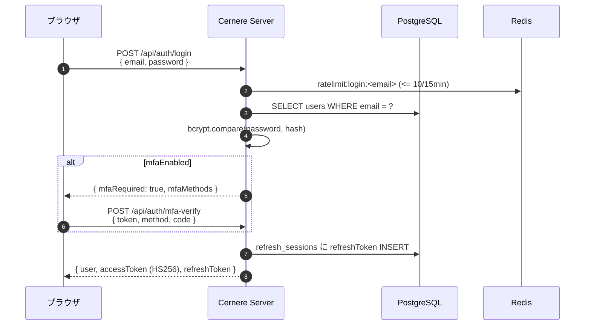
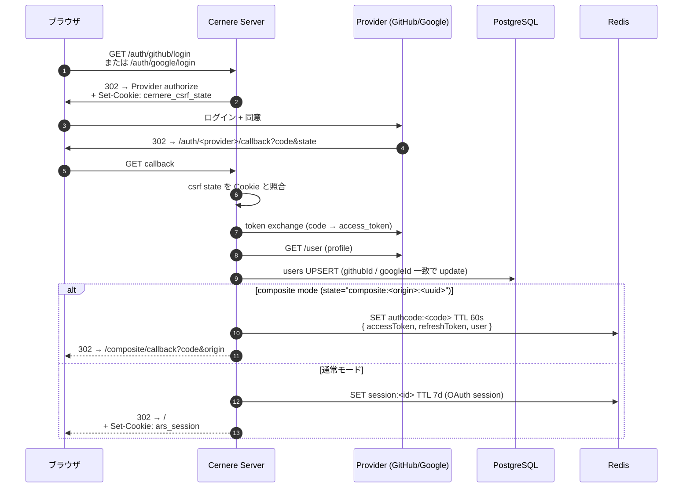
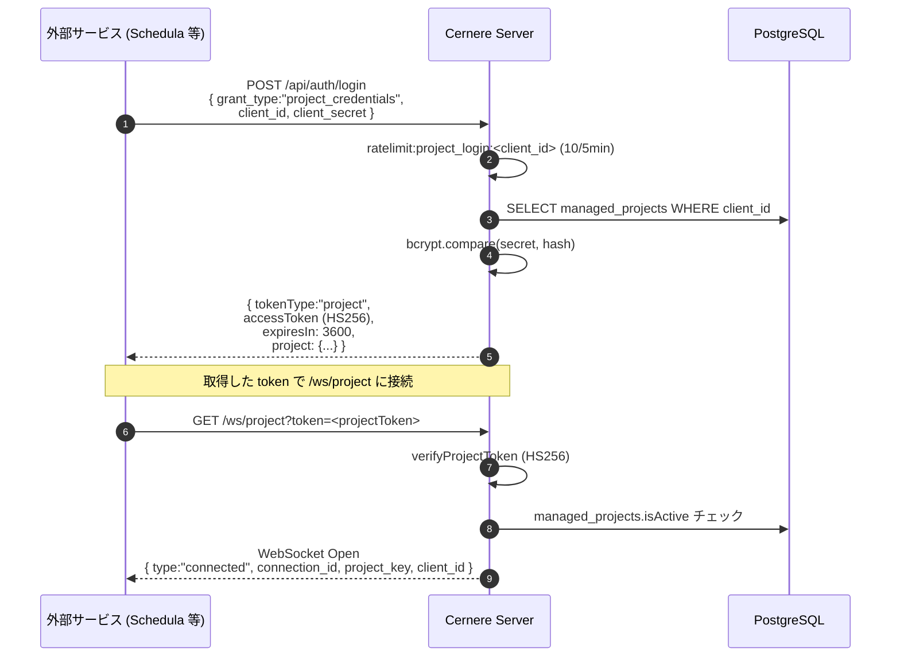
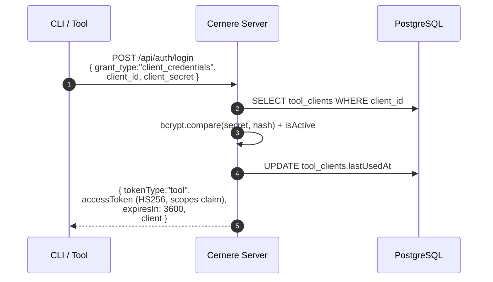
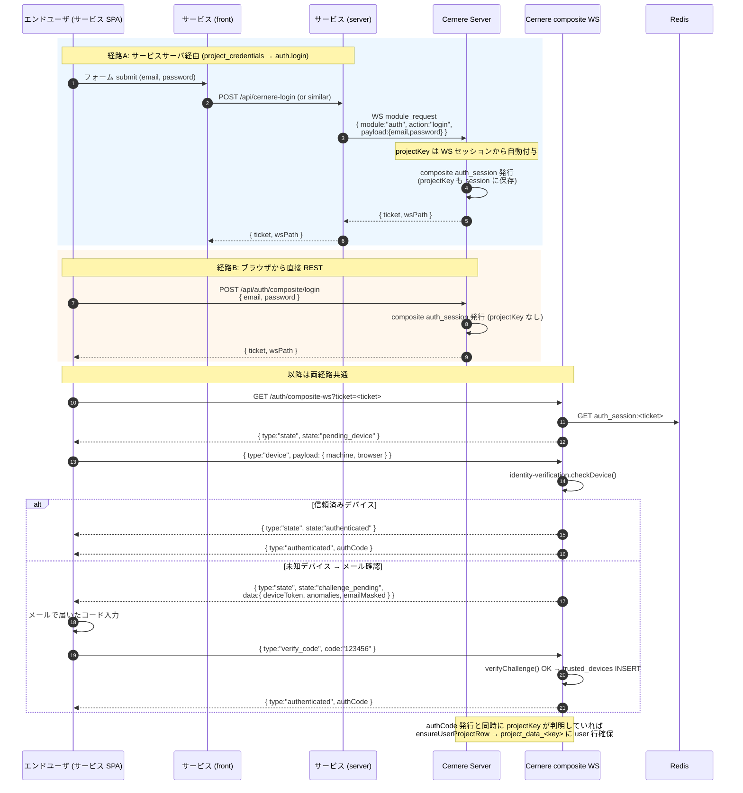
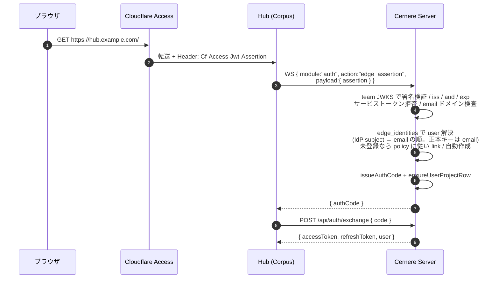
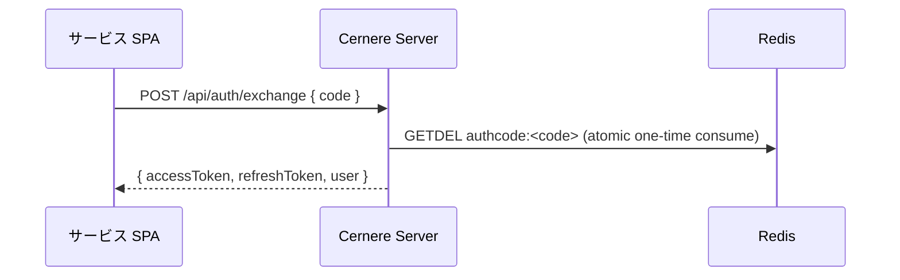
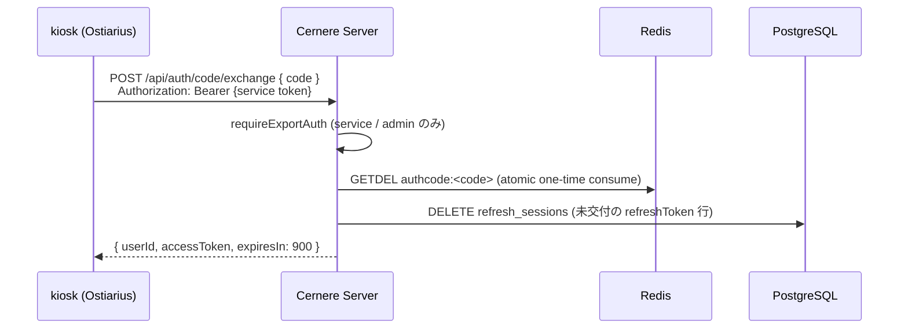
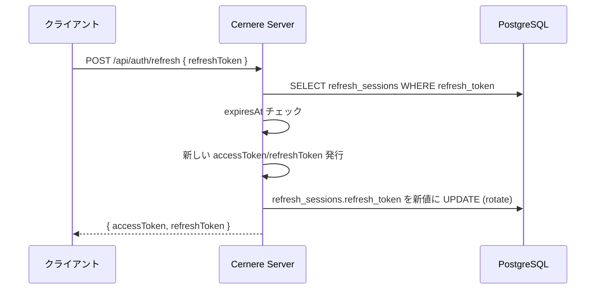
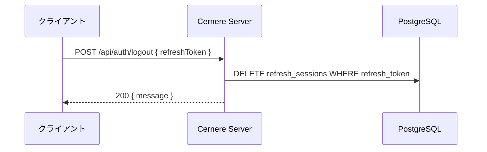

# 認証フロー一覧

Cernere がサポートする 6 種類の認証経路。すべて最終的に **HS256 JWT (`JWT_SECRET`)** で署名される。

> **別経路 — user×project token は PASETO Ed25519**: 「ログイン中ユーザ × 参照先 project」の短命トークン (`POST /api/auth/project-token`) は本表の 5 経路とは別物で、**PASETO Ed25519 (公開鍵署名・`aud` 必須)** で署名する。マスタ `JWT_SECRET` で署名する旧 HS256 フォールバックは、鍵の leaf 横展開と `aud` 無し横断偽造を許すため撤去した。詳細は [../setup/service-registration.md](../setup/service-registration.md) §3。

| 経路 | 入力 | 出力 | 用途 |
|---|---|---|---|
| [user (email/pw)](#1-user-email--password) | email + password | access + refresh | エンドユーザの直接ログイン |
| [user (OAuth)](#2-user-oauth-github--google) | GitHub / Google code | access + refresh | SNS 連携ログイン |
| [project](#3-project-credentials) | client_id + client_secret | project token | サービスのサーバ認証 |
| project launch | launcher project credential | 起動対象project credential | Excubitorによる起動時rotate |
| [tool](#4-tool-client-credentials) | client_id + client_secret | tool token | CLI / API ツール認証 |
| [composite](#5-composite-埋め込みログイン) | email + pw + デバイス本人確認 | one-time authCode | サービス内 SPA 埋め込みログイン |
| [edge assertion](#6-edge-assertion-エッジ認証のバイパス) | 上流エッジの署名済みアサーション (Cloudflare Access JWT) | one-time authCode | 企業 SSO 配下の Hub (再ログイン無し) |

---

## 1. user (email + password)

```mermaid
sequenceDiagram
    autonumber
    participant U as ブラウザ
    participant CS as Cernere Server
    participant DB as PostgreSQL
    participant R as Redis

    U->>CS: POST /api/auth/login<br/>{ email, password }
    CS->>R: ratelimit:login:<email> (<= 10/15min)
    CS->>DB: SELECT users WHERE email = ?
    CS->>CS: bcrypt.compare(password, hash)
    alt mfaEnabled
        CS-->>U: { mfaRequired: true, mfaMethods }
        U->>CS: POST /api/auth/mfa-verify<br/>{ token, method, code }
    end
    CS->>DB: refresh_sessions に refreshToken INSERT
    CS-->>U: { user, accessToken (HS256), refreshToken }
```

- Rate limit: `login:<email>` で 15 分 10 回
- Token: `accessToken` HS256 60 分、`refreshToken` UUID 30 日
- `users.lastLoginAt` を now() に更新

## 2. user (OAuth: GitHub / Google)

```mermaid
sequenceDiagram
    autonumber
    participant U as ブラウザ
    participant CS as Cernere Server
    participant P as Provider (GitHub/Google)
    participant DB as PostgreSQL
    participant R as Redis

    U->>CS: GET /auth/github/login<br/>または /auth/google/login
    CS->>U: 302 → Provider authorize<br/>+ Set-Cookie: cernere_csrf_state
    U->>P: ログイン + 同意
    P->>U: 302 → /auth/<provider>/callback?code&state
    U->>CS: GET callback
    CS->>CS: csrf state を Cookie と照合
    CS->>P: token exchange (code → access_token)
    CS->>P: GET /user (profile)
    CS->>DB: users UPSERT (githubId / googleId 一致で update)
    alt composite mode (state="composite:<origin>:<uuid>")
        CS->>R: SET authcode:<code> TTL 60s<br/>{ accessToken, refreshToken, user }
        CS-->>U: 302 → /composite/callback?code&origin
    else 通常モード
        CS->>R: SET session:<id> TTL 7d (OAuth session)
        CS-->>U: 302 → /<br/>+ Set-Cookie: ars_session
    end
```

- CSRF: state パラメータ + Cookie で二重検証
- Composite mode: PC は `redirect_uri` へ authCode を返し、呼び出し元が state を照合する。
  popup を使うクライアントは authCode を親 SPA に postMessage する

## Passkey アカウント作成

- `POST /api/auth/passkey/signup-begin` は `name` (必須) と `email` (**任意**) を受け取り、
  discoverable credential (`residentKey=required`) の WebAuthn 作成 options と短命 `signupId` を
  返す。パスワードは受け取らない。email 無しなら `users.email = NULL` のまま登録される
  (Windows Hello 等の passkey だけでアカウントが成立する)。
- `POST /api/auth/passkey/signup-finish` は `signupId` と attestation を検証し、User Verification
  成功後にのみ `users(password_hash=NULL)`・`passkeys`・refresh session を同一 transaction で作る。
- 登録・ログインとも User Verification を必須とする。Windows では Windows Hello の生体認証または
  端末 PIN が使われる。
- 既存ユーザーへの passkey 追加は bearer 認証済みの `register-begin` / `register-finish` を使い、
  既存パスワードとの紐付けは行わない。

## Passkey 他デバイス登録 (one-time device link)

email 無しアカウントは新しい端末でログイン手段を持たないため、ログイン済み端末から
one-time リンクを発行して新端末の passkey を追加する
(spec/plan/passkey-default-authentication.md §7.3 registration_grants の簡略形。
スマホも同じ経路で、その端末自身の credential を登録する — パスワードへのフォールバックはしない)。

1. ログイン済み端末: `POST /api/auth/passkey/device-link` (bearer + 既存 passkey 保持者は
   `X-Cernere-Action-Proof` 必須) → `{ url, expiresIn }`。token は 32 byte 乱数で、
   Redis には SHA-256 digest のみを TTL 15 分で保存する。
2. 新端末: URL (`/device-register?token=...`) を開き `POST /api/auth/passkey/device-register-begin`
   → grant を GETDEL (単回消費) し、registration options + `ceremonyId` を返す。
3. 新端末: `POST /api/auth/passkey/device-register-finish` — UV 必須で attestation を検証し、
   passkey 追加 + refresh session 発行 (= その端末はそのままログイン状態になる)。
4. begin 時点で token を消費するため、ceremony 中断時はリンクを再発行する (fail-closed)。
- アカウントリンク: `state="link:<userId>"` で既存ユーザに OAuth ID を後付け追加

## 3. project (client_credentials)

```mermaid
sequenceDiagram
    autonumber
    participant S as 外部サービス (Schedula 等)
    participant CS as Cernere Server
    participant DB as PostgreSQL

    S->>CS: POST /api/auth/login<br/>{ grant_type:"project_credentials",<br/>  client_id, client_secret }
    CS->>CS: ratelimit:project_login:<client_id> (10/5min)
    CS->>DB: SELECT managed_projects WHERE client_id
    CS->>CS: bcrypt.compare(secret, hash)
    CS-->>S: { tokenType:"project",<br/>  accessToken (HS256),<br/>  expiresIn: 3600,<br/>  project: {...} }

    Note over S,CS: 取得した token で /ws/project に接続
    S->>CS: GET /ws/project?token=<projectToken>
    CS->>CS: verifyProjectToken (HS256)
    CS->>DB: managed_projects.isActive チェック
    CS-->>S: WebSocket Open<br/>{ type:"connected", connection_id, project_key, client_id }
```

- Token は HS256 (`JWT_SECRET` 共有)。RS256/JWKS は廃止
- `/ws/project` 接続成立時、メモリレジストリに登録 → ダッシュボード「使用中」バッジが点灯
- WS では `module_request`/`module_response` 形式で `managed_project.*`, `managed_relay.*`, `auth.*` コマンドを呼ぶ

## 4. tool (client_credentials)

```mermaid
sequenceDiagram
    autonumber
    participant T as CLI / Tool
    participant CS as Cernere Server
    participant DB as PostgreSQL

    T->>CS: POST /api/auth/login<br/>{ grant_type:"client_credentials",<br/>  client_id, client_secret }
    CS->>DB: SELECT tool_clients WHERE client_id
    CS->>CS: bcrypt.compare(secret, hash) + isActive
    CS->>DB: UPDATE tool_clients.lastUsedAt
    CS-->>T: { tokenType:"tool",<br/>  accessToken (HS256, scopes claim),<br/>  expiresIn: 3600,<br/>  client }
```

- `tool_clients.scopes` (JSONB) を JWT claim に含める
- 用途: 自動化スクリプト、E2E テスト、運用ツール

## 5. composite (埋め込みログイン)

外部サービスの SPA に Cernere ログイン UI を埋め込むためのフロー。
プロジェクトサーバ経由 (CORS-free) または 直接 REST の 2 経路。

```mermaid
sequenceDiagram
    autonumber
    participant U as エンドユーザ (サービス SPA)
    participant SF as サービス (front)
    participant SS as サービス (server)
    participant CS as Cernere Server
    participant CW as Cernere composite WS
    participant R as Redis

    rect rgba(220,240,255,0.5)
    Note over U,SS: 経路A: サービスサーバ経由 (project_credentials → auth.login)
    U->>SF: フォーム submit (email, password)
    SF->>SS: POST /api/cernere-login (or similar)
    SS->>CS: WS module_request<br/>{ module:"auth", action:"login",<br/>  payload:{email,password} }
    Note over CS: projectKey は WS セッションから自動付与
    CS->>CS: composite auth_session 発行<br/>(projectKey も session に保存)
    CS-->>SS: { ticket, wsPath }
    SS-->>SF: { ticket, wsPath }
    end

    rect rgba(255,240,220,0.5)
    Note over U,CS: 経路B: ブラウザから直接 REST
    U->>CS: POST /api/auth/composite/login<br/>{ email, password }
    CS->>CS: composite auth_session 発行 (projectKey なし)
    CS-->>U: { ticket, wsPath }
    end

    Note over U,CW: 以降は両経路共通
    U->>CW: GET /auth/composite-ws?ticket=<ticket>
    CW->>R: GET auth_session:<ticket>
    CW-->>U: { type:"state", state:"pending_device" }
    U->>CW: { type:"device", payload: { machine, browser } }
    CW->>CW: identity-verification.checkDevice()
    alt 信頼済みデバイス
        CW-->>U: { type:"state", state:"authenticated" }
        CW-->>U: { type:"authenticated", authCode }
    else 未知デバイス → メール確認
        CW-->>U: { type:"state", state:"challenge_pending",<br/>  data:{ deviceToken, anomalies, emailMasked } }
        U->>U: メールで届いたコード入力
        U->>CW: { type:"verify_code", code:"123456" }
        CW->>CW: verifyChallenge() OK → trusted_devices INSERT
        CW-->>U: { type:"authenticated", authCode }
    end

    Note over CW,CS: authCode 発行と同時に projectKey が判明していれば<br/>ensureUserProjectRow → project_data_<key> に user 行確保
```

- `auth_session` Redis TTL: 10 分
- `device_challenge` Redis TTL: 10 分、最大 5 回試行
- `authCode` 発行 → `/api/auth/exchange` で one-time 交換 → `accessToken`/`refreshToken`
- 経路A の `projectKey` は [user-project-row.md](user-project-row.md) の自動 row 初期化に使われる

## 6. edge assertion (エッジ認証のバイパス)

**Status: Proposed** — 詳細は [../feature/edge-assertion-login.md](../feature/edge-assertion-login.md)。

Cloudflare Access など上流エッジで本人確認済みのアサーションを Cernere が検証し、
再ログイン無しで Cernere セッションを発行する経路。project WS 限定
(`module:"auth", action:"edge_assertion"`) で、REST は公開しない。

```mermaid
sequenceDiagram
    autonumber
    participant U as ブラウザ
    participant CF as Cloudflare Access
    participant SS as Hub (Corpus)
    participant CS as Cernere Server

    U->>CF: GET https://hub.example.com/
    CF->>SS: 転送 + Header: Cf-Access-Jwt-Assertion
    SS->>CS: WS { module:"auth", action:"edge_assertion",<br/>  payload:{ assertion } }
    CS->>CS: team JWKS で署名検証 / iss / aud / exp<br/>サービストークン拒否 / email ドメイン検査
    CS->>CS: edge_identities で user 解決<br/>(IdP subject → email の順。正本キーは email)<br/>未登録なら policy に従い link / 自動作成
    CS->>CS: issueAuthCode + ensureUserProjectRow
    CS-->>SS: { authCode }
    SS->>CS: POST /api/auth/exchange { code }
    CS-->>SS: { accessToken, refreshToken, user }
```

- 前提: Hub の origin が **CF 経由でしか到達できない**こと (直接到達可能ならヘッダ偽装で成りすまし可)
- Cernere は Hub の主張ではなく**生アサーションを自分で検証**する
- アカウントの正本キーは **email**。 IdP subject (custom OIDC claim、任意) を副次インデックスに
  持ち、 email 変更に追従する。 CF の `sub` は email 単位かつ削除→再追加で変わるため使わない
- 表示名の初期値は email の `@` より前。 ユーザが変更したら以後は自動上書きしない
- 退職者の個人データは無効化ではなく **削除**する (アドレス再利用時に前任者のアカウントを
  掴まないため)
- 端末本人確認 (identity-verification) は既定で省略。破壊的操作の passkey step-up は据え置き
- refresh 時もアサーション再提示を要求し、offboarding を最大 60 分で反映する

## 共通: トークン交換 (exchange)

```mermaid
sequenceDiagram
    participant SF as サービス SPA
    participant CS as Cernere Server
    participant R as Redis
    SF->>CS: POST /api/auth/exchange { code }
    CS->>R: GETDEL authcode:<code> (atomic one-time consume)
    CS-->>SF: { accessToken, refreshToken, user }
```

- 60 秒以内に exchange しないと失効
- `GETDEL` で取得と削除を原子的に行い、一度 exchange した code の再利用は 401

## 共通: kiosk 向け限定交換 (code/exchange)

共有端末 (Ostiarius kiosk) は生徒の refreshToken を受け取ってはならない。 生徒が立ち去った後も
30 日有効な資格情報が端末に残るため、 認可付きの限定交換口を分ける。

```mermaid
sequenceDiagram
    participant KS as kiosk (Ostiarius)
    participant CS as Cernere Server
    participant R as Redis
    participant DB as PostgreSQL
    KS->>CS: POST /api/auth/code/exchange { code }<br/>Authorization: Bearer {service token}
    CS->>CS: requireExportAuth (service / admin のみ)
    CS->>R: GETDEL authcode:<code> (atomic one-time consume)
    CS->>DB: DELETE refresh_sessions (未交付の refreshToken 行)
    CS-->>KS: { userId, accessToken, expiresIn: 900 }
```

- 認可必須。 無認可で叩ける `/api/auth/exchange` と違い、 service token (または admin) を要求する
- 返すのは `{ userId, accessToken, expiresIn }` のみ。 **refreshToken と user プロフィールは返さない**
- bearer token を含む応答には `Cache-Control: no-store` を付け、共有端末や中間キャッシュへ残さない
- `issueAuthCode` が先に作った `refresh_sessions` 行は交換時に削除する。 誰にも渡さない
  refreshToken の行を 30 日残さないため
- kiosk は受け取った accessToken (15 分) を同意記録 `POST /api/identity/face-consent` を
  生徒本人として打つためだけに使い、 端末へ保存しない

## 共通: refresh

```mermaid
sequenceDiagram
    participant C as クライアント
    participant CS as Cernere Server
    participant DB as PostgreSQL
    C->>CS: POST /api/auth/refresh { refreshToken }
    CS->>DB: SELECT refresh_sessions WHERE refresh_token
    CS->>CS: expiresAt チェック
    CS->>CS: 新しい accessToken/refreshToken 発行
    CS->>DB: refresh_sessions.refresh_token を新値に UPDATE (rotate)
    CS-->>C: { accessToken, refreshToken }
```

- refresh token は使用毎に rotate (使い回し検出のため)
- 期限切れは 401 → ユーザは再ログイン

## 共通: logout

```mermaid
sequenceDiagram
    participant C as クライアント
    participant CS as Cernere Server
    participant DB as PostgreSQL
    C->>CS: POST /api/auth/logout { refreshToken }
    CS->>DB: DELETE refresh_sessions WHERE refresh_token
    CS-->>C: 200 { message }
```

`accessToken` の即時無効化はしない (60 分 TTL で自然失効)。リアルタイム遮断が必要なら WS セッション側を `SessionExpired` に遷移させる ([security_design.md](security_design.md))。

## 共通: Action authentication (破壊的操作の step-up)

通常のログインと日常操作は access/refresh session だけで継続する。資格情報やデータを失う操作、
権限・秘密鍵に影響する操作だけは、実行直前に登録済み passkey で User Verification を行う。

1. `POST /api/auth/action/begin` に `{ action, resource, sessionId? }` を送る。
2. 返された WebAuthn options をOSの生体認証または端末PINで検証する。
3. `POST /api/auth/action/finish` に assertion を送り、短命の opaque `proof` を受け取る。
4. HTTP操作は `X-Cernere-Action-Proof`、WS操作は `action_proof` に proof を付ける。

proof は Redis にハッシュキーで保存し、ユーザ、HTTP access token またはWS session、action、resource
へ結び付ける。TTLは5分で、検証時は `GETDEL` により成功・失敗にかかわらず一度だけ消費する。
別操作・別対象・別セッションへの流用とリプレイは拒否する。

対象は passkey の追加/削除、OAuth アカウントの link/unlink、アカウント削除、組織削除、メンバー除外/権限変更、プロジェクト削除・
スキーマ変更・秘密鍵ローテーション、OIDC client の秘密鍵/redirect URI/無効化である。
ユーザがまだ passkey を1本も持たない場合の最初の登録だけはブートストラップとしてstep-upを免除し、
最後の1本の削除は拒否する。

## 7. Discord account link / unlink

An authenticated account posts `{ provider: "discord" }` to `/api/auth/link`
with its Bearer access token. Cernere creates a random state, returns the fixed
provider authorization URL, sets the HttpOnly `cernere_csrf_state` cookie for
600 seconds, and stores a structured `oauthlink:<state>` grant in Redis with the
same TTL. The callback requires
an exact cookie/state match before exchanging the code with Discord. It requests
only `identify`, stores `discord_id` and a display username, and discards the
access token. A Discord identity linked to another user redirects with
`linkError=discord_already_linked`. Discord-only signup is rejected: no
`/auth/discord/login` route exists, and a callback whose state has no
`oauthlink:` entry is refused.

The SPA uses the authenticated POST before navigating, so Google, password,
passkey, composite, and GitHub sessions can all start a link. The state cookie
binds the returned URL to the initiating browser: forwarding only the provider
URL to another browser cannot complete the callback. Link initiation is POST-only;
there is no credential-changing GET route that can bypass action authentication.

If the account already has a passkey, both link and unlink require a fresh
`oauth.link` / `oauth.unlink` action proof bound to the provider. Accounts with
no passkey follow the existing first-credential bootstrap rule; the server does
not pretend that a step-up method exists when none is registered.

The same Redis-backed handshake handles GitHub and Google linking. The link
target user id and provider are read only from `oauthlink:<state>`, never from
the state string itself. A direct callback client can choose its state/cookie,
so `link:<userId>` carries no authority without the authenticated Redis grant.

Link states are minted as `link:<uuid>`. The prefix is a marker with no
authority — forging it cannot link anything, because the callback still refuses
without a matching `oauthlink:<state>` entry. Its only purpose is fail-closed
routing: a `link:` callback whose Redis entry has expired (600 s) is rejected
with "Account link expired" instead of falling through to the ordinary sign-in
path, which would otherwise sign the user into — or newly create — the account
that owns the OAuth identity.

The structured grant binds both the target user and provider and relies on the
HttpOnly state cookie issued to that same browser. The callback consumes the
grant as soon as it resolves the target, so it cannot be replayed with another
code or moved to another provider callback. Legacy user-id-only grants are
rejected because they cannot prove the provider-specific action target.

`POST /api/auth/unlink` accepts `{ provider }`. GitHub and Google unlinking is
rejected with HTTP 409 when it would remove the last password, passkey, or other
OAuth login method. Discord can always be unlinked because it is not a login
method.
