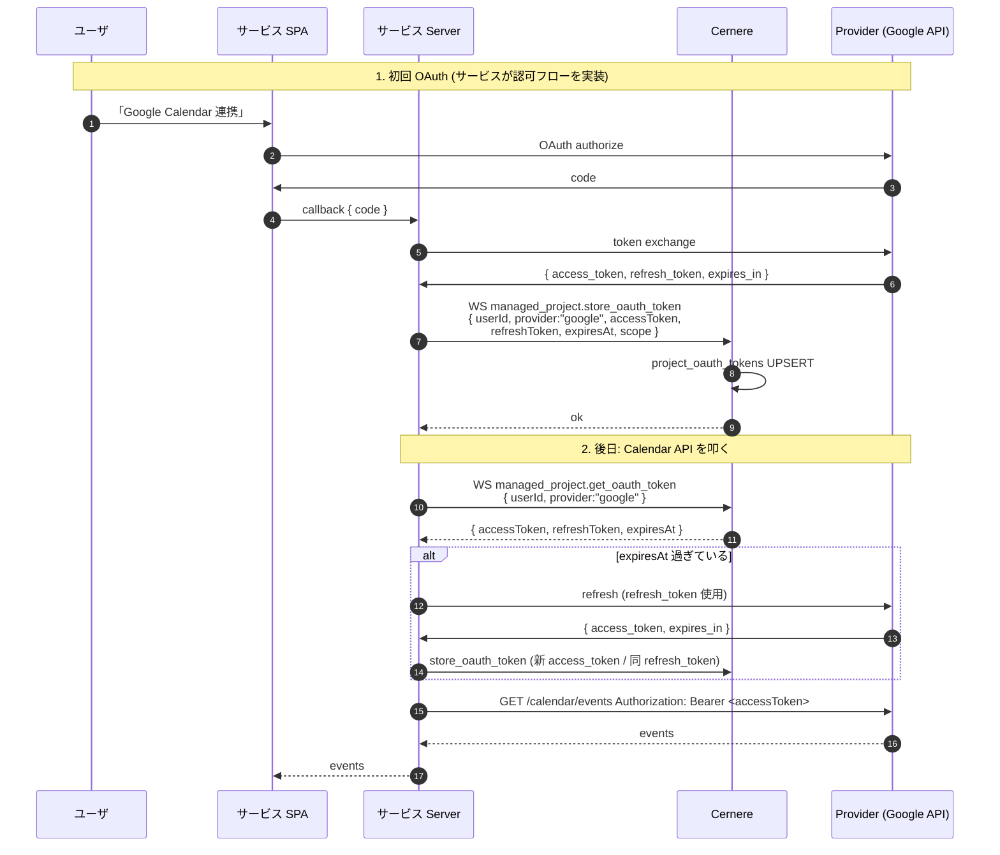

# OAuth トークンの集中管理 (個人データ単一情報源)

LUDIARS のルール「個人データは Cernere に集約」に基づき、**各サービスは OAuth refresh/access トークンを自前 DB に持たず Cernere に預ける**。

## 動機

- 各サービスが OAuth トークンを保持すると、ユーザの opt-out (Cernere からの個人データ削除要求) 時に整合性が取れない
- GDPR 等の "right to be forgotten" を Cernere 一カ所で完結させる
- トークンローテーションも Cernere 側で実装すれば全サービスに一律適用できる

## DB スキーマ

```sql
-- migrations/<n>_project_oauth_tokens.sql
CREATE TABLE project_oauth_tokens (
    id              UUID PRIMARY KEY DEFAULT gen_random_uuid(),
    project_key     TEXT NOT NULL,
    user_id         UUID NOT NULL REFERENCES users(id) ON DELETE CASCADE,
    provider        TEXT NOT NULL,                    -- "google", "github", "microsoft", ...
    access_token    TEXT,
    refresh_token   TEXT,
    expires_at      TIMESTAMPTZ,
    token_type      TEXT,
    scope           TEXT,
    metadata        JSONB NOT NULL DEFAULT '{}',
    created_at      TIMESTAMPTZ NOT NULL DEFAULT now(),
    updated_at      TIMESTAMPTZ NOT NULL DEFAULT now()
);

CREATE UNIQUE INDEX idx_oauth_tokens_project_user_provider
    ON project_oauth_tokens (project_key, user_id, provider);
CREATE INDEX idx_oauth_tokens_project_user
    ON project_oauth_tokens (project_key, user_id);
CREATE INDEX idx_oauth_tokens_project_provider
    ON project_oauth_tokens (project_key, provider);
```

- `(project_key, user_id, provider)` でユニーク (1 ユーザ × 1 プロバイダ × 1 プロジェクトに 1 トークン)
- 削除は user CASCADE のみ。明示的な `delete_oauth_token` も提供

## WS API

`/ws/project` 経由で `managed_project.{store|get|list|delete}_oauth_token` を呼ぶ。
projectKey は WS セッションに bind されており payload では受け取らない。

### store

```json
{ "type":"module_request", "module":"managed_project", "action":"store_oauth_token",
  "payload": {
    "userId": "<uuid>",
    "provider": "google",
    "accessToken": "ya29...",
    "refreshToken": "1//0...",
    "expiresAt": "2026-04-26T15:00:00Z",
    "tokenType": "Bearer",
    "scope": "openid email profile",
    "metadata": { "subject": "user@example.com" }
  }
}
```

UPSERT (ON CONFLICT (project_key, user_id, provider) DO UPDATE)。`updated_at = now()`。

### get

```json
{ "module":"managed_project", "action":"get_oauth_token",
  "payload": { "userId":"<uuid>", "provider":"google" } }
```

戻り値:
```json
{
  "provider":"google",
  "accessToken":"...",
  "refreshToken":"...",
  "expiresAt":"...",
  "tokenType":"Bearer",
  "scope":"...",
  "metadata":{...},
  "updatedAt":"..."
}
```

存在しなければ `null`。

### list

```json
{ "action":"list_oauth_tokens", "payload": { "userId":"<uuid>" } }
```

該当 user × 該当 project の全プロバイダトークンを返す。

### delete

```json
{ "action":"delete_oauth_token", "payload": { "userId":"<uuid>", "provider":"google" } }
```

## 利用シーケンス



## やってはいけないこと

- ❌ サービス側 DB に access/refresh token を保存する
- ❌ token を JS でフロントに渡してからリクエストする (XSS で漏洩する)
- ❌ token を ログに出力する (`console.log(token)` 等)
- ❌ provider 文字列を payload で揺らす ("google" / "Google" / "google-oauth" 等が混在しないよう統一)

## サービス側ヘルパー (推奨)

`@ludiars/cernere-id-cache` パッケージに OAuth トークン取得ヘルパーを集約する想定 (Actio 等で利用)。
ヘルパーは:

1. Cernere に WS で `get_oauth_token` を投げる
2. 期限チェックして必要なら refresh
3. refresh 結果を `store_oauth_token` で書き戻す
4. caller には valid な access_token のみ返す
