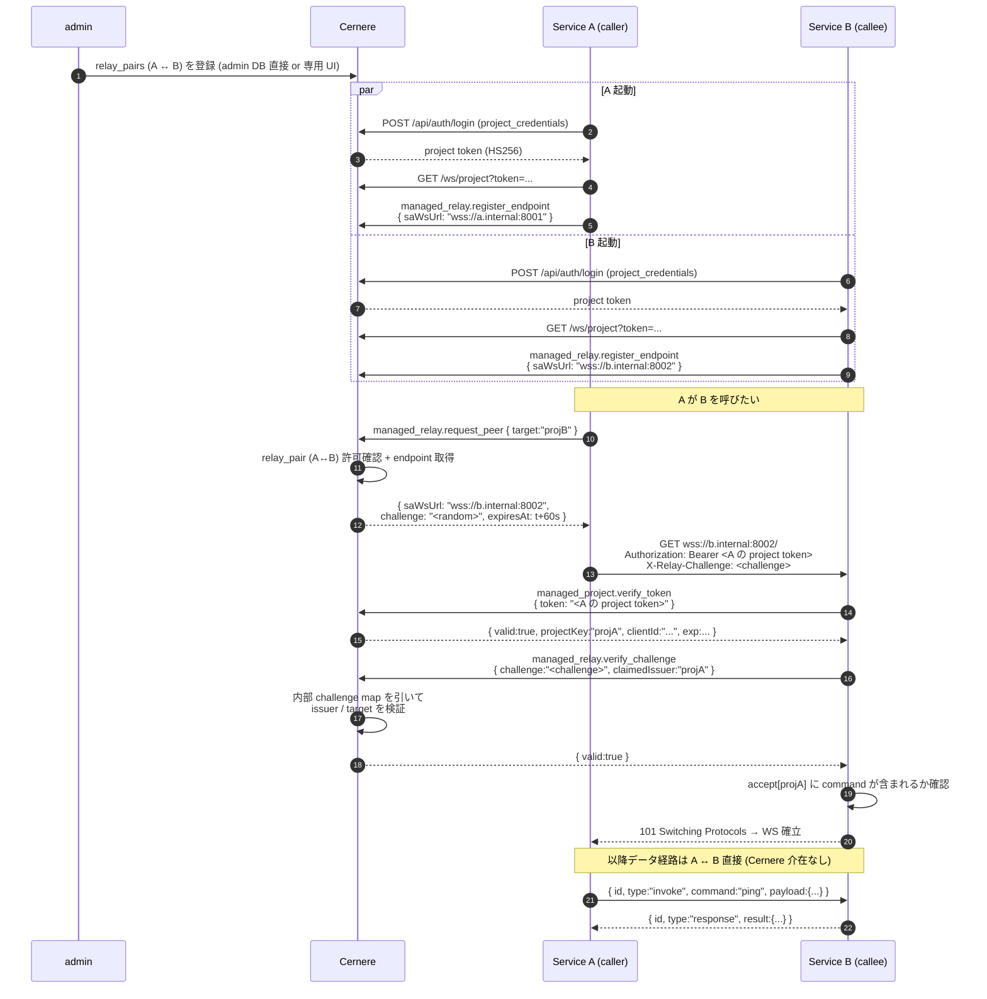

# peer relay (サービス間直接 WS 通信)

LUDIARS バックエンド (Actio / Imperativus / Nuntius 等) が **Cernere をデータ経路に挟まずに** 直接 WebSocket で呼び出し合うための仕組み。Cernere は **認証局** (control-plane) としてのみ介在する。

## 関連パッケージ

| パッケージ | 役割 |
|---|---|
| `@ludiars/cernere-service-adapter` | サービス側で `PeerAdapter` を起動するライブラリ |
| `@ludiars/cernere-service-adapter/testing` | `FakeCernere` (peer-adapter テスト用ミニ Cernere) |

## 旧仕様からの変更 (2026-04-26)

- ❌ RS256 + JWKS によるローカル検証 → **撤去**
- ✅ peer 側は受信した token を Cernere の `managed_project.verify_token` に投げてリモート検証する
- 結果: Cernere 内に RSA 鍵管理 / `project-keys.ts` / `JwksCache` が不要となった

## プロトコル全体



## Cernere 側のコマンド

| コマンド | 用途 |
|---|---|
| `managed_project.verify_token` | A の project token を B が遠隔検証 |
| `managed_relay.register_endpoint` | 自 SA WS URL を Cernere registry に登録 |
| `managed_relay.unregister_endpoint` | 登録解除 |
| `managed_relay.request_peer` | B の SA WS URL + challenge を取得 (relay_pair 検査) |
| `managed_relay.verify_challenge` | B が受け取った challenge を検証する |

### relay_pairs テーブル

```sql
CREATE TABLE relay_pairs (
    id              UUID PRIMARY KEY DEFAULT gen_random_uuid(),
    from_project_key TEXT NOT NULL REFERENCES managed_projects(key) ON DELETE CASCADE,
    to_project_key   TEXT NOT NULL REFERENCES managed_projects(key) ON DELETE CASCADE,
    bidirectional    BOOLEAN NOT NULL DEFAULT TRUE,
    is_active        BOOLEAN NOT NULL DEFAULT TRUE,
    created_at       TIMESTAMPTZ NOT NULL DEFAULT now(),
    updated_at       TIMESTAMPTZ NOT NULL DEFAULT now()
);
CREATE UNIQUE INDEX uq_relay_pairs_from_to ON relay_pairs (from_project_key, to_project_key);
```

`bidirectional=TRUE` なら A→B と B→A どちらも開通。FALSE なら from→to のみ。

## 認証 / 認可の 3 層

| 層 | 何を検証 | 失敗時 |
|---|---|---|
| (1) `verify_token` | A の token が valid な project token か | `deny("invalid token")` |
| (2) `verify_challenge` | request_peer 時に発行した challenge と一致 + issuer 一致 + target が自分 | `deny("challenge rejected")` |
| (3) `accept` リスト | A の projectKey が B の `accept` 設定に含まれ、command も許可されている | `deny("not in accept list")` / `forbidden` |

`accept` は PeerAdapter 設定で:

```ts
new PeerAdapter({
  ...,
  accept: {
    actio:       ["ping", "tasks.create"],
    imperativus: "*",   // 全コマンド許可
  },
});
```

設定にないプロジェクトからは fail-closed (拒否)。

## challenge の特性

- Cernere が `request_peer` ごとに `randomBytes(24).base64url` で発行
- TTL 60 秒
- `verify_challenge` で **1 度** 引かれたら即削除 (one-time)
- issuer (request_peer 呼び出し元) と target (call 先) を Redis に保持

## なぜ JWKS をやめたか

旧設計では peer 側が起動時に Cernere から JWKS を取得し、以降は **ローカル検証** で round-trip を回避していた。だが:

- RSA 鍵管理 (`CERNERE_PROJECT_SIGNING_KEY` env) の運用コストが高い
- 開発環境では鍵が ephemeral (再起動で変わる) で運用がきしむ
- 1 接続あたり 1 round-trip 増えても peer 接続は long-lived なので実コスト微小

→ シンプルさを優先し JWKS を撤去、`verify_token` を round-trip で叩く方式に統一。

## テスト

`packages/service-adapter/tests/peer-adapter.test.ts` で `FakeCernere` を相手に PeerAdapter ↔ PeerAdapter の往復を検証。同じシナリオが `Actio/tests/service-adapter.test.ts` にも含まれる。
