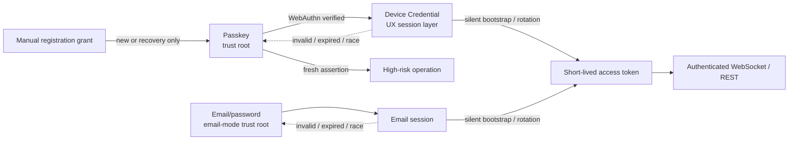
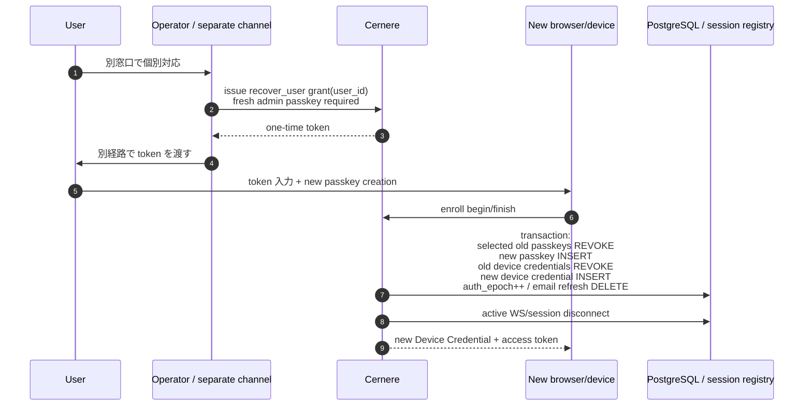

# Cernere パスキー既定・メール認証併存 設計書

- 状態: Proposed
- 対象: Cernere の対話型ユーザー認証 (Web UI / composite / OIDC / 公開 auth package / 将来のネイティブクライアント)
- 非対象: `project_credentials` / `client_credentials` によるサービス・ツール認証。Project認証は[Project認証・ユーザー委譲設計](project-authentication.md)で扱う
- 既定方針: `passkey` モード。`email` 認証版も正式サポートし、同一ソースから runtime mode で切り替える

## 1. 決定事項

1. `passkey` mode の対話型ユーザー認証の信頼の根は WebAuthn パスキーとする。`email` / `hybrid` mode では email credential も明示的な trust root となる。
2. passkey新規アカウント作成、既存アカウントへの新しいパスキー追加、新しい端末セッションの登録には、必ずWebAuthn ceremonyを通す。
3. Web UI は初回のパスキー認証後、ブラウザプロファイルごとに一意な `device_id` と秘密値を組み合わせた **Device Credential** を保持する。公開 `device_id` 単体では認証しない。
4. 通常起動は Device Credential を使って無操作でログインし、短命 access token と次世代 Device Credential を発行する。
5. Device Credential は UX 最適化レイヤーであり、失効・期限切れ・ローテーション競合時はパスキー認証へ戻る。Device Credential の失効だけでパスキーを削除しない。
6. 端末紛失時の回復は公開セルフサービスにしない。別窓口で本人確認後、運用者が一回限りの登録用トークンを発行し、新しいパスキーを紐付ける。成功時は既存 Device Credential を全失効させる。
7. email/password 認証版は互換残置ではなく正式な `email` モードとして保守する。`hybrid` モードでは passkey と email の両方を表示できる。GitHub/Google OAuth と MFA は email モード内の追加 provider とする。
8. WebAuthn の生成・検証は、すでに導入済みの `@simplewebauthn/server` と `@simplewebauthn/browser` を継続利用する。署名、challenge、origin、RP ID の検証を自前実装しない。
9. passkey/email の別 branch・別 repository を作らず、共通セッション基盤と独立した認証 provider を同一 build に含める。サーバーの runtime config を認可の正本とする。

## 2. 用語

| 用語 | 意味 |
|---|---|
| パスキー | Cernere の信頼の根となる WebAuthn credential |
| Device Credential | `device_id` と秘密値からなる、サーバー発行・ローテーション式の端末資格情報 |
| `device_id` | ブラウザプロファイルまたはネイティブアプリのインストール単位を表すランダム ID。非秘密 |
| device secret | 256 bit の秘密値。`device_id` 単体でのログインを防ぐ |
| 端末セッション登録 | パスキー検証後に Device Credential を新規発行する処理 |
| 登録用トークン | 新規登録または手動回復を開始する、一回限り・短命・用途固定の grant |
| `passkey` mode | Device Credential + WebAuthn だけを対話型ユーザー認証に使う既定モード |
| `email` mode | email/password を主認証にする正式サポートモード。OAuth/MFA は個別に追加可能 |
| `hybrid` mode | passkey を主表示し、email 認証も同じインスタンスで明示的に許可するモード |
| email session | email 認証後の長期セッション。Web UI では HttpOnly Cookie、API client では既存 JSON refresh token 契約を使う |

`device_id` は物理 PC のハードウェア ID ではない。Web UI ではブラウザプロファイルと Cernere origin の組み合わせ、ネイティブアプリではインストール単位を表す。Cookie やアプリデータを消した場合は別端末として扱い、パスキーで再登録する。

## 3. 目標と非目標

### 3.1 目標

- 初回だけパスキーを操作し、通常起動は無操作にする。
- email、電話番号、パスワード、OAuth プロフィールを要求しない新規登録を可能にする。
- ブラウザに JS から読める長期 bearer token を置かない。
- 複数タブ、複数プロセス、応答消失が起きても、アカウント全体をロックアウトしない。
- 端末資格情報とパスキーのライフサイクルを分離する。
- 既存ユーザーを段階移行でき、`email` / `hybrid` modeではメール認証版を正式利用できる。
- email 認証版と passkey 認証版を一つの repository/binary から継続的にテスト・運用できる。

### 3.2 非目標

- email/SMS/security question によるセルフサービス回復。
- 端末フィンガープリント、IP、OS、ブラウザ、位置情報から本人らしさを推定すること。
- WebAuthn 非対応ブラウザ向けに、既定モードの安全性を自動降格すること。
- `project_credentials` / `client_credentials` をパスキーに置き換えること。
- 物理端末とブラウザプロファイルを同一視すること。
- passkey 版と email 版のソースをコピーして別々に保守すること。

### 3.3 選択肢と採用理由

| 論点 | 選択肢 | 判断 |
|---|---|---|
| 2つの認証版 | repository/build を分岐 | 不採用。修正・監査・migration が漂流する |
| 2つの認証版 | 同一 build の provider + runtime mode | 採用。共通 session/WS/API guard を一度だけ保守できる |
| passkey 新規登録 | 無制限の public self-registration | 不採用。PII を持たないため重複・濫用アカウントを整理する手掛かりがない |
| passkey 新規登録 | 運用者発行の one-time grant | 採用。公開 recovery/register endpoint を持たず、role と対象を固定できる |
| passkey 回復 | email magic link / SMS | 不採用。連絡先収集と公開回復面が必要になる |
| browser device | 公開 `device_id` だけ | 不採用。ID の漏洩だけでなりすまし可能になる |
| browser device | localStorage bearer token | 不採用。XSS で長期資格情報を直接抽出できる |
| browser device | `device_id + secret` の HttpOnly Cookie | 採用 |
| rotation | 旧 token 再提示で即ユーザー全失効 | 不採用。正常競合・応答消失でロックアウトする |
| rotation | 端末単位 idempotency + grace + passkey fallback | 採用 |
| WS credential | access token を URL query | 不採用。履歴・proxy/log へ露出する |
| WS credential | path-bound one-time ticket を subprotocol 送信 | 採用。既存 parser を再利用できる |

public passkey registration が必要になった場合は別 mode として再設計する。本設計の `passkey` mode に暗黙追加しない。

## 4. 現状と必要な差分

現在の Cernere にはパスキー実装とライブラリがすでに存在する。新規実装ではなく、信頼モデルとセッション管理の切り替えが中心となる。

| 現状 | ファイル | 必要な差分 |
|---|---|---|
| `@simplewebauthn/server` / `browser` 13.3.0 導入済み | `server/package.json`, `frontend/package.json` | 継続利用する |
| パスキー登録は既存 bearer token 必須 | `server/src/http/passkey-handler.ts` | 登録 grant と fresh passkey step-up の両方に対応する |
| 登録の `residentKey` は `preferred` | 同上 | 新規登録は `required` にする |
| ログインの user verification は `preferred`、検証時 `false` | 同上 | options と finish の両方を `required` にする |
| challenge は user/`challengeOwner` 単位で後勝ち | 同上 | ceremony ごとのランダム ID、単回消費へ変更する |
| パスキーログイン後に access/refresh token を発行 | 同上 | access token + Device Credential を発行する |
| access/refresh token を `localStorage` に保存 | `frontend/src/lib/api.ts` | access token はメモリ、Device Credential は HttpOnly Cookie にする |
| user WS の access token を URL query に載せ、接続 URL を console 出力 | `frontend/src/lib/ws-client.ts` | URL から token を除去し、一回限り WS ticket を subprotocol で送る |
| 起動時は保存済み user/refresh token を読む | `frontend/src/contexts/AuthContext.tsx` | 共通 `/api/auth/session` からmode別HttpOnly sessionをsilent restoreする |
| email/password がログイン画面の主経路 | `frontend/src/pages/LoginPage.tsx` | mode capability により passkey版/email版の独立 panel を選ぶ。hybrid は passkey 主表示 |
| refresh token の再利用でユーザー全セッションを削除 | `server/src/http/auth-handler.ts` | device/email共通rotationで正常競合と明示replayを分け、session単位に処理する |
| OS・画面・timezone・language・UA から fingerprint を作る | `frontend/src/lib/device-fingerprint.ts` | 新しいランダム `device_id` と混同せず、passkey mode では呼ばない |
| machine/browser/IP を `trusted_devices` に保存し email code を送る | `server/src/auth/identity-verification.ts` | passkey経路では呼ばない。email/hybrid の明示設定時だけ使う |
| 公開 composite SDK が email/password/fingerprint を前提とする | `packages/composite/src/ui/CompositeLogin.tsx`, `packages/composite/src/types.ts` | passkey popup版とemail form版をversioned exportとして分離する |

### 4.1 実現性判定

**3モード分離は実現可能**。理由は次のとおり。

| 判定対象 | 結果 |
|---|---|
| email/password と passkey のデータ共存 | 現schemaで可能 |
| 同一source/artifactからの3モード提供 | 本設計のprovider分離と共通guard実装後に可能 |
| 現行releaseへ設定値だけ追加して安全に切替 | 不可。分散した全認証入口とsessionを先に改修する必要がある |
| passkey instanceとemail instanceを同じDB/Redis/originへ同時接続 | 不可。単一modeまたは`hybrid`を使う |

- `users.email` / `password_hash` は nullable で、passkey は独立テーブルにあるため、email-only / passkey-only / 両方の account を同じ schema で表現できる。
- user access token、role、WS command、project/tool credentials は認証方式の後段にあり、共通 session service に集約できる。
- server/frontend とも SimpleWebAuthn と email/password の両実装をすでに持ち、新しい外部サービスを導入せず provider 分割できる。
- mode ごとに別 migration や別 build は不要で、同じ artifact に対する config/CI matrix で運用できる。

ただし現在は email auth が REST、guest WS、composite、OAuth、公開 package に分散している。`LoginPage` の表示だけを変える方式では迂回可能なため、§14 の全入口 mode guard、mode別 session Cookie、切替時の session 失効を完了することが運用可能性の条件となる。

## 5. 信頼モデル



### 5.1 認証強度

- パスキー: phishing-resistant な一次認証。登録・認証とも User Verification を必須にする。
- Device Credential: パスキーで認証済みの端末に与える長期セッション資格情報。単独では新しいパスキーの追加・削除、全端末失効、回復処理を実行できない。
- email credential: `email` / `hybrid` mode の一次認証。password hashing、rate limit、設定済みMFAを適用するが、passkeyと同じphishing-resistant保証は持たない。
- email session: email認証済みclientに与えるrotating長期資格情報。Web UIではHttpOnly Cookieに限定する。
- access token: API/WS 用の短命 JWT。新しい経路では refresh token をブラウザへ発行しない。
- 登録用トークン: アカウントを選択し WebAuthn 登録を開始する権限だけを持つ。API/WS access token には交換できない。

### 5.2 fresh step-up が必要な操作

次の操作は長期sessionや通常access tokenだけでは許可しない。

| 操作 | passkey | email | hybrid |
|---|---|---|---|
| passkey追加・削除、Device Credential全失効 | fresh passkey | endpoint無効 | fresh passkey |
| email/password/MFA変更、email session全失効 | endpoint無効 | fresh password + 設定済みMFA | fresh passkeyまたはfresh password+MFA |
| 登録/回復grant発行、role変更、account削除 | fresh passkey | fresh password + 必須admin MFA | fresh passkey (emailへ降格しない) |

proofのfreshnessは5分以内とする。email modeでadmin MFAが構成されていない場合、高権限grant/role変更を許可せず、先にMFAを構成する。

最後の有効パスキーは削除できない。先に別のパスキーを登録するか、手動回復フローを使う。

### 5.3 step-up proof

fresh passkey/email reauthentication の結果を通常access tokenのclaimや再利用可能なJWTに埋め込まない。高リスク操作ごとに一回限りのopaque proofを使う。

1. 認証済み client が `step-up-begin` に server allowlist 上の `action` と canonical `resource_ref` を送る。
2. Cernereは`user_id`、`auth_source`、`auth_session_id`、`auth_epoch`、`action`、`resource_ref`をpasskey ceremonyまたはemail reauthentication challengeにbindする。
3. `step-up-finish`がUV必須assertionまたはpassword+要求MFAを検証したら32 byteのproofを返し、Redis `stepup:<SHA-256(proof)>` にbindingを5分TTLで保存する。
4. 対象 API/WS command は `X-Cernere-Step-Up: <proof>` または WS payload の専用 `stepUpProof` field で受け、Redis Lua / `GETDEL` で一回だけ消費する。
5. access tokenのuser/auth-source/auth-session/epochとproof binding、要求action/resourceが完全一致した場合だけ操作を実行する。

proof を URL、一般 payload、ログへ入れない。失敗・期限切れ・別操作への転用は fresh ceremony からやり直す。

## 6. 識別子とデータ最小化

### 6.1 パスキーのみの新規ユーザー

新規登録 payload に name、email、phone、password を含めない。

- `users.id`: サーバー生成 UUID
- `webauthn_user_id`: 32 byte のランダム値を base64url 化した opaque user handle
- `login` / `display_name`: 現行 NOT NULL 制約との互換用に `user-<random suffix>` をサーバー生成
- `email`, `password_hash`, OAuth ID/token, MFA fields: `NULL` / disabled
- `role`: 登録 grant に固定。最初の bootstrap grant だけ `admin`、通常は `general`

ユーザーが後からプロフィール名を設定する機能は認証と分離する。認証開始時にプロフィール入力を要求しない。

### 6.2 「個人情報ゼロ」の境界

ここでいう「ゼロ」は、実名、連絡先、パスワード、外部アカウント、端末指紋、位置情報などの本人属性を対話型認証のために収集しない、という意味とする。認証に不可欠な `user_id`、`device_id`、credential ID/public key は仮名識別子であり、法域によっては個人データとして扱われ得るため、法的な意味で「データが一切ない」とは表現しない。

既定経路で永続化してよいもの:

- ランダムな user handle / user ID
- WebAuthn credential ID、公開鍵、counter、transports、device type、backup state
- ランダムな `device_id`、device secret の HMAC、世代、発行・最終利用・失効時刻
- 認証イベント種別、成功/失敗、opaque ID、時刻

既定経路で収集・永続化しないもの:

- email、電話番号、パスワード/hash、OAuth ID/token
- OS、画面サイズ、言語、timezone、ブラウザ version などの fingerprint
- raw IP、位置情報、raw User-Agent
- passkey nickname、AAGUID、自由入力の端末名

レート制限で接続元を区別する必要がある場合は、raw IP ではなく日次ローテーション鍵による HMAC を Redis に制限時間だけ保存する。永続ログへ raw IP/User-Agent を出さない。`email` / `hybrid` mode は email 等を保存するため、この「本人属性を収集しない」性質は `passkey` mode にだけ適用される。

## 7. データモデル

既存カラムは削除せず、新しい migration で追加する。migration 番号は作業開始時の次の空き番号を使う。

### 7.1 users / passkeys の追加列

```sql
ALTER TABLE users
  ADD COLUMN IF NOT EXISTS webauthn_user_id TEXT,
  ADD COLUMN IF NOT EXISTS auth_epoch BIGINT NOT NULL DEFAULT 0;

CREATE UNIQUE INDEX IF NOT EXISTS idx_users_webauthn_user_id
  ON users (webauthn_user_id)
  WHERE webauthn_user_id IS NOT NULL;

ALTER TABLE passkeys
  ADD COLUMN IF NOT EXISTS discoverable BOOLEAN NOT NULL DEFAULT false,
  ADD COLUMN IF NOT EXISTS revoked_at TIMESTAMPTZ;
```

- 新規パスキーは `residentKey: "required"` で成功した ceremony のため `discoverable=true` とする。
- 既存 passkey 行は安全側に倒して `false` のままにする。
- 現行実装は WebAuthn `userID` に `TextEncoder(users.id)` を使っている。既存 passkey を持つ user の `webauthn_user_id` は、その UUID UTF-8 byte列を base64url 化して backfill し、同一アカウント内で user handle を変えない。passkey を持たない既存 user と新規 user だけ 32 byte の新しい乱数を使う。
- `auth_epoch` は回復・全端末失効時に increment し、旧 access token / WS session を無効化する。
- `nickname` / `aaguid` は互換のため残すが、passkey mode では新規保存しない。
- `revoked_at IS NULL` を login、list、`excludeCredentials`、counter update、export の全 query に共通適用する。削除 API は hard delete ではなく論理失効へ変更する。
- 最後の passkey 判定・複数 passkey の同時失効は user 単位 transaction + row lock で直列化する。counter は credential 行を lock するか、期待旧 counter を条件にした CAS で更新する。

### 7.2 device_credentials

```sql
CREATE TABLE IF NOT EXISTS device_credentials (
    id                       UUID PRIMARY KEY,
    user_id                  UUID NOT NULL REFERENCES users(id) ON DELETE CASCADE,
    root_passkey_id          UUID REFERENCES passkeys(id) ON DELETE SET NULL,
    client_kind              TEXT NOT NULL CHECK (client_kind IN ('browser', 'native')),
    token_key_id             TEXT NOT NULL,
    generation               BIGINT NOT NULL DEFAULT 0,
    current_secret_hash      TEXT NOT NULL,
    previous_secret_hash     TEXT,
    previous_valid_until     TIMESTAMPTZ,
    last_rotation_id         UUID,
    last_rotated_at          TIMESTAMPTZ,
    expires_at               TIMESTAMPTZ NOT NULL,
    last_used_at             TIMESTAMPTZ NOT NULL DEFAULT now(),
    revoked_at               TIMESTAMPTZ,
    revoked_reason           TEXT CHECK (revoked_reason IN
                              ('logout', 'replay', 'admin', 'recovery', 'passkey_revoked', 'key_rotation', 'expired')),
    created_at               TIMESTAMPTZ NOT NULL DEFAULT now()
);

CREATE INDEX IF NOT EXISTS idx_device_credentials_user_active
  ON device_credentials (user_id, last_used_at DESC)
  WHERE revoked_at IS NULL;
```

- `id` が stable な `device_id` となる。
- secret は32 byte。DBには`CERNERE_AUTH_SESSION_KEY`から派生したdevice検証鍵によるHMAC-SHA-256のみ保存する。
- token 形式は version 付き `cdt1.<device_id>.<secret>` とする。ログ・URL・DB に token 全体を保存しない。
- `root_passkey_id` は発行元を監査・失効連動するための参照であり、Device Credential の失効から passkey を逆向きに削除しない。
- `client_kind` は `browser` / `native` だけとし、OS、UA、自由入力ラベルを保存しない。

### 7.3 registration_grants

```sql
CREATE TABLE IF NOT EXISTS registration_grants (
    id                 UUID PRIMARY KEY,
    purpose            TEXT NOT NULL CHECK (purpose IN
                         ('bootstrap', 'create_user', 'recover_user', 'email_enroll')),
    subject_user_id    UUID REFERENCES users(id) ON DELETE CASCADE,
    pending_user_id    UUID,
    pending_webauthn_user_id TEXT,
    role               TEXT CHECK (role IN ('admin', 'general')),
    revoke_passkey_ids JSONB NOT NULL DEFAULT '[]'::jsonb,
    revoke_all_existing_passkeys BOOLEAN NOT NULL DEFAULT false,
    token_hash         TEXT NOT NULL UNIQUE,
    expires_at         TIMESTAMPTZ NOT NULL,
    used_at            TIMESTAMPTZ,
    revoked_at         TIMESTAMPTZ,
    created_by_user_id UUID REFERENCES users(id) ON DELETE SET NULL,
    created_at         TIMESTAMPTZ NOT NULL DEFAULT now(),
    CONSTRAINT chk_registration_grant_subject CHECK (
      (purpose IN ('bootstrap', 'create_user')
        AND subject_user_id IS NULL
        AND pending_user_id IS NOT NULL
        AND pending_webauthn_user_id IS NOT NULL)
      OR
      (purpose IN ('recover_user', 'email_enroll')
        AND subject_user_id IS NOT NULL
        AND pending_user_id IS NULL
        AND pending_webauthn_user_id IS NULL)
    )
);
```

`purpose` は次に限定する。

- `bootstrap`: 空の Cernere に最初の admin と passkey を作る
- `create_user`: 新しい一般ユーザーと最初の passkey を作る
- `recover_user`: 既存ユーザーへ新しい passkey を追加し、全 Device Credential を失効する
- `email_enroll`: `email` / `hybrid` モードの認証済みユーザーを passkey 登録へ接続する

`bootstrap` / `create_user` grant の発行時に `pending_user_id` と `pending_webauthn_user_id` を予約する。これらはまだ存在しない user を表すため FK にしない。finish transaction が user row を作る。`recover_user` / `email_enroll` は既存の `subject_user_id` とその `users.webauthn_user_id` を使う。

回復 grant には、運用者が特定した紛失・侵害 passkey の ID を `revoke_passkey_ids` として bind する。識別できない場合は `revoke_all_existing_passkeys=true` を選べる。client はこの指定を変更できない。

grant token は 32 byte 以上の乱数とし、DB には SHA-256 digest だけを保存する。有効期間は既定 15 分、一回限りとする。発行 API を未認証の公開ネットワークへ出さない。

### 7.4 email_sessions

email版の新しいbrowser/API refresh credentialも、Device Credentialと同じ競合耐性を持つversioned opaque tokenにする。

```sql
CREATE TABLE IF NOT EXISTS email_sessions (
    id                       UUID PRIMARY KEY,
    user_id                  UUID NOT NULL REFERENCES users(id) ON DELETE CASCADE,
    client_kind              TEXT NOT NULL CHECK (client_kind IN ('browser', 'api')),
    token_key_id             TEXT NOT NULL,
    generation               BIGINT NOT NULL DEFAULT 0,
    current_secret_hash      TEXT NOT NULL,
    previous_secret_hash     TEXT,
    previous_valid_until     TIMESTAMPTZ,
    last_rotation_id         UUID,
    last_rotated_at          TIMESTAMPTZ,
    expires_at               TIMESTAMPTZ NOT NULL,
    last_used_at             TIMESTAMPTZ NOT NULL DEFAULT now(),
    revoked_at               TIMESTAMPTZ,
    revoked_reason           TEXT CHECK (revoked_reason IN
                              ('logout', 'replay', 'admin', 'mode_switch', 'recovery', 'key_rotation', 'expired')),
    created_at               TIMESTAMPTZ NOT NULL DEFAULT now()
);

CREATE INDEX IF NOT EXISTS idx_email_sessions_user_active
  ON email_sessions (user_id, last_used_at DESC)
  WHERE revoked_at IS NULL;
```

token形式は`est1.<email_session_id>.<32-byte-secret>`。現行`refresh_sessions`はv1 compatibility入力として残し、`email` / `hybrid`で次に正しくrefreshされた時、一度だけ`email_sessions`へ移してv1 rowを失効する。新規loginとWeb UIは最初から`est1`を使う。移行期間終了後、期限切れv1 rowは削除できるが、列/tableをrollback目的でDROPしない。

### 7.5 rotating session credential の暗号契約

- `CERNERE_AUTH_SESSION_KEY`: base64urlで表した32 byteのmaster key
- `CERNERE_AUTH_SESSION_KEY_ID`: DBの`token_key_id`に保存する短い識別子。既定値なし
- 全modeで両方を起動時必須とし、欠損・長さ不正はfail-fastする
- Infisicalまたは同等のsecret storeに置き、`.env`、ログ、DBへkeyを保存しない

domain-separated key:

```text
K_device_verify = HKDF-SHA256(master, salt="cernere/session/v1", info="device/verify", 32)
K_device_rotate = HKDF-SHA256(master, salt="cernere/session/v1", info="device/rotate", 32)
K_email_verify  = HKDF-SHA256(master, salt="cernere/session/v1", info="email/verify", 32)
K_email_rotate  = HKDF-SHA256(master, salt="cernere/session/v1", info="email/rotate", 32)
```

```text
device_hash = HMAC-SHA256(K_device_verify, "cdt1" || device_id || secret)
device_next = HMAC-SHA256(K_device_rotate,
                          "next" || device_id || uint64be(next_generation) || rotation_id)
email_hash  = HMAC-SHA256(K_email_verify, "est1" || email_session_id || secret)
email_next  = HMAC-SHA256(K_email_rotate,
                          "next" || email_session_id || uint64be(next_generation) || rotation_id)
```

比較には`crypto.timingSafeEqual`を使う。自由な`HMAC/hash`選択や独自暗号化へ分岐しない。

master key rotation時は旧keyを並行検証しない。運用手順で全Device Credentialとemail sessionを`key_rotation`として失効し、全userの`auth_epoch`を更新してからkey ID/keyを切り替える。各modeの一次認証(passkeyまたはemail)へ戻せるため、複数世代の長期keyringより単純な全失効を採用する。

## 8. WebAuthn ceremony

### 8.1 共通ポリシー

```ts
// Registration
authenticatorSelection: {
  residentKey: "required",
  userVerification: "required",
}
attestationType: "none"

// Authentication
userVerification: "required"
allowCredentials: [] // discoverable credential による usernameless login
```

finish 側でも必ず次を検証する。

- `expectedChallenge`
- 許可リストとの完全一致による `expectedOrigin`
- `expectedRPID`
- `requireUserVerification: true`
- credential ID と DB user の対応
- discoverable login では返却された `userHandle` と `users.webauthn_user_id` の一致
- signature counter。multi-device passkey や常時 0 の authenticator はライブラリの判定に従う

### 8.2 challenge 管理

現行の `passkey:challenge:<kind>:<user>` とクライアント返却 `challengeOwner` は廃止し、ceremony ごとに 128 bit 以上のランダム `ceremony_id` を発行する。

Redis record:

```json
{
  "kind": "register | authenticate | step_up",
  "challenge": "...",
  "userId": "optional uuid",
  "pendingUserId": "optional uuid",
  "webauthnUserId": "base64url opaque handle",
  "grantId": "optional uuid",
  "deviceId": "optional uuid",
  "rpId": "...",
  "origin": "...",
  "createdAt": "..."
}
```

- TTL は 5 分。
- finish 開始時に原子的に一回だけ取得・消費する。検証失敗時も再利用せず begin からやり直す。
- ceremony は kind、grant/user/device、RP ID、origin に bind する。
- `ceremony_id` は非秘密の opaque ID として begin response の body に返し、finish body で送り返す。単一 Cookie に置くと複数タブの ceremony が後勝ちになるため、ブラウザでも Cookie は使わない。
- challenge や grant token を URL query に入れない。

## 9. 認証フロー

### 9.1 初回 bootstrap / 新規ユーザー登録

```mermaid
sequenceDiagram
    autonumber
    participant O as Operator
    participant B as Browser
    participant C as Cernere
    participant R as Redis
    participant D as PostgreSQL

    O->>C: local/admin command: issue registration grant
    C-->>O: one-time token (表示は一度だけ)
    O->>B: 別経路で token を渡す
    B->>C: POST passkey/enroll-begin<br/>Authorization: Cernere-Registration &lt;token&gt;
    C->>D: grant hash / purpose / TTL 検証
    C->>R: ceremony challenge SET EX 300
    C-->>B: registration options
    B->>B: startRegistration()
    B->>C: POST passkey/enroll-finish<br/>ceremony + response
    C->>C: WebAuthn verify (UV required)
    C->>D: transaction:<br/>user + passkey + device credential + grant used
    C-->>B: Set-Cookie device credential<br/>+ access token
```

- public self-registration endpointは設けない。
- user row は WebAuthn 検証成功後に作る。begin の時点では grant に予約した user ID/user handle を使う。
- 同じ grant の finish が並行した場合、DB transaction の `used_at IS NULL` 条件で一件だけ成功させる。

### 9.2 新しい端末・Cookie 消去後

1. `POST /api/auth/passkey/login-begin` を識別子入力なしで呼ぶ。
2. `allowCredentials: []` で discoverable passkey を選択する。
3. UV 必須で assertion を検証する。
4. 新しい `device_id` と secret を発行する。
5. ブラウザには Device Credential Cookie、ネイティブには secure storage 用 token を返す。
6. access token を発行し、WS 接続へ進む。

既存の非 discoverable passkey の移行期間は、失効済み Device Credential に含まれる高エントロピー `device_id` を user hint として `allowCredentials` を組み立ててもよい。ただし新規登録は必ず discoverable とし、この互換分岐は移行完了後に削除する。

### 9.3 Web UI の通常起動

```mermaid
sequenceDiagram
    autonumber
    participant B as Browser
    participant C as Cernere
    participant D as PostgreSQL

    B->>C: POST /api/auth/session<br/>HttpOnly session Cookie
    C->>D: modeに応じたdevice/email session lookup<br/>row lock
    C->>D: rotate generation / secret hash
    C-->>B: Set-Cookie: rotated Device Credential<br/>{ user, accessToken, expiresIn }
    B->>B: accessToken はメモリのみ
    B->>C: POST /api/auth/ws-ticket<br/>Bearer accessToken
    C-->>B: one-time ticket
    B->>C: WS /auth<br/>subprotocol: ticket, &lt;ticket&gt;
```

- JS は Cookie の値を読めない。
- access token は `localStorage` / `sessionStorage` / IndexedDB に保存しない。
- 再読込時は Cernere Web UI の共通 dispatcher `POST /api/auth/session` で silent bootstrap する。`passkey` は Device Credential、`email` は email session を検証し、mode 固有 endpoint へ client が推測分岐しない。
- `hybrid` は Device Credential / email session Cookie のうち存在する唯一の一方を復元する。両方あれば `409 AUTH_SESSION_AMBIGUOUS` で fail-closed とし、明示ログインで account/method を選び直す。email session の復元は既存 session の継続であり、passkey 失敗から email への自動降格ではない。
- access token 更新も同じ device session endpoint を呼ぶ。React hook 内だけでなく module singleton + Web Locks API で、StrictMode の二重 effect と同一 tab の並行 401 を single-flight にする。
- winner は `BroadcastChannel` へ完了通知だけを送り、Device Credential や secret を流さない。待機 tab は通知後に endpoint を呼び、ブラウザが自動添付する最新 Cookie を使う。サーバーは直近 rotation のため世代を進めず、その tab 用 access token を返す。
- generic 401 で無条件 rotation しない。JWT `exp` timer または `ACCESS_TOKEN_EXPIRED` の構造化 code だけを更新トリガーにする。
- 有効な長期 session が無ければ、`passkey` / `hybrid` は passkey 主画面、`email` は email 画面へ遷移する。`hybrid` でも無効な Device Credential を email credential の入力へ自動降格しない。
- 1 Cookie なので、1 browser profile × Cernere origin につき active account は 1 つとする。account switch は fresh passkey/email mode login で現在 Cookie を置換し、旧 device row を失効する。
- offline/5xx は資格情報を保持したまま再試行画面を出し、ログイン画面を一瞬表示しない。明示的な認証 401 の場合だけ passkey 画面へ移る。

### 9.4 ネイティブクライアント

- Windows: DPAPI で暗号化した資格情報ストアまたは Windows Credential Manager
- macOS/iOS: Keychain
- Linux: Secret Service 対応時のみ。平文ファイルへの fallback はしない
- secure store には `device_id`、token、pending `rotation_id` を一つの record として保存する
- OS 全体の named mutex / file lock で「読み取り → request → 保存」を直列化する
- 新 token の保存成功前に旧 token record を破棄しない

ネイティブ token は `Authorization: Cernere-Device <token>` で送り、body/query/log に入れない。

### 9.5 composite / OIDC

任意サービス origin に埋め込んだ JS は Cernere RP の WebAuthn/Cookie を直接使えない。公開 composite SDK は Cernere-hosted popup launcher とする。

1. 親サービスはユーザー操作の同期 call stack 内でまず空 popup を開き、その後に登録済み `client_id`、ランダム `state`、PKCE `code_challenge` を含む Cernere URL へ遷移させる。redirect origin は DB の完全一致 allowlist から解決し、query の任意 origin を信用しない。SDK は popup block、close、timeout、unmount 時の listener/timer cleanup を契約に含める。
2. popup は `passkey` / `hybrid` なら Device Credential silent login → passkey、`email` なら email form を実行する。
3. 成功時の `authCode` Redis record は `{userId, authSource, authSessionId, authEpoch, amr, projectKey, redirectOrigin, codeChallenge}` だけを持つ。access/refresh token を先に生成せず、`refresh_sessions` へ INSERT しない。
4. popup は `{type:"cernere_auth_code", code, state}` だけを登録済み親 origin へ `postMessage` する。
5. 親は `event.origin === configured Cernere origin`、`event.source === popup`、`state` 一致をすべて検証し、code を自分の backend へ渡す。
6. 登録済み project backend は project 認証 + PKCE verifier 付きで exchange する。Cernere は Redis `GETDEL` または Lua で code を原子的に単回消費し、現在の epoch、認証 session、project binding を再検証する。
7. exchange は既存の audience-bound user×project assertion と最小 user 情報を返し、Cernere refresh token は返さない。project は自分の service session を発行する。

既存 `issueProjectOpenUrl()` は `userId` だけから交換可能 code を作らない。現在の `AuthPrincipal` と project/origin/PKCE を受ける v2 launcher に置き換え、URL query には code ではなく認証能力を持たない短命 `flow_id` / `state` だけを載せる。code は popup から検証済み `postMessage` で返す。

Cookie が third-party context で送られない場合でも、top-level popup 内なら first-party として扱える。iframe third-party Cookie を前提にしない。OIDC は同じ mode 選択を使うが、token contract は OIDC authorization code + PKCE のまま維持する。OIDC authorization code にも `authSource`、`authSessionId`、`authEpoch` を束縛し、token exchange 時に再検証する。userinfo/introspection も共通 access guard を通し、回復・mode切替・session失効後の token を受理しない。

passkey-only user の `email` は `null` のまま扱い、service assertion / JWT / OIDC claim では値がない `email` と `email_verified` を omit する。空文字へ変換しない。

email form/fingerprint/email code の旧 composite UI は `email` / `hybrid` mode の versioned component として残す。passkey popup と一つの component 内で暗黙混在させない。

## 10. Device Credential の発行・保存

### 10.1 ブラウザ Cookie

```http
Set-Cookie: __Host-cernere-device=<cdt1...>;
  Path=/; Secure; HttpOnly; SameSite=Strict; Max-Age=2592000
```

- production は HTTPS 必須。
- `__Host-` prefix のため `Domain` を指定しない。
- fetch は same-origin を原則とし、分離 origin が必要な場合だけ `credentials: "include"` と完全一致 CORS allowlist を使う。
- silent login/rotation は `POST` のみ、`Origin` を `WEBAUTHN_ORIGINS` 相当の完全一致リストで検証する。
- Cookie の安定部分に一意な `device_id`、秘密部分に secret を含める。`device_id` だけを localStorage に複製しない。
- local development も HTTPS を推奨する。既存 `http://localhost` を維持する場合だけ、`isDevelopment && hostname in {localhost,127.0.0.1}` の fail-closed 条件で `cernere-device-dev` (HttpOnly, SameSite=Strict, Path=/, session-only) を使える。`__Host-` / Secure を外した Cookie を非 loopback や production で発行しない。
- CORS の `Access-Control-Allow-Headers` へ `X-Cernere-Rotation-Id` と `X-Cernere-Step-Up` を追加する。許可 origin は wildcard にしない。

### 10.2 有効期間

初期値:

| 値 | 既定 |
|---|---|
| Device Credential sliding TTL | 30 日 |
| access token TTL | 15 分 (現行 user access token と同じ) |
| rotation grace | 30 秒 |
| 同一 rotation 再送受付 | 30 秒。grace と同じ window を使う |
| WebAuthn ceremony | 5 分 |
| registration grant | 15 分 |
| fresh passkey step-up | 5 分 |

期間は設定化できるが、production で無期限を許可しない。

## 11. ローテーション競合と応答消失

### 11.1 要件

- 二重起動、複数タブ、同時 401、通信断で旧 token が再提示されても、ユーザー全体を失効しない。
- 正常な再送と盗用 replay を区別するため、token の世代と idempotency key を持つ。
- 回復不能な不整合は passkey を要求し、アカウントをロックしない。

### 11.2 リクエスト

クライアントは 128 bit 以上の `rotation_id` を生成し、成功した新 token を安全に保存するまで同じ値を再利用する。

```http
POST /api/auth/device/session
X-Cernere-Rotation-Id: <uuid>
```

ブラウザは Web Locks API と `BroadcastChannel` で同一 origin の rotation を single-flight にする。API 非対応時もサーバー側処理を正とする。ネイティブは OS 全体の mutex を使う。

### 11.3 サーバーアルゴリズム

以下はDevice Credential表記だが、email sessionも`device_id`を`email_session_id`、`cdt1`を`est1`へ置き換えた同じ共通engineを使う。最終fallbackだけ、deviceはpasskey、email sessionはemail再認証となる。

1. token から `device_id` と secret を parse する。
2. `device_credentials` を `SELECT ... FOR UPDATE` する。
3. HMAC を constant-time compare する。
4. 現行 secret と一致し、直近 30 秒以内に同 row がローテーション済みなら、世代を進めず現行 token と access token を返す。
5. 現行 secret と一致し、直近 rotation でなければ次世代を発行する。
6. 次世代 secret は`CERNERE_AUTH_SESSION_KEY`のdevice rotation subkeyから、`device_id`、次世代番号、ランダム`rotation_id`を使って導出する。これにより同じ`rotation_id`の再送には同じtokenを再生成でき、raw tokenをDB/Redisに保存しない。
7. transaction 内で current hash を previous へ移し、`previous_valid_until=now+30s`、generation、current hash、`last_rotation_id`、`last_rotated_at` を更新する。
8. previous secret + 同じ `last_rotation_id` が 30 秒以内に再提示された場合は、現行 token を再生成して同じ成功応答を返す。
9. previous secret + 異なる rotation ID が grace 内に来た場合は失効せず `409 DEVICE_ROTATION_CONFLICT` を返す。ブラウザは先行 rotation の完了通知を待ってから再試行し、ブラウザが自動送信する最新 Cookie を使う。ネイティブは共有 secure store を再読込する。解決しなければパスキーへ移る。
10. grace 外の previous secret、未知 secret、失効済み row は `401 PASSKEY_REQUIRED`。盗用確度が高い場合でも失効対象は当該 device row に限定し、他端末や passkey を巻き込まない。

PostgreSQL 更新に失敗した場合は token を進めず 5xx とする。DB commit 後に HTTP 応答が失われても、同じ `rotation_id` で結果を再生成できる。これにより「サーバーでは更新済み、クライアントでは保存できていない」を吸収する。

### 11.4 エラー契約

| HTTP | code | クライアント動作 |
|---|---|---|
| 401 | `DEVICE_CREDENTIAL_MISSING` | パスキーへ |
| 401 | `DEVICE_CREDENTIAL_INVALID` | サーバーが Cookie を clear。native は store を消してパスキーへ |
| 401 | `DEVICE_CREDENTIAL_EXPIRED` | パスキーへ |
| 401 | `DEVICE_CREDENTIAL_REVOKED` | パスキーへ |
| 401 | `PASSKEY_REQUIRED` | パスキーへ |
| 409 | `DEVICE_ROTATION_CONFLICT` | ブラウザは先行処理を待って自動添付 Cookie で 1 回再試行。ネイティブは secure store 再読込。次にパスキー |
| 401 | `EMAIL_SESSION_INVALID_OR_EXPIRED` | サーバーがemail session Cookieをclearし、email再認証へ |
| 409 | `EMAIL_SESSION_ROTATION_CONFLICT` | 先行処理を待って最新Cookie/tokenで1回再試行。解決しなければemail再認証へ |
| 409 | `AUTH_SESSION_AMBIGUOUS` | hybridで両方式Cookieが存在。silent復元せず明示ログインへ |
| 409 | `CEREMONY_CONSUMED` | begin からやり直す |
| 403 | `AUTH_METHOD_DISABLED` | 別 mode へ自動降格せず、現在の mode を案内 |

エラー本文に token、credential ID 全文、ユーザー有無を含めない。

これらの `code` は文字列 message の解析ではなく、既存 `AppError` / `classifyError()` / `jsonResponse()` を拡張して構造化する。network error、offline、timeout、5xx では Cookie/secure store を消さず、同じ `rotation_id` で再試行する。サーバーが認証上の 401 (`INVALID` / `EXPIRED` / `REVOKED`) を確定した場合だけ、同じ Cookie 属性で `Max-Age=0` を返してブラウザ資格情報を削除する。

## 12. 失効と回復

### 12.1 失効の独立性

| 操作 | Device Credential | access/WS session | passkey |
|---|---|---|---|
| 現在端末から logout | 現在端末だけ失効 | 現在接続を終了 | 維持 |
| Device Credential の replay 検出 | 当該端末だけ失効 | 当該端末由来を終了 | 維持 |
| 全端末から logout | 全失効 | `auth_epoch` 更新 + 全接続終了 | 維持 |
| 手動回復成功 | 旧 row を全失効し、新端末用を1件発行 | `auth_epoch` 更新 + email refresh 全削除 + 全接続終了 | grant で指定した旧 passkey を失効し、新規を追加 |
| passkey の明示失効 | その passkey 由来の端末を失効 | 対象接続を終了 | 指定 passkey のみ失効 |
| アカウント削除 | 全削除 | 全終了 | 全削除 |

Device Credential 失効時に passkey row を削除してはならない。逆に、侵害された passkey を明示失効した場合は、その passkey から発行された Device Credential も失効させる。

### 12.2 端末紛失・手動回復



- 公開された「回復トークンを要求する」API、forgot-password、email/SMS code は設けない。
- token は URL query に載せない。手入力または URL fragment から読み、即座に history から消す。
- grant は user ID と `recover_user` purpose に bind し、他ユーザー・新規作成へ転用できない。
- 成功 transaction が完了するまで grant を used にしない。同じ transaction で既存 Device Credential を全失効してから、回復端末用の新しい Device Credential を 1 件だけ作る。
- Cernere は本人属性を持たないため、運用者は email/name で account を検索できない。利用者が enrollment 時に提示された opaque `user_id` (認証秘密ではない account locator) を提示するか、別システムの承認済み台帳が person/case と Cernere `user_id` を対応付ける。本人確認と台帳は Cernere の外で管理する。
- recovery grant 発行時に、運用者は失効する旧 passkey ID 群または `revoke_all_existing_passkeys` を固定する。finish は grant 発行時点の対象旧 passkey を論理失効してから新 passkey を追加し、client から失効範囲を変更させない。
- 対象外の旧 passkey は維持できるが、紛失端末の passkey を残すと、その端末で UV に成功した者が新しい Device Credential を再発行できる。端末紛失/侵害では対象 passkey の同時失効を推奨し、識別不能なら全旧 passkey 失効を選ぶ。

「回復攻撃面ゼロ」は、公開セルフサービス回復経路がゼロという意味である。登録 grant の発行権限と運用者本人確認は依然として高権限の境界なので、発行者・目的・対象 user・使用/失効時刻を監査し、token 自体は記録しない。

## 13. access token / WS 連携

新しい user access token には次を含める。

```json
{
  "sub": "<user_id>",
  "role": "general",
  "auth_source": "passkey",
  "device_id": "<uuid>",
  "auth_epoch": 4,
  "amr": ["device"],
  "root_passkey_id": "<uuid>",
  "iat": 0,
  "exp": 0
}
```

email mode の access token は `auth_source:"email"`、`email_session_id`、`auth_epoch`、`amr:["pwd"]` (MFA時は追加method) を持ち、`device_id` / `root_passkey_id` は持たない。

- passkey assertion 直後は `amr:["passkey","uv"]`、silent login は `amr:["device"]` とする。
- REST/WS の共通 user-token 検証は `auth_epoch` と device の active state を確認する。個別 handler で `verifyToken()` だけを直接呼ぶ実装を減らし、共通 guard へ集約する。
- 全端末失効・回復時は `auth_epoch` を increment し、Redis user state と in-memory SessionRegistry を無効化する。
- access token を即時 blacklist する代わりに epoch を使う。通常の端末単位失効は `device_id` の active state と WS 切断で反映する。
- passkey access token は `device_id`、email access token は `email_session_id` と `auth_source:"email"` を持つ。共通 guard は起動中 mode と session kind の組み合わせを検証し、mode 外の token を拒否する。

### 13.1 WebSocket 認証

access token、Device Credential、registration grant を WebSocket URL query に入れない。ブラウザ WebSocket API は任意の Authorization header を設定できないため、次の one-time ticket を使う。

1. メモリ上の access token で `POST /api/auth/ws-ticket` を呼ぶ。
2. Cernere は 32 byte 以上のランダム ticket を Redis に 30 秒 TTL で保存する。record は user ID、auth source、device IDまたはemail session ID、`auth_epoch`、接続可能な WS path に bind する。
3. クライアントは credential を含まない URL で WebSocket を開き、既存の subprotocol 形式 `new WebSocket(url, ["ticket", ticket])` で ticket を送る。
4. サーバーは upgrade 時に ticket を原子的に取得・削除し、binding と現在の epoch/device-or-email-session state を検証する。応答の `Sec-WebSocket-Protocol` には既存 `parseWsAuthProtocol()` の規則どおり scheme 名 `ticket` だけを echo し、値を返さない。
5. 別 path への転用、再利用、期限切れ、検証失敗は upgrade を拒否する。

ticket は access token ではなく短命 one-time secret だが、subprotocol 生ヘッダーを含めログ・エラー・メトリクスには出さない。`frontend/src/lib/ws-client.ts` の接続 URL 全文ログは削除し、origin/path と結果だけを記録する。ネイティブクライアントも同じ ticket フローを使える。移行完了後は `/auth?token=...` と bearer JWT subprotocol の user-facing fallback を撤去する。

### 13.2 Redis session と即時失効

現行 `session:<id>` は raw access token を含み、`session_id` だけで 7 日間再接続できる。これを user-facing 再認証資格情報として使わない。

新しい内部 WS session record:

```ts
interface RedisSession {
  id: string;
  userId: string;
  authSource: "passkey" | "email";
  authSessionId: string; // device_id or email_session_id
  authEpoch: number;
  expiresAt: string;
  // raw access/device token は保存しない
}
```

- reconnect は毎回 fresh WS ticket を要求し、`session_id` bearer reconnect を廃止する。
- `WsUserData` / `RegisteredSession` に `authSource`、`authSessionId`、`authEpoch` を追加する。
- Redis に `user_sessions:<userId>` と `auth_sessions:<authSource>:<authSessionId>` の session ID set を持ち、session 作成/close を原子的に追跡する。
- `SessionRegistry` に `closeByUser(userId, reason)` と `closeByAuthSession(authSource, authSessionId, reason)` を追加する。
- 全失効/回復/role変更は DB `auth_epoch` 更新後、Redis Pub/Sub `cernere:auth:invalidate` へ `{userId, authSource?, authSessionId?, authEpoch, reason}` を publish する。全 server process がローカル socket を閉じる。
- Pub/Sub の取りこぼし・伝播遅延を前提に、各 `module_request` dispatch 前にも current `auth_epoch` と device/email-session active state を共通 guard で再確認する。短い Redis cache は可、失効イベントで必ず purge する。
- `ustate:<userId>` の `logged_in` は presence/UX 状態であり、単独の認証根拠にしない。
- recovery/all revoke transaction 後に user/auth-session index の全 `session:<id>` を削除する。email refresh row も対象 user 単位で削除する。

これにより、既存 Redis session、既に開いている WS、複数 Cernere process のいずれからも `auth_epoch` 更新を迂回できない。

## 14. 認証モードと email 版の併存

email/password 版は削除・凍結しない。passkey 版と同じ repository/binary に含め、認証 provider を分けて正式にテストする。mode は deployment 単位の runtime config とし、リクエスト payload やフロント build flag では切り替えない。

### 14.1 モード

```dotenv
# passkey | email | hybrid。未指定時は passkey
CERNERE_USER_AUTH_MODE=passkey

# email/hybrid のみ。password,github,google,mfa の明示リスト
CERNERE_EMAIL_AUTH_METHODS=password

# email/hybrid の新規登録: public | grant | disabled
CERNERE_EMAIL_REGISTRATION=public

# disabled | fingerprint_email。email/hybridのみ
CERNERE_EMAIL_DEVICE_VERIFICATION=disabled

# 旧 guest WS register/login transport。既定 false
CERNERE_EMAIL_WS_COMPAT=false
```

| mode | 主 UI | 有効な対話型認証 | 長期ブラウザ資格情報 | 性質 |
|---|---|---|---|---|
| `passkey` | passkey | WebAuthn + Device Credential | `__Host-cernere-device` | 本人属性を認証に収集しない既定モード |
| `email` | email/password | email + 設定済み OAuth/MFA | `__Host-cernere-email-session` | email/password 版を正式運用。PII を保持する |
| `hybrid` | passkey、email は「別の方法」 | passkey と email の両方 | 成功した方式の Cookie 1つ | 移行または明示的な複数方式運用。email が代替 trust root になる |

未知 mode、method の不整合、必要 secret の欠損は起動時エラーにする。`passkey` mode で GitHub/Google/mail secret を必須にせず、`email` / `hybrid` でも実際に有効な method の secret だけを要求する。

environment bootstrap は二段階にする。最初に mode/method と全mode共通のbase設定だけを parse し、その結果から WebAuthn、OAuth、mail、MFA の条件付きrequired値を検証する。`env-cli.config.ts` の静的required配列だけを正本にせず、production/devの両方で同じtyped validatorを使う。

mode は起動時に確定してprocess lifetime中は不変とする。切替はcoverage/session移行jobを実行したmaintenance deploymentとして扱い、hot reloadしない。

### 14.2 ソース分割

```text
server/src/auth/providers/
  passkey-provider.ts   # ceremony / device / recovery
  email-provider.ts     # register / password / MFA / OAuth / email session
  provider-types.ts     # 共通 AuthPrincipal / AuthResult

server/src/auth/session/
  access-token.ts       # 共通の短命 JWT
  access-guard.ts       # mode / epoch / device-or-email-session 検証
  ws-ticket.ts          # 共通 one-time WS ticket
```

- provider は資格情報の検証と `AuthPrincipal` 生成までを担当する。
- access JWT、WS ticket、SessionRegistry、監査、role/permission は共通 service が担当する。
- route は `config.userAuthMode` を参照する共通 mode guard を必ず通す。provider 内の if 文や UI 非表示だけに依存しない。
- `auth-handler.ts` に混在する project/tool branch は machine-auth handler へ分離し、user mode の影響を受けないようにする。
- source を2コピーしないため、security fix は両 mode に同時適用される。一方の provider 固有テストが失敗しても他方を skip せず、CI matrix で3 modeすべてを回す。

### 14.3 capabilities

サーバーを権限の正本とし、`GET /api/auth/capabilities` は非機密の表示情報だけを返す。

```json
{
  "version": 1,
  "mode": "passkey",
  "primary": "passkey",
  "methods": {
    "passkey": true,
    "deviceSession": true,
    "emailPassword": false,
    "oauth": []
  },
  "passkeyRegistration": "grant",
  "emailRegistration": "disabled",
  "guestWsAuth": false
}
```

response は `Cache-Control: no-store` とする。frontend/package は `version: z.literal(1)` と `mode` の strict discriminated union で検証し、mode ごとに許される method/registration の組合せを固定する。未知 version/mode/method、余分な field、矛盾した組合せ、JSON 不正、取得失敗はいずれも blocking configuration error とし、email/OAuth ボタンを推測表示しない。

### 14.4 endpoint matrix

| 経路 | passkey | email | hybrid |
|---|---|---|---|
| passkey enroll/login/step-up | 有効 | 無効 (`hybrid`へ切替えて登録) | 有効 |
| device silent session | 有効 | 無効 | 有効 |
| Web UI 共通 silent session | device を復元 | email session を復元 | 存在する唯一の一方。両方なら409 |
| REST email register/login | `AUTH_METHOD_DISABLED` | 有効 | 有効 |
| email refresh/session | 無効。既存 row も cutover 時失効 | 有効 | 有効 |
| GitHub/Google/MFA | 無効 | method list にある場合だけ | method list にある場合だけ |
| unauthenticated `/auth` guest WS register/login | 無効 | `CERNERE_EMAIL_WS_COMPAT=true` の場合だけ | 同左 |
| composite / OIDC user auth | device → passkey | email | device → passkey、ユーザー操作時だけ email |
| project/tool credentials | 有効 | 有効 | 有効 |

mode guard の対象には REST だけでなく、`/api/auth/refresh`、v1 email auth-code exchange、OAuth callback、MFA、password変更、`server/src/ws/guest.ts`、`server/src/ws/project-dispatch.ts` の `auth.login/register/mfa-verify`、composite WS/REST、公開 package route を含める。project WS の machine principal は全 mode で維持するが、その中の user email action は `email` / `hybrid` かつ有効 method の時だけ許可し、`passkey` では `AUTH_METHOD_DISABLED` と Cernere-hosted popup 導線を返す。`passkey` mode で token なし `/auth` 接続を guest に自動昇格せず拒否する。

OIDC Provider 自体は全 mode で継続し、Cernere 側の user authentication だけ mode に従う。consent/approve は単なる署名済みJWT検査ではなく共通 access guard を通す。authorization code と access record は認証session/epoch/sourceを保持し、approve と token exchange の間にも再検証する。passkey-only user は email が `NULL` のため、OIDC `email` claim / `email_verified` は存在する場合だけ返す。

### 14.5 email mode の browser session

email 版を残すことと、現行 `localStorage` refresh token を残すことは分ける。

- Cernere Web UI の email login は server が `__Host-cernere-email-session` HttpOnly/Secure/SameSite Cookie を発行し、access token はメモリだけに返す。
- email sessionは`est1`と§11の共通rotating-credential engineを使い、DB transaction/CAS、30秒grace、`X-Cernere-Rotation-Id`、single-flightで現行のselect → update → insert競合を修正する。正常競合でuser全sessionを削除しない。
- 明示的な replay は email session family 単位で失効し、email 再認証へ戻す。passkey mode の passkey fallback とは混同しない。
- 外部 API client 向け既存 JSON access/refresh response は `email` / `hybrid` mode で versioned compatibility API として残せる。Web UI はその refresh token を JS storage へ保存しない。
- v1 `refresh_sessions` tokenが提示された場合は、正しく検証できた1回だけ`est1`へ移行する。以後v1 tokenを再発行しない。
- `hybrid` で一方の方式にログイン成功したら、同じ browser の他方式 Cookie をサーバーが clear/revoke し、異なる2アカウントの Cookie が同居しないようにする。
- email mode の MFA は現状の未完成箇所を修復し、`mfaToken` 発行・REST action・code 検証を統合テストできるまで capability に `mfa` を出さない。
- production の email Cookie は `__Host-cernere-email-session` とする。localhost HTTP を残すなら loopback + development 限定の `cernere-email-session-dev` を定義し、それ以外は開発環境もHTTPS必須にする。
- Cookie 発行・削除を同じ helper に集約し、`Path=/; Secure; HttpOnly; SameSite=Strict` を一致させて `Max-Age=0` を返す。既存 Secure なし delete helper を `__Host-*` に流用しない。cutover 時は旧 `ars_session` を明示 clear し、以後は認証として受理しない。

### 14.6 mode 切り替え

- `email → hybrid`: 既存 email session を保ち、認証後に `email_enroll` grant で passkey を追加できる。
- `hybrid → passkey`: 全対象 user に有効な discoverable passkey があることを preflight し、email refresh/session を削除、`auth_epoch` 更新、既存 WS を切断してから切り替える。
- `passkey → hybrid`: email/password が設定済みの user だけ email login 可能。email を自動生成・推測しない。
- `passkey/hybrid → email`: passkey-only user には email/password がないため即時切替でロックアウトする。事前に email credential を明示登録するか、passkey provider を移行期間維持する。
- mode config の変更だけで既存 session の trust root は変わらない。切替 command/job が session invalidation と coverage check を完了して初めて有効化する。

### 14.7 公開 auth packages

- `@ludiars/cernere-composite` は Cernere-hosted popup launcher を既定 API にし、service origin で Cernere RP の WebAuthn を直接実行しない。旧 email form component は `email` / `hybrid` 用 versioned export として残す。
- `@ludiars/cernere-id-service` の独立 password/OAuth/refresh/password変更 route も `CERNERE_USER_AUTH_MODE` を尊重する adapter へ更新する。現 package の raw refresh-token store 契約を新 provider へ直接流用せず、共通 rotating-credential engine へ寄せる。更新できない consumer 向け旧 export は `email-compat` と明示し、passkey mode の既定 route として公開しない。
- package の email 必須型は `email: string | null` へ変更する。破壊的変更は major version または新しい v2 type/export で提供する。

### 14.8 運用トポロジー

- mode は instance-wide / deployment-wide とし、userごと・requestごとには変えない。
- 同じdeploymentの全replicaは mode、JWT/session key、RP ID、origin、Cookie名を一致させる。起動時にconfig fingerprintをRedisへ登録し、不一致replicaをreadyにしない。
- passkeyとemailを同時提供する必要があるdeploymentは `hybrid` を使う。`passkey` instanceと`email` instanceを同じDB/Redis/issuer/originで別々に立てると、token受理、Cookie、session invalidationが分裂するため非推奨。
- 物理的に分離した2deploymentが必要なら、origin、WebAuthn RP、Cookie namespace、DB/Redis key prefix、issuer、signing/session keysをすべて分離する。同じuser tableだけを共有する構成は採用しない。

したがって通常運用は「一つのsource artifact + 一つのmode」、同時提供は`hybrid`であり、別forkを運用単位にしない。

## 15. セキュリティ上の注意

| 脅威 | 対策 |
|---|---|
| `device_id` の漏洩 | ID は selector に限定し、256 bit secret と組み合わせる |
| DB 漏洩 | device secret は HMAC-SHA-256、passkey は公開鍵、grant は SHA-256 digest のみ |
| token replay | 世代ローテーション、previous grace、端末単位失効、passkey fallback |
| 正常な二重起動を盗用扱い | client lock、idempotent rotation、409 conflict、ユーザー全失効禁止 |
| 応答消失 | 同じ `rotation_id` から同じ token を再生成 |
| XSS で長期 token 窃取 | Device Credential は HttpOnly、access token はメモリのみ。CSP 等の XSS 対策は別途必須 |
| CSRF による rotation/logout | SameSite=Strict、POST、exact Origin check、CORS deny-by-default |
| phishing | WebAuthn の RP ID/origin binding、UV required |
| challenge replay | ceremony ごとの乱数、5 分 TTL、finish で単回消費 |
| account enumeration | email/username を login-begin に要求せず、失敗応答を均一化 |
| lost device の既存 access token | `auth_epoch` increment、WS/session disconnect、email refresh 全削除 |
| recovery abuse | 公開発行 API なし、短命 one-time grant、fresh admin passkey、監査 |
| 安全性の無言降格 | WebAuthn 不可時は明示エラー。email は `email` / `hybrid` mode だけ |

HttpOnly Cookie は XSS の影響をゼロにはしない。攻撃中の同一 origin JS は silent endpoint や API を呼べるため、CSP、依存関係監査、出力エスケープは引き続き必要である。

`email` / `hybrid` mode は password phishing、credential stuffing、email account takeover の脅威を再び持つ。bcrypt、rate limit、完成済み MFA、email session rotation を別のテスト境界として維持し、passkey mode と同じ phishing-resistant 保証を表示しない。

## 16. API 契約案

| Method / path | 認証 | 用途 |
|---|---|---|
| `GET /api/auth/capabilities` | 不要 | 有効な UI/経路を取得 |
| `POST /api/auth/session` | HttpOnly session Cookie | modeに応じたWeb UI silent restore。hybridは一意性検査 |
| `POST /api/auth/passkey/enroll-begin` | registration grant または fresh step-up | 新規/回復/追加登録 options |
| `POST /api/auth/passkey/enroll-finish` | ceremony | WebAuthn 登録検証、必要なら最初の device 発行 |
| `POST /api/auth/passkey/login-begin` | 不要 | usernameless authentication options |
| `POST /api/auth/passkey/login-finish` | ceremony | assertion 検証、device/access 発行 |
| `POST /api/auth/passkey/step-up-begin` | access token | 高リスク操作用 challenge |
| `POST /api/auth/passkey/step-up-finish` | ceremony | 5 分の step-up proof 発行 |
| `POST /api/auth/device/session` | Device Credential | silent login + rotation |
| `POST /api/auth/ws-ticket` | access token | path-bound one-time WS ticket 発行 |
| `POST /api/auth/email/register` | email mode policy | email/password user 登録 |
| `POST /api/auth/email/login` | 不要 | email/password 検証。Web UI は HttpOnly email session 発行 |
| `POST /api/auth/email/session` | email session | silent login + refresh rotation |
| `POST /api/auth/email/logout` | email session | 現在の email session 失効 |
| `POST /api/auth/email/step-up-begin` | email access token + password | 高リスク操作用MFA challengeまたはproof |
| `POST /api/auth/email/step-up-finish` | email challenge + MFA | action-bound one-time step-up proof |
| `POST /api/auth/composite/code` | mode認証済み access token | client/origin/PKCE bound authCode 発行 |
| `POST /api/auth/composite/exchange` | project auth + PKCE verifier | authCode を audience-bound assertion へ atomic exchange |
| `GET /api/auth/devices` | access token | opaque device 一覧 |
| `DELETE /api/auth/devices/current` | access token + Device Credential | 現在端末 logout |
| `DELETE /api/auth/devices/:id` | fresh passkey | 指定端末失効 |
| `POST /api/auth/devices/revoke-all` | fresh passkey | 全端末失効 + auth epoch 更新 |

ブラウザの passkey login/enroll finish は Device Credential を `Set-Cookie` し、JSON には返さない。ネイティブクライアントは明示した `client_kind=native` と origin/client policy の検証後だけ token を JSON で受け取る。1 つの未認証 endpoint が要求 payload だけを見て browser/native を切り替えない。

registration grant は `Authorization: Cernere-Registration <token>` で送る。passkey step-up と registration grant を同時に受け付けず、ceremony の開始時に認証方式と purpose を一つに固定する。

既存 `/api/auth/register|login|refresh|logout|exchange` は `email` / `hybrid` mode の versioned compatibility alias として残す。新 Web UI は mode 固有 endpoint を使い、compatibility alias の JSON refresh token を localStorage へ保存しない。`passkey` mode では alias の user branch と既存 refresh/authCode を `AUTH_METHOD_DISABLED` にするが、同じ `/login` 内の project/tool grant branch は machine-auth handler として継続する。

## 17. 実装配置

### 17.1 Server

- `server/src/auth/providers/passkey-provider.ts`, `email-provider.ts`, `provider-types.ts`: mode別資格情報検証と共通principal
- `server/src/auth/session/rotating-credential.ts`: cdt1/est1共通のtoken parse/HKDF/HMAC/idempotent rotation
- `server/src/auth/device-credential.ts`: device固有のpasskey binding/list/revoke
- `server/src/auth/registration-grant.ts`: grant 発行・検証・単回消費
- `server/src/auth/session/access-guard.ts`: JWT + mode + `auth_epoch` + device/email session 共通検証
- `server/src/auth/session/ws-ticket.ts`: path-bound one-time WS ticket
- `server/src/http/device-auth-handler.ts`: device session/list/revoke API
- `server/src/http/email-auth-handler.ts`: 現 `auth-handler.ts` から email register/login/refresh/MFA を抽出
- `server/src/http/machine-auth-handler.ts`: project/tool credentials を user mode から分離
- `server/src/http/passkey-handler.ts`: ceremony ID、enroll/login/step-up、UV required
- `server/src/http/auth-handler.ts`: capability/mode router とversioned compatibility alias
- `server/src/auth/auth-code.ts`, `server/src/http/composite-handler.ts`, `server/src/ws/composite-auth.ts`: token非包含authCode、principal/project/PKCE binding、atomic exchange、mode別UI
- `server/src/project/service.ts` の `issueProjectOpenUrl()` と `server/src/ws/project-dispatch.ts`: userId-only code/query伝送を廃止し、principal-bound flow とproject WS内email actionのmode guardへ変更
- `server/src/ws/guest.ts`, `server/src/ws/handler.ts`: guest email auth のmode gate、既定無効、device/epoch command guard
- `server/src/redis.ts`, `server/src/ws/session-registry.ts`, `WsUserData`: device/epoch session index、close API、Pub/Sub invalidation、raw access token撤去
- `server/src/commands.ts`: 各command前のepoch/device-or-email-session共通guard
- `server/src/db/schema.ts`: 追加列・3テーブル (`device_credentials`, `email_sessions`, `registration_grants`)
- `server/src/config.ts`, `env-cli.config.ts`, `server/src/lib/env-bootstrap.ts`, `.env.example`: mode別required secret、device token key、TTL、production fail-fast
- `server/src/app.ts`: route/Cookie/Origin/CORS custom header/structured error配線
- `server/src/app.ts` の `parseWsAuthProtocol()` / user WS upgrade と `server/src/ws/auth.ts`: path-bound one-time ticket 検証と user-facing query/bearer fallback 撤去
- `server/src/http/oidc-handler.ts`, `server/src/oidc/provider.ts`, `server/src/oidc/store.ts`: consent共通guard、code/tokenへのsource/session/epoch束縛とexchange/userinfo再検証
- `packages/id-service/src/core/routes.ts`, `core/types.ts`, `core/session-store.ts` とpackage config: mode-aware provider adapter、nullable email、共通rotation、旧password/OAuth exportのemail-compat化

### 17.2 Frontend

- `frontend/src/lib/api.ts`: localStorage token/user 管理を廃止し、memory access token + mode別credentialed fetch + single-flight rotation
- `frontend/src/contexts/AuthContext.tsx`: module singletonの共通 `/api/auth/session` bootstrap、hybrid Cookie一意性検査、memory-only user、`email: string | null`
- `frontend/src/pages/LoginPage.tsx`: 共有 `PasskeyLoginPanel` / `EmailLoginPanel` とcontrollerをcapabilityで選択。hybridは明示切替
- `frontend/src/pages/PasskeyEnrollPage.tsx` とroute: grant手入力/fragment受領、即history除去、enroll begin/finish
- `frontend/src/pages/ProfilePage.tsx`: passkey と device の独立管理、fresh step-up
- `frontend/src/pages/composite/CompositeLoginPage.tsx`: 通常loginと同じprovider controllerを使うmode別 Cernere-hosted popup。成功sinkだけauthCode発行へ差し替える
- `frontend/src/lib/ws-client.ts`: token query/URL log を廃止し、one-time WS ticket の subprotocol 認証へ移行
- `frontend/nginx.conf`: exact `/auth` を含むWS Upgrade proxyを確認・修正
- `frontend/src/pages/oidc/OidcConsentPage.tsx`, Profile/Organizations表示: email/name nullable対応
- `packages/composite/src/ui/CompositeLogin.tsx`, `packages/composite/src/types.ts`, `packages/composite/src/composite.ts`: ユーザー操作内での同期popup作成、origin/source/state/timeout/cleanup、popup版/email版versioning、atomic exchange新契約、`CernereUser.email` nullable化

### 17.3 仕様・運用文書

- `spec/interface/auth-flows.md`: passkey/device/composite/OIDC の正規フローへ更新
- `spec/interface/security_design.md`: 信頼の根、epoch、端末単位失効を反映
- `spec/feature/identity-verification.md`: email/hybrid mode 専用であることを明記
- `spec/data/schema.md`: `device_credentials` / `email_sessions` / `registration_grants` / 追加列を反映
- `spec/setup/config-reference.md`, `.env.example`: policy、token key、TTL を追加
- `spec/test/test-design.md`: passkey と rotation の異常系を追加
- `docs/auth_packages.md`, `docs/composite_design.md`: localStorage 廃止と新フローを反映

## 18. 移行計画

1. **Additive schema**: 次の空き migration 番号で新テーブル・列・config を追加する。既存 `refresh_sessions` / `trusted_devices` / email/password/OAuth 列は削除しない。
2. **Provider extraction**: 現 email/password source を `EmailAuthProvider` へ移し、挙動を保ったまま `CERNERE_USER_AUTH_MODE=email` で既存回帰テストを通す。machine credentials を先に分離する。
3. **Email browser hardening**: email版 Web UI を HttpOnly email session + memory access token に切り替える。既存 API JSON refresh 契約はversioned aliasで残す。
4. **Shadow passkey endpoint**: device session、新 ceremony、grant、step-up、WS ticket を追加する。mode はまだ `email` のままにする。
5. **Hybrid migration**: `hybrid` で email 認証済み user に `email_enroll` grant を発行し、`residentKey:required` passkey を登録させる。既存 passkey は `discoverable=false`、既存 user handle は UUID byte列からbackfillする。
6. **Composite/OIDC/package cutover**: mode-aware popup/authCode v2、nullable email、公開 package v2 を先に展開する。
7. **Passkey default**: coverage preflight 後、新規 deployment の既定を `passkey` にする。email版を使う deployment は `CERNERE_USER_AUTH_MODE=email` を明示し続ける。
8. **Privacy cleanup**: passkey event から raw IP/UA、nickname、AAGUID を除外し、`trusted_devices` 書込みが email/hybrid の明示設定時だけであることを確認する。
9. **Browser storage cleanup**: 既存 localStorage の `accessToken` / `refreshToken` / `user` を一度だけ削除する。ただし先に旧 refresh token で認証し、Device Credential または email session Cookie の発行を確認し、その Cookie で silent session が成功してから削除する。途中失敗時は旧値を保持し再試行する。

既存ユーザーを passkey coverage の確認なしで `passkey` へ切り替えてはならない。各ユーザーに `discoverable=true` の有効 passkey が 1 件以上あること、または運用者が登録 grant を配布できることを cutover 条件とする。email版は削除せず、同じrelease artifactの別CI/運用modeとして継続する。

## 19. ロールバック方針

- DB 変更は additive にし、テーブル/列を `DROP` して戻さない。
- frontend cutover 前に旧 frontend/server artifact と設定値を保持する。
- passkey provider障害時は、email credential coverageを確認したdeploymentだけ `CERNERE_USER_AUTH_MODE=email` または `hybrid` へ切り替える。同じartifact内のemail providerを使い、必要なら旧 UI artifactへ戻す。project/tool credentialsは継続する。
- 新しい device endpoint は停止しても `device_credentials` 行を削除しない。再デプロイ時に再利用または明示失効できる状態を保つ。
- passkey-only userにはemail/password資格情報がないため、emailだけへ完全rollbackしてはならない。passkey providerを維持するか、対象userが別経路でemail credentialを登録済みであることを確認する。
- mode rollbackも通常切替と同じくsession invalidation/`auth_epoch`更新を実行し、旧mode tokenを残さない。
- privacy要件に反するfingerprint/email codeを暗黙に再有効化しない。email版で必要な場合だけ設定し、security/privacy差分を運用者が承認する。

## 20. テスト設計

### 20.1 WebAuthn

- registration/authentication の origin、RP ID、challenge、UV 不一致を拒否
- `residentKey:required` / `userVerification:required` を options と finish の両方で確認
- ceremony の同時 finish は一方だけ成功
- 消費済み/期限切れ challenge を拒否
- credential ID と user handle の対応不一致を拒否
- 最後の passkey 削除を拒否
- revoked passkey が login/list/exclude/export/counter update の全経路から除外される
- 既存userのUUID由来handle backfill後も既存passkey assertionを検証できる
- 最後の2本を並行revokeしても0本にならず、counter並行更新がrow lock/CASに従う

### 20.2 Device Credential

- token DB 保存値が raw secret でない
- HKDF/HMACの固定test vector、key長不正fail-fast、key rotation全失効
- current token が原子的に一世代だけ進む
- 同じ token + 同じ `rotation_id` の再送が同じ結果になる
- same token + 異なる `rotation_id` の並行実行が一件成功、一件 409 になる
- grace 内 previous token でユーザー全 session を削除しない
- grace 外 previous/未知 token が passkey fallback になり、passkey row は維持される
- DB 更新失敗時に旧 token が有効なまま
- current device revoke、all-device revoke、passkey revoke の影響範囲が表どおり

### 20.3 Browser

- Cookie に `__Host-`, Secure, HttpOnly, SameSite, Path 属性がある
- passkey Web UIとemail Web UIのどちらでもaccess/refresh/device tokenと`user`がlocalStorage/sessionStorage/IndexedDBに存在しない
- reload は UI を出さず silent login する
- Cookie 削除、期限切れ、409 解決不能時は mode に応じて passkey または email 再認証を表示する
- 複数タブから同時 bootstrap してもロックアウトしない
- React StrictModeの二重effectでもmodule singletonが1回だけrotationする
- 複数タブで別々の WebAuthn ceremony を開始しても `ceremony_id` が衝突しない
- URL、console、operation log、error body に token が出ない
- user WS URL に access/device token がなく、ticket が一回限り・path bound・30 秒 TTL である
- explicit auth 401はサーバーがCookieをclearし、offline/timeout/5xxはCookieを維持する
- hybrid account switchで異なるaccountのdevice/email Cookieが同居しない
- hybrid reloadは唯一のdevice/email Cookieを無音復元し、両方存在時は409でfail-closedする
- capability responseは`version`付きstrict union、`Cache-Control: no-store`で、未知/矛盾payloadをblocking errorにする

### 20.4 Session / WS / composite

- `session_id`だけの7日再接続を拒否し、Redis sessionにraw access tokenがない
- `auth_epoch`更新後、既存Redis session、同process WS、別process WS、command dispatchのすべてを拒否
- device単位失効は他deviceを閉じず、user単位失効は全instanceへPub/Sub伝播する
- authCode発行時にrefresh session/tokenを作らない
- authCode exchangeはatomic GETDEL、principal session/source/epoch/project/origin/PKCE bindingを検証する
- popupはユーザー操作中に同期作成され、親がorigin/source/state不一致を拒否し、close/timeout/unmount時にcleanupする。service originでWebAuthnを直接実行しない
- `issueProjectOpenUrl()`がuserIdだけでcodeを発行せず、URL queryへcodeを載せない
- OIDC approve/code/token/userinfoが共通guardとsource/session/epoch再検証を通る

### 20.5 Recovery / auth mode

- grant は一回限り、用途・subject/pending user・user handle・失効passkey範囲・TTLが固定
- recovery 成功と全 Device Credential 失効が同一 transaction
- recovery 後に旧 access token/WS/email refreshが使えない
- grant指定の旧passkeyだけ、または全旧passkeyが論理失効し、新passkeyは有効
- `passkey` / `email` / `hybrid` の全CI matrixでcapability/UI/endpoint gateが一致する
- passkey modeでREST refresh、OAuth/MFA、guest WS email auth、project WSのemail action、password変更、v1 email exchangeを迂回できない
- email modeでregister/login/HttpOnly session/transactional refreshが動作する
- email modeのMFAはtoken発行・code検証を含むE2E合格前にcapabilityへ出ない
- modeに関係なくproject/tool credentialsが動作する
- email/hybridの明示設定時だけfingerprint/email code経路が到達可能
- `@ludiars/cernere-id-service` とcomposite packageのmode-aware/v2 exportも同じmatrixに従う

## 21. 受け入れ条件

- 新規の production 設定では、対話型ユーザーの主画面にパスキー以外の認証方法が表示されない。
- 同じrelease artifactを `CERNERE_USER_AUTH_MODE=email` で起動すると、email/password版の登録・ログイン・HttpOnly sessionが正式に動作する。
- `hybrid`ではpasskeyを主表示し、ユーザーが選んだときだけemail認証へ移れる。capabilitiesと全endpoint gateが一致する。
- `hybrid`の再読込では既存email sessionも無音復元でき、両方式Cookieの曖昧な同居は拒否される。
- passkey/emailを別repository・別source copyにせず、独立provider + 共通session/WS guardとして保守できる。
- name/email/password を送らず、登録 grant + passkey だけで新規ユーザーを作れる。
- Web UI はパスキー成功後に一意な Device Credential Cookie を持ち、通常の再起動・再読込で操作を要求しない。
- passkey版・email版ともブラウザJSから長期tokenを読めず、access token/userはメモリにしか存在しない。
- rotation の並行・応答消失でユーザー全端末を失効せず、最終的に passkey へ安全に戻れる。
- Device Credential 失効後も対応する passkey は利用できる。
- 手動回復で指定旧passkeyの失効と新passkey追加が行われ、旧 Device Credential、旧 access/WS session、email refreshが全失効する。
- `passkey` modeではemail経路を呼べず、`email` / `hybrid` modeではPII・phishing耐性の差がUI/設定/監査に可視化される。
- mode切替前にcredential coverageを検査し、passkey-only userやemail-only userをロックアウトしない。
- project/tool client credentials と既存サービス連携は影響を受けない。

## 22. 参照

- [Web Authentication Level 3](https://www.w3.org/TR/webauthn-3/)
- [SimpleWebAuthn: `@simplewebauthn/server`](https://simplewebauthn.dev/docs/packages/server)
- [SimpleWebAuthn: Passkeys](https://simplewebauthn.dev/docs/advanced/passkeys/)
- [RFC 9700: Best Current Practice for OAuth 2.0 Security](https://www.rfc-editor.org/rfc/rfc9700.html)
- [既存の認証フロー](../interface/auth-flows.md)
- [既存のセキュリティ設計](../interface/security_design.md)
- [既存の本人確認設計](../feature/identity-verification.md)
