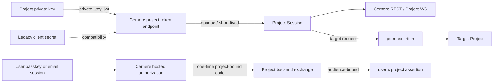

# Cernere Project 認証・ユーザー委譲 実装設計書

- 状態: Proposed
- 対象: Project backend の機械認証、Project WebSocket、ユーザーからProjectへの委譲、Project間peer通信、launcher credential
- 非対象: 対話型ユーザー認証の内部実装、tool client認証、Project固有の業務認可
- 関連設計: [パスキー既定・メール認証併存設計](passkey-default-authentication.md)

## 1. 結論

Project認証は`CERNERE_USER_AUTH_MODE=passkey|email|hybrid`と別軸にする。人はCernere-hosted UIで認証し、Project backendは機械資格情報で認証する。Projectがユーザーとして振る舞うことは許可せず、必要な操作だけ短命なuser×project assertionで委譲する。

1. 新規confidential Projectの既定認証はEd25519の`private_key_jwt`とする。Projectは秘密鍵、Cernereは公開JWKだけを保持する。
2. Excubitorが自分の子processを起動・停止まで管理する場合は、起動ごとの`launcher_managed_secret`をfirst-class methodとして認める。一般Projectの長期`client_id + client_secret`はversioned compatibility methodとして残し、新規登録の既定にはしない。
3. client認証成功後に返すCernere API/WS用資格情報は、10〜15分の短命opaque Project Sessionとする。refresh tokenは発行しない。
4. Project SessionはCernereだけが受理し、peerへ転送しない。Project間通信にはsource/target/audience/scopeを固定した別の短命署名assertionを使う。
5. ユーザー認証は常にCernere-hosted popup/top-level画面で行う。Projectはemail/password、passkey assertion、Device Credentialを受け取らない。
6. ユーザー認証結果はproject/client/origin/redirect URI/PKCE/scope/user session/epochに束縛した一回限りcodeへ変換する。
7. code交換結果はCernereのaccess/refresh tokenではなく、対象Projectだけが利用できる5分のuser×project assertionとする。
8. `aud`はrequestの任意URLから作らず、登録済みresource indicatorからCernereが決定する。
9. Project認証とProject認可を分離し、全REST/WS commandにProject scopeを割り当てる。ユーザー単位操作にはProject scopeに加えてuser×project assertionを要求する。
10. credential失効、Project無効化、全session失効をRedis index + Pub/Sub + `project_auth_epoch`で全processへ即時反映する。

## 2. 用語と4つの資格情報

| 用語 | 保持者 | 用途 | Cernere以外での受理 |
|---|---|---|---|
| Project Credential | Project backend | Project Client Assertionの署名、または互換secret認証 | 不可 |
| Project Client Assertion | Project backendが都度生成 | token endpointでProject自身を認証 | 不可 |
| Project Session | Cernere発行の短命opaque token | Cernere REST/`/ws/project` | 不可 |
| user×project assertion | Cernere発行の短命署名token | ユーザー権限を対象Projectへ委譲 | 登録済みresource serverだけ |
| peer assertion | Cernere発行の超短命署名token | Project AからProject Bへの直接通信 | `aud`で指定したtargetだけ |

`client_id`、`project_key`、`kid`はいずれも公開selectorであり、単体では認証情報ではない。

## 3. スコープと非目標

### 3.1 目標

- ユーザー認証方式の切替に関係なくProject backendが同じ契約で稼働する。
- CernereがProjectの秘密鍵を保持しない。
- credential rotation中に新旧credentialを安全に重複稼働できる。
- credential失効後に発行済みProject Sessionと接続済みWSを即時停止する。
- Project tokenをURL、Referer、browser history、operation logへ露出しない。
- Projectの権限をproject/client/credential/scope単位で最小化する。
- ProjectがユーザーのCernere refresh tokenを取得しない。
- user×project tokenを別Projectや別resource serverへ横流しできない。

### 3.2 非目標

- Project runtimeにpasskeyを登録すること。
- Projectにユーザーのemail/passwordを代理送信させること。
- Project Sessionを汎用JWTとしてleaf serviceへ配布すること。
- 純SPAへconfidential client相当の機密性を与えること。
- Project固有の業務role/permissionをCernereだけで完結させること。
- 既存secret経路を初回migrationで即時削除すること。

## 4. 現状と実現性

### 4.1 現行経路

| 経路 | 現状 | 問題 |
|---|---|---|
| Project backend login | `client_id + client_secret`をbcrypt照合 | 単一credential列で安全な重複rotationができない |
| Project access token | 共通`JWT_SECRET`のHS256、60分 | `aud`、scope、`jti`、credential ID、epochがない |
| Project WS | HS256 tokenをupgrade時と各commandでDB世代照合 | 同一processはrotation時に即時close。他processも次commandで拒否するが、全instanceへのPub/Sub closeは未実装 |
| WS token搬送 | subprotocol対応済み、query fallbackあり | `service-adapter`は現在`?token=`を使用する |
| Project command | Project keyだけをdispatcherへ渡す | command scopeがなく、任意`userId`操作の境界が広い |
| Project内ユーザーlogin | project WSが`auth.login/register/mfa-verify`を中継 | Projectがユーザーpasswordを扱い、passkeyと両立しない |
| open/composite authCode | code発行前にCernere access/refreshを生成 | Project binding前に長期user sessionが生成される |
| authCode exchange | Redis `GET`→`DEL`、Project認証なし | atomicでなく、project/origin/PKCE/audienceに束縛されない |
| user×project token | PASETO Ed25519、15分、`aud=hub_url` | `hub_url`がcaller入力で登録済みresourceと照合されない |
| launcher credential | Exが起動ごとのtarget secretを生成し、Cernereはbcrypt verifierだけを保存 | secret配送は残るためHTTPS/loopback限定。child env以外へ継承しない |
| peer relay | Project HS256 tokenを提示しCernereへremote verify | DB active/credential generationは再確認するが、Cernere用tokenが別用途へ再利用される |

### 4.2 実現性判定

**同一artifactで段階移行可能**。`managed_projects`、PASETO署名基盤、Redis、Project WS registry、launcher issuer allowlistは再利用できる。必要なのはcredential/client/session/grantの分離と、全Project commandの共通guard化である。

| 判定対象 | 結果 |
|---|---|
| Project認証とuser auth modeの分離 | 可能。既存project branchはuser login後段と独立している |
| secret互換を残した非対称鍵移行 | 可能。child credential tableをadditiveに追加する |
| 発行済みProject Sessionの即時失効 | 可能。opaque sessionをRedis管理しWS registryと連携する |
| 既存HS256 Project JWTを設定だけで安全化 | 不可。token/session/dispatcher契約の変更が必要 |
| Project WSの任意user操作を表示変更だけで制限 | 不可。server dispatcherでscopeとuser assertionを検証する |

## 5. 信頼境界



次の境界を越えて資格情報を再利用しない。

- Project CredentialはProject認証にだけ使い、user assertionの署名には使わない。
- Project SessionはCernereだけが受理し、peerやbrowserへ渡さない。
- user×project assertionは対象resource serverだけが受理し、Cernere user sessionへ交換できない。
- peer assertionは単一target、relay pair、command scope、challengeに固定する。
- `client_id`だけを持つbrowser public clientは認証済みProject backendとして扱わない。

## 6. Project ClientとCredentialのデータモデル

### 6.1 managed_projectsの追加列

```sql
ALTER TABLE managed_projects
  ADD COLUMN project_auth_epoch BIGINT NOT NULL DEFAULT 0;
```

`is_active=false`、全credential失効、緊急遮断時に`project_auth_epoch`を増やす。credential一件だけの通常rotationでは増やさず、当該credential由来sessionだけを失効する。

### 6.2 project_clients

一つのProjectにbackend client、public SPA、launcher clientを複数登録できるよう、現行の単一`managed_projects.client_id`をchild tableへ正規化する。

```sql
CREATE TABLE project_clients (
  id UUID PRIMARY KEY,
  project_key TEXT NOT NULL REFERENCES managed_projects(key) ON DELETE CASCADE,
  client_id TEXT NOT NULL UNIQUE,
  client_kind TEXT NOT NULL CHECK (client_kind IN ('confidential', 'public')),
  redirect_uris JSONB NOT NULL DEFAULT '[]',
  allowed_origins JSONB NOT NULL DEFAULT '[]',
  resource_indicators JSONB NOT NULL DEFAULT '[]',
  allowed_scopes JSONB NOT NULL DEFAULT '[]',
  is_active BOOLEAN NOT NULL DEFAULT TRUE,
  created_at TIMESTAMPTZ NOT NULL DEFAULT now(),
  updated_at TIMESTAMPTZ NOT NULL DEFAULT now()
);
```

- `redirect_uris`と`allowed_origins`は正規化済み完全一致値だけを保持する。wildcardを許可しない。
- `resource_indicators`はCernereが`aud`を決める正本であり、requestの任意URLをそのまま使わない。
- `public` clientにはProject Credentialを発行しない。
- migration時は現行`managed_projects.client_id`からconfidential clientを1件backfillする。

### 6.3 project_credentials

```sql
CREATE TABLE project_credentials (
  id UUID PRIMARY KEY,
  project_client_id UUID NOT NULL REFERENCES project_clients(id) ON DELETE CASCADE,
  credential_type TEXT NOT NULL
    CHECK (credential_type IN ('private_key_jwt', 'client_secret', 'launcher_managed_secret')),
  kid TEXT NOT NULL,
  public_jwk JSONB,
  secret_hash TEXT,
  allowed_scopes JSONB NOT NULL DEFAULT '[]',
  status TEXT NOT NULL
    CHECK (status IN ('pending', 'active', 'retiring', 'revoked')),
  not_before TIMESTAMPTZ NOT NULL DEFAULT now(),
  expires_at TIMESTAMPTZ,
  last_used_at TIMESTAMPTZ,
  created_by_user_id UUID REFERENCES users(id),
  created_by_project_key TEXT REFERENCES managed_projects(key),
  created_at TIMESTAMPTZ NOT NULL DEFAULT now(),
  revoked_at TIMESTAMPTZ,
  UNIQUE (project_client_id, kid),
  CHECK (
    (credential_type = 'private_key_jwt' AND public_jwk IS NOT NULL AND secret_hash IS NULL)
    OR
    (credential_type IN ('client_secret', 'launcher_managed_secret')
      AND public_jwk IS NULL AND secret_hash IS NOT NULL)
  )
);
```

- 新規鍵はEd25519 JWK (`kty=OKP`, `crv=Ed25519`, `alg=EdDSA`, `use=sig`)だけを受理する。
- `kid`はProject内で一意なselector。鍵materialから計算したJWK thumbprintも監査用に保持してよい。
- Cernereへprivate JWK (`d` field) が送られた場合は拒否し、保存前に単に削る処理はしない。
- `allowed_scopes`はclientの許可scopeの部分集合でなければならない。
- 現行`managed_projects.client_secret_hash`はcompatibility列として残し、dual-read展開後にnullableへ緩和する。migration中にDROPしない。

### 6.4 user_project_grants

```sql
CREATE TABLE user_project_grants (
  id UUID PRIMARY KEY,
  user_id UUID NOT NULL REFERENCES users(id) ON DELETE CASCADE,
  project_key TEXT NOT NULL REFERENCES managed_projects(key) ON DELETE CASCADE,
  scopes JSONB NOT NULL DEFAULT '[]',
  grant_epoch BIGINT NOT NULL DEFAULT 0,
  granted_at TIMESTAMPTZ NOT NULL DEFAULT now(),
  expires_at TIMESTAMPTZ,
  revoked_at TIMESTAMPTZ,
  UNIQUE (user_id, project_key)
);
```

内部first-party Projectでもgrant rowを作り、暗黙の全面委譲にしない。UI上の同意を省略できるpolicyと、server上のgrant記録は分ける。

## 7. `private_key_jwt` Client Assertion

### 7.1 request

```http
POST /api/auth/project/token
Content-Type: application/x-www-form-urlencoded

grant_type=client_credentials&
client_id=<client_id>&
client_assertion_type=urn:ietf:params:oauth:client-assertion-type:jwt-bearer&
client_assertion=<signed-jwt>&
scope=project%3Aconnect%20relay%3Arequest
```

JWT header:

```json
{
  "alg": "EdDSA",
  "kid": "2026-07-main",
  "typ": "JWT"
}
```

JWT claims:

```json
{
  "iss": "<client_id>",
  "sub": "<client_id>",
  "aud": "https://cernere.example/api/auth/project/token",
  "jti": "<128-bit-or-more-random>",
  "iat": 1783730000,
  "exp": 1783730060
}
```

### 7.2 検証順序

1. body/header/token長へ上限を設ける。
2. 未検証headerの`kid`とbodyの`client_id`をselectorとしてだけ読む。
3. activeなclient、Project、credentialを完全一致で取得する。通常は`active`、overlap期限内は`retiring`を許可する。`pending`は有効なlauncher activation recordに束縛された初回認証だけ許可し、署名検証成功後にtransaction内で`active`へ昇格する。`revoked`は常に拒否する。
4. JWKにprivate fieldがなく、`alg=EdDSA`、`kty=OKP`、`crv=Ed25519`であることを確認する。
5. JOSEライブラリで署名を検証し、algorithm allowlistを`EdDSA`だけに固定する。JWS/JWK parsingを自前実装しない。
6. `iss === sub === client_id`を確認する。
7. `aud`をserver configから構築したtoken endpoint完全一致値と比較する。
8. `exp - iat <= 60秒`、future skew最大30秒、期限内であることを確認する。
9. `jti`をRedis `project_assertion_jti:<clientId>:<jti>`へ`SET NX EX 120`し、既存ならreplayとして拒否する。
10. requested scopeがProject、client、credentialの3階層すべての許可集合に含まれることを確認する。
11. Project Sessionを発行し、credentialの`last_used_at`を更新する。

失敗理由は外部へ細分化せず、invalid client/client assertionは同じ401応答にする。内部監査だけ`unknown_client`、`bad_signature`、`bad_audience`、`replayed_jti`等を区別する。

### 7.3 compatibility secret

既存clientは同じtoken endpointで`client_secret` methodを使える。新規Projectへsecretを自動発行しない。

```http
POST /api/auth/project/token
Content-Type: application/json

{
  "grant_type": "project_credentials",
  "client_id": "...",
  "client_secret": "...",
  "scope": ["project:connect"]
}
```

- 新規/rotation secretは32 byte以上のランダム値とし、DBには既存`hashProjectSecret()`相当のhashだけを保存する。backfill済み既存secretはrotation完了まで現在の検証契約で受理する。
- secret成功後も返すのは新しいProject Sessionであり、認証methodとaccess token形式を分離する。
- 新しい`/api/auth/project/token`はsecret認証成功後も`pjs1`を返す。既存`/api/auth/login`の`project_credentials`はlegacy HS256を返すv1契約のまま明示flag下で残し、同じendpointのtoken意味を無言で変更しない。利用metricが0になったらv1自体を停止する。

## 8. Project Session

### 8.1 形式

```text
pjs1.<session_id>.<32-byte-random-secret>
```

- `session_id`はUUIDまたは同等の128 bitランダムID。
- secretはbase64url、paddingなし。
- tokenはProject backendのmemoryにだけ置き、disk・URL・Infisicalへ保存しない。
- refresh tokenは発行しない。期限時は新しいClient Assertionで再認証する。

### 8.2 Redis record

```ts
interface ProjectSessionRecord {
  secretMac: string;
  keyId: string;
  projectKey: string;
  projectClientRowId: string;
  clientId: string;
  credentialId: string;
  projectAuthEpoch: number;
  scopes: string[];
  issuedAt: string;
  expiresAt: string;
}
```

Redis keys:

| key | TTL/用途 |
|---|---|
| `project_session:<sessionId>` | 15分。session本体 |
| `project_sessions:project:<projectKey>` | Project単位失効用session ID/expiry scoreのsorted set |
| `project_sessions:credential:<credentialId>` | credential単位失効用session ID/expiry scoreのsorted set |
| `project_assertion_jti:<clientId>:<jti>` | Client Assertion replay防止 |

`secretMac`は`CERNERE_PROJECT_SESSION_KEY`から導出したHMAC-SHA-256で生成し、raw secretをRedis/logへ保存しない。検証はconstant-time compareを使う。session本体とindex sorted setの追加・削除はLuaまたはRedis transactionで原子的に行い、expired scoreを定期pruneしてstale IDを蓄積しない。

### 8.3 TTLと再接続

| 対象 | 既定TTL |
|---|---|
| Project Client Assertion | 60秒以内 |
| Project Session | 15分 |
| user authorization code | 60秒 |
| user×project assertion | 5分 |
| peer assertion | 60秒 |

長時間のProject WSはsession期限時にserverが`PROJECT_SESSION_EXPIRED`でcloseし、adapterが再認証して接続し直す。WS接続だけをsession期限後も延命しない。

### 8.4 token搬送

- REST/WS: `Authorization: Bearer <pjs1...>`に統一する。routeと`pjs1` prefixの両方でProject/user tokenの取り違えを拒否する。
- WS: Node等のconfidential clientでは`Authorization` headerを優先する。
- proxy制約時は既存`Sec-WebSocket-Protocol: bearer,<token>`をcompatibility transportとして使える。
- `GET /ws/project?token=...`はadapter移行後に削除する。query fallbackを新clientへ案内しない。
- token、assertion、code、JWK private fieldをrequest URL、access log、console、error bodyへ出さない。

## 9. Project ScopeとCommand Guard

### 9.1 scope例

| scope | 対象 |
|---|---|
| `project:connect` | Project REST/WSの基本接続 |
| `project:schema:write` | 自Project schema更新 |
| `project:data:read` | 委譲されたユーザーの自Project data読取 |
| `project:data:write` | 委譲されたユーザーの自Project data更新 |
| `project:data:delete` | 委譲されたユーザーの自Project data削除 |
| `profile:read` | 委譲されたユーザーのprofile読取 |
| `profile:write` | 委譲されたユーザーのprofile更新 |
| `oauth-token:read` | 委譲されたユーザーのOAuth token取得 |
| `oauth-token:write` | 委譲されたユーザーのOAuth token保存/削除 |
| `relay:endpoint:manage` | 自Projectのpeer endpoint登録 |
| `relay:request` | 許可済みtargetへのpeer assertion要求 |
| `relay:verify` | compatibility introspection |
| `project:credential:issue` | allowlist対象Projectのlauncher credential発行 |

scope名は実装前に既存command全件を棚卸しして固定enumにする。payloadやDB値から動的scope名を組み立てない。

### 9.2 二重認可

`profile.*`、`managed_project.*user_data`、`oauth_token.*`等のユーザー単位commandには次の両方を要求する。

1. Project Sessionが必要なProject scopeを持つ。
2. user×project assertionの`azp/projectKey`がProject Sessionと一致し、`sub`がpayloadの`userId`と一致し、user scopeが操作を許す。

Project Sessionだけで任意`userId`を指定できる現行境界は廃止する。system maintenanceで全ユーザー操作が必要な場合は、通常Projectと別credentialに明示的system scopeを与え、fresh admin step-up、短い有効期限、全件監査を必須にする。

### 9.3 dispatcher

`dispatchProjectCommand(projectKey, module, action, payload)`を次のprincipal形式へ変更する。

```ts
interface ProjectPrincipal {
  projectKey: string;
  clientId: string;
  credentialId: string;
  sessionId: string;
  projectAuthEpoch: number;
  scopes: ReadonlySet<ProjectScope>;
}

interface ProjectCommandContext {
  project: ProjectPrincipal;
  user?: UserProjectPrincipal;
}
```

command routerは`module.action -> requiredProjectScope / requiredUserScope / targetPolicy`の静的mapを参照する。各handlerが独自にscope文字列を解釈しない。

ユーザー単位commandはbusiness payloadと分離したtop-level authorizationを持つ。

```json
{
  "type": "module_request",
  "module": "managed_project",
  "action": "get_user_data",
  "authorization": {
    "type": "user_project",
    "assertion": "<PASETO v4 public>"
  },
  "payload": { "userId": "...", "columns": ["..."] }
}
```

dispatcherはassertionを共通validatorで検証して`UserProjectPrincipal`へ変換し、raw assertionをhandler、log、errorへ渡さない。

各`module_request`前にRedis sessionの存在、Project active、epoch、credential active/retiring状態を共通guardで再検証する。短いcacheを使う場合もinvalidation eventで必ずpurgeする。

## 10. ユーザーからProjectへの委譲

### 10.1 原則

- Project frontend/backendはユーザーpassword、passkey challenge/assertion、Device Credentialを受け取らない。
- `server/src/ws/project-dispatch.ts`の`auth.login/register/mfa-verify`は新契約で無効化する。
- email modeで既存Projectを移行する間だけ`CERNERE_PROJECT_USER_PASSWORD_RELAY_COMPAT=true`でversioned v1を許可できる。既定false、passkey modeでは常にfalseとする。
- 成功結果にCernere access token/refresh tokenを含めない。

### 10.2 authorization開始

Projectは同期的なユーザー操作中に空popupを開き、次のURLへ遷移する。

`response_mode=web_message`はCernere内部のversioned contractであり、汎用OAuth clientが自動的に対応すると仮定しない。将来標準response modeへ合わせる場合もversionを変える。

```text
GET /project/authorize?
  client_id=<registered-client>&
  redirect_uri=<exact-registered-uri>&
  response_mode=web_message&
  code_challenge=<S256>&
  code_challenge_method=S256&
  scope=profile:read project:data:read&
  state=<random>&
  nonce=<random>
```

- `redirect_uri`、親origin、resource indicatorはDBの完全一致値で検証する。
- PKCEはpublic/confidentialの両clientで必須、methodは`S256`だけを許可する。
- `state`はProject側CSRF binding、`nonce`はtransaction replay/mix-up検出に使う。
- arbitrary redirect/open redirectorを実装しない。
- popup SDKはblock、close、timeout、unmount時にlistener/timerをcleanupする。

### 10.3 Cernere-hosted認証

1. popupは共通`POST /api/auth/session`で既存user sessionをsilent restoreする。
2. sessionがなければdeploymentの`passkey|email|hybrid` policyに従うCernere-hosted UIを表示する。
3. Project側UIへuser credential inputを埋め込まない。
4. requested scopeと既存`user_project_grants`を比較する。
5. first-party pre-approved scopeはUI同意を省略できるがgrant rowは作成・更新する。
6. 新規/拡張scope、個人情報scope、高リスクscopeは明示同意またはfresh step-upを要求する。

### 10.4 authorization code

codeは256 bitランダム値とし、Redis keyには`SHA-256(code)`だけを使う。

```ts
interface ProjectAuthorizationCodeRecord {
  userId: string;
  authSource: "passkey" | "email";
  authSessionId: string;
  userAuthEpoch: number;
  grantId: string;
  grantEpoch: number;
  projectKey: string;
  projectClientRowId: string;
  clientId: string;
  clientKind: "confidential" | "public";
  redirectUri: string;
  redirectOrigin: string;
  codeChallenge: string;
  scopes: string[];
  resourceAudience: string;
  nonce: string;
  expiresAt: string;
}
```

access token、refresh token、password、email、Device Credentialをcode recordへ保存しない。

code digestは`project_auth_code:<digest>`へ60秒TTLで保存し、`project_auth_codes:user:<userId>`、`project_auth_codes:grant:<grantId>`、`project_auth_codes:project:<projectKey>`のexpiry付きsorted setにも原子的に登録する。user/grant/Project失効時はindexからpending codeを列挙して削除し、通常消費・期限切れ時はindexをpruneする。

popupは`{type:"cernere_project_code", code, state, iss}`だけを登録済み親originへ`postMessage`する。親は`origin`、`source`、`state`、`iss`をすべて検証する。

### 10.5 code交換

```http
POST /api/auth/project/authorize/exchange
Authorization: Bearer <pjs1...>   # confidential client
Content-Type: application/json

{
  "code": "...",
  "client_id": "...",
  "redirect_uri": "...",
  "code_verifier": "..."
}
```

- confidential clientはProject Sessionまたはfresh Client Assertionを必須とする。
- public clientはProject Credentialを持たず、codeに束縛済みclient ID、redirect URI、PKCEだけで交換する。
- Redis `GETDEL`またはLuaでcodeを原子的に単回消費する。
- 交換時にProject/client active、user session/epoch、grant/epoch、redirect URI、PKCE、scope、resource audienceを再検証する。
- codeが期限切れ、使用済み、別client、別redirect、PKCE不一致なら同じinvalid grant応答にする。

### 10.6 user×project assertion

既存PASETO v4 public/Ed25519署名基盤を利用し、用途別`kid`と`kind`を固定する。

鍵配布・current/previous key rotationは既存`CERNERE_PASETO_*`契約を再利用する。Project Session用HMAC keyとは共有しない。user×projectとpeer assertionは少なくとも`kind`、`aud`、validatorを分離し、片方のvalidatorが他方を受理しない。

```json
{
  "iss": "https://cernere.example",
  "sub": "<user-id>",
  "kind": "user_for_project",
  "azp": "<project-client-id>",
  "project_key": "memoria",
  "aud": "urn:ludiars:project:memoria",
  "scope": ["profile:read", "project:data:read"],
  "sid": "<user-auth-session-id>",
  "auth_epoch": 12,
  "grant_id": "<grant-id>",
  "grant_epoch": 3,
  "amr": ["passkey"],
  "auth_time": 1783730000,
  "nonce": "<authorization-request-nonce>",
  "jti": "<random>",
  "iat": 1783730000,
  "exp": 1783730300
}
```

- 既定TTLは5分、refreshなし。
- profile/email claimはscopeと実在値がある場合だけ返す。`email=null`を空文字へ変換しない。
- Project backendはassertion検証後に自サービスのHttpOnly sessionを発行する。
- resource serverはsignature、`kid`、`iss`、`kind`、`aud`、`azp/project_key`、scope、`exp`を毎回検証する。
- 即時失効が必要な高リスク操作はCernere introspectionまたは短命one-time action proofを追加する。署名tokenのローカル検証だけでは最大TTL分の失効遅延がある。

### 10.7 既存`/api/auth/project-token`

- migration中はcompatibility aliasとして残す。
- caller指定`hub_url`を`aud`へ直接使わず、`project_clients.resource_indicators`から解決する。
- user access tokenだけで任意Project tokenを発行せず、grantとscopeを確認する。
- 新規contractと同じ5分TTL、claim set、PASETO keyを使う。
- consumer移行完了後に旧request field `hub_url`を拒否する。

## 11. Browser Public Client

public clientの`client_id`は識別子であり、Project backend認証ではない。

- secret/private keyをbrowser bundle、localStorage、Cookieへ置かない。
- exact redirect URI/origin、PKCE S256、state、nonceを必須とする。
- BFFを既定構成とし、confidential backendがcodeを交換して自サービスHttpOnly Cookieを発行する。
- pure SPAを許す場合は、memory-onlyの5分user×project assertionだけを返し、refresh tokenを発行しない。
- pure SPAのtoken theft耐性を上げる必要がある場合はDPoPを別設計で追加できるが、XSS自体の防止にはならない。
- public clientにProject SessionやProject management scopeを発行しない。

## 12. Project間Peer認証

### 12.1 分離方針

Project SessionはCernere専用なのでpeerへ送らない。source ProjectはCernereへtarget、command scopes、challengeを提示し、target-bound peer assertionを取得する。

```json
{
  "iss": "https://cernere.example",
  "kind": "project_peer",
  "sub": "project-a",
  "aud": "urn:ludiars:project:project-b",
  "target_project": "project-b",
  "relay_pair_id": "<uuid>",
  "scope": ["relay:command:schedule.read"],
  "challenge_hash": "<sha256>",
  "project_auth_epoch": 7,
  "jti": "<random>",
  "iat": 1783730000,
  "exp": 1783730060
}
```

### 12.2 発行・検証

1. sourceは有効なProject Sessionと`relay:request` scopeを提示する。
2. Cernereはactiveなrelay pair、direction、target endpoint、requested command allowlistを確認する。
3. peer assertionをPASETO v4 public/Ed25519で署名する。TTLは60秒、単一targetとchallengeに固定する。
4. targetはCernere公開鍵、`kind`、`sub`、`aud/target_project`、relay pair、scope、challenge、`exp/jti`を検証する。
5. targetはchallengeと`jti`を期限までreplay cacheへ原子的に登録し、全commandで再利用を拒否する。high-risk commandは追加でCernere introspectionを要求できる。

現行`managed_project.verify_token`はlegacy HS256 Project JWTの移行用introspectionとして残す。新peer flowでProject Sessionを検証する用途には使わない。

## 13. Launcher-managed Credential

### 13.1 適用条件と決定

Excubitorのようにlauncherがtarget child processを直接spawnし、環境変数の構築、再起動、停止まで管理できる場合は、起動ごとの256-bit secretを`launcher_managed_secret`として使用する。このsecretは長期Project secretではなく、一つのlaunchに束縛されたbootstrap credentialである。一般の独立Projectは`private_key_jwt`を既定とする。

### 13.2 起動フロー

```http
POST /api/auth/project-launch-credential
Content-Type: application/json

{
  "client_id": "<Excubitor client id>",
  "client_secret": "<Excubitor issuer credential>",
  "target_project_key": "glab",
  "launch_id": "<uuid>",
  "target_client_secret": "<Ex-generated 32-byte base64url secret>"
}
```

1. ExはGLABのspawn直前に32-byte secretとUUID `launch_id`を一度だけ生成する。
2. Exは自分のissuer credentialでCernereへ認証する。Cernereはactiveなissuer/targetと`project_credential_issuers`の完全一致をfail-closedで確認する。
3. Cernereはtarget単位のadvisory lock内でcredentialをrotateし、`credential_generation`を単調増加させる。
4. Cernereは`client_id`、admin user ID、launch metadataだけを返し、target secretをresponseへ返さない。
5. Exは自分で保持しているsecretをGLAB child envへ注入し、issuer credentialを継承envから削除してspawnする。
6. 自動再起動も新規spawnとして扱い、毎回新しい`launch_id + secret`を発行する。

### 13.3 永続化・冪等性・失効

- Cernereは現行認証用と履歴照合用のbcrypt verifierだけを保存し、新規行へ復号可能なsecret暗号文を保存しない。
- 同じactiveな`issuer + target + launch_id + secret`の再送は冪等に同じmetadataを返す。同じlaunch IDでsecretが異なる場合、または既にsupersede済みの場合は409とする。
- Exのnetwork failure/timeout/429/5xx再試行は、同じ`launch_id + secret`を使用する。4xxは再試行しない。
- 新世代の発行時点で旧secretによる新規loginを拒否し、旧世代JWTをintrospection/WS upgrade/各WS commandで拒否する。同一server process上の旧WSは即時closeする。
- `CERNERE_BASE_URL`はHTTPSを必須とし、開発時だけlocalhost/loopback HTTPを許可する。secret、issuer credential、response bodyをlogへ出さない。
- 現行方式は発行直後のspawn失敗時に旧GLABも失効するfail-closed設計である。可用性上二段階activationが必要になった場合は、別migrationでpending→active protocolを追加する。

### 13.4 公開鍵launcher拡張

launcherがchild processへsecretを安全に注入できない、またはProjectがlauncherと独立して長期間動作する場合は、公開JWK + proof方式を追加できる。その場合もissuer allowlist、`launch_id`冪等性、advisory lock、監査履歴、credential generationを共通化する。これは現在のEx→GLAB経路を自動的にdeprecatedにするものではない。

## 14. 失効と即時遮断

| 操作 | DB | Redis | WS/署名assertion |
|---|---|---|---|
| credential一件失効 | credential=`revoked` | credential indexのsession削除 | 当該credential由来WSを閉じる。署名assertionは最大TTLまで |
| Project全session logout | epoch維持 | Project indexのsession削除 | 全Project WSを閉じる |
| Project緊急遮断 | `is_active=false`, epoch+1 | 全session削除 | 全WSを閉じ、新assertion発行拒否 |
| user grant失効 | grant epoch+1/revoked | pending code削除 | 新code/exchange拒否。既発行user assertionは最大5分 |
| user回復/全session失効 | user auth epoch+1 | pending code削除 | 新exchange/introspection拒否 |
| relay pair失効 | pair inactive | peer challenge削除 | 新peer assertion拒否。既発行は最大60秒 |

Redis Pub/Sub `cernere:project-auth:invalidate`へ次をpublishする。

```ts
interface ProjectInvalidationEvent {
  projectKey: string;
  credentialId?: string;
  projectAuthEpoch: number;
  reason: string;
}
```

全server processはProject WS registryに`closeByProject()`、`closeByCredential()`を実装する。Pub/Sub取りこぼしを前提に、各command前のRedis/epoch guardも維持する。

## 15. API契約案

| Method / path | 認証 | 用途 |
|---|---|---|
| `POST /api/auth/project/token` | client assertionまたはcompat secret | Project Session発行 |
| `POST /api/auth/project/session/revoke` | Project Session | current session失効 |
| `POST /api/auth/project/authorize/exchange` | Project Session/fresh Client Assertionまたはpublic PKCE | project-bound code交換 |
| `POST /api/auth/project/peer-assertion` | Project Session | target-bound peer assertion発行 |
| `POST /api/auth/project/introspect` | 許可Project Session | assertion/sessionの高リスク検証 |
| `POST /api/admin/projects/:key/credentials` | fresh user step-up + admin | public JWK/compat secret登録 |
| `DELETE /api/admin/projects/:key/credentials/:id` | fresh user step-up + admin | credential失効 |
| `POST /api/admin/projects/:key/revoke-sessions` | fresh user step-up + admin | 全Project Session失効 |
| `POST /api/admin/projects/:key/disable` | fresh user step-up + admin | Project無効化 + epoch更新 |
| `POST /api/auth/project/launch-key` | issuer Project Session | launcher公開鍵登録 |
| `GET /project/authorize` | public browser flow | Cernere-hosted user認証開始 |
| `GET /ws/project` | Project Session | Project command WS |

既存`/api/auth/login`の`project_credentials`、`/api/auth/project-token`、`managed_project.verify_token`、`project-launch-credential`はmigration節のcompatibility policyに従う。

## 16. エラー契約

| HTTP/WS | code | 意味/クライアント動作 |
|---|---|---|
| 401 | `INVALID_PROJECT_CLIENT` | client/assertion/secret失敗。詳細を表示しない |
| 401 | `PROJECT_SESSION_INVALID` | 再認証 |
| 401 | `PROJECT_SESSION_EXPIRED` | 再認証してWS再接続 |
| 401 | `PROJECT_SESSION_REVOKED` | 自動loopせず運用者へ通知 |
| 403 | `PROJECT_INACTIVE` | 再試行せず運用者へ通知 |
| 403 | `PROJECT_AUTH_METHOD_DISABLED` | 有効methodへ明示移行 |
| 403 | `PROJECT_SCOPE_DENIED` | scope設定またはuser grantを確認 |
| 400/401 | `PROJECT_CODE_INVALID` | authorizationを最初からやり直す |
| 400 | `PROJECT_AUDIENCE_INVALID` | 登録済みresourceを使用 |
| 409 | `PROJECT_CREDENTIAL_CONFLICT` | 同じlaunch/rotation IDのmaterial不一致 |

外部error本文へclient存在、credential status、`kid`一覧、token、assertion claim全文を含めない。

## 17. 設定

```dotenv
# 許可する機械認証方式の明示リスト
CERNERE_PROJECT_AUTH_METHODS=private_key_jwt,launcher_managed_secret,client_secret

# 新規Project credentialの既定
CERNERE_PROJECT_DEFAULT_AUTH_METHOD=private_key_jwt

CERNERE_PROJECT_SESSION_TTL_SECONDS=900
CERNERE_PROJECT_CODE_TTL_SECONDS=60
CERNERE_USER_PROJECT_ASSERTION_TTL_SECONDS=300
CERNERE_PEER_ASSERTION_TTL_SECONDS=60
CERNERE_PROJECT_CREDENTIAL_OVERLAP_SECONDS=600

# base64url 32-byte。user session keyとは分離
CERNERE_PROJECT_SESSION_KEY=...
CERNERE_PROJECT_SESSION_KEY_ID=...

# migration中だけtrue
CERNERE_PROJECT_LEGACY_JWT_COMPAT=false
CERNERE_PROJECT_QUERY_TOKEN_COMPAT=false
CERNERE_PROJECT_USER_PASSWORD_RELAY_COMPAT=false
```

- `CERNERE_USER_AUTH_MODE`はProject client authenticationを変更しない。
- Project user delegation UIだけがuser auth modeに従う。
- 新規production deploymentはlegacy flagsをfalseにする。
- legacy flag有効時はwarning、利用counter、対象client IDを監査し、無期限compatibilityにしない。
- session key欠損、短すぎるTTL、未知method、legacyと新契約の矛盾は起動時fail-fastとする。
- `CERNERE_PROJECT_SESSION_KEY_ID`は各Redis sessionに保存する。master key変更は暗黙rotationにせず、全Project Session削除、全Project WS切断、必要なら`project_auth_epoch`更新を行うmaintenance jobとして実施する。

## 18. セキュリティ上の注意

| 脅威 | 対策 |
|---|---|
| Cernere DB漏洩でProjectになりすます | private keyをProjectだけに置き、Cernereはpublic JWKのみ保持 |
| Client Assertion replay | 短い`exp`、random `jti`、Redis `SET NX` |
| algorithm confusion | `alg=EdDSA`、OKP/Ed25519をallowlist固定 |
| Project Session窃取 | TLS、URL禁止、15分TTL、Redis即時失効。必要に応じmTLS/DPoPを別phaseで追加 |
| secret compatibility漏洩 | 高entropy、hash保存、scope制限、利用metric、段階廃止 |
| Project A tokenをBで使用 | server登録resourceから`aud`を決定し、resource側で完全一致検証 |
| Projectがユーザーを偽装 | user assertion必須、`sub`とpayload user ID一致、Projectだけでmint不可 |
| Projectがユーザーpasswordを収集 | Cernere-hosted UI、project WS password relay既定無効 |
| authCode横取り/injection | project/client/redirect/PKCE/session/epoch binding、atomic GETDEL |
| Project command権限過大 | static scope map、Project + userの二重認可 |
| credential rotation race | pending→active→retiring→revoked、overlap、credential単位session index |
| Project無効化後もWS継続 | epoch、Redis削除、Pub/Sub、各command guard |
| peer token横流し | source/target/aud/scope/challenge/jti/60秒TTL |
| pure SPAの長期token漏洩 | BFF既定、memory-only 5分、refreshなし |

`private_key_jwt`はtoken endpointでのclient authenticationを強化するが、その後のopaque Project Session自体はbearer tokenである。高価値deploymentでsender constraintが必要ならmTLSまたはDPoPを別の設計・互換性試験後に追加する。

## 19. 実装配置

### 19.1 Server

- `server/src/auth/project/client-assertion.ts`: EdDSA/JWK/claim/`jti`検証
- `server/src/auth/project/credential-store.ts`: credential検索・status・rotation
- `server/src/auth/project/project-session.ts`: `pjs1`発行、HMAC、Redis index、失効
- `server/src/auth/project/project-principal.ts`: ProjectPrincipalと共通guard
- `server/src/auth/project/scope-policy.ts`: command→scope静的map
- `server/src/auth/project/user-delegation.ts`: authorize/code/exchange/user assertion
- `server/src/auth/project/peer-assertion.ts`: target-bound peer assertion
- `server/src/http/project-auth-handler.ts`: `/api/auth/project/*`
- `server/src/http/auth-handler.ts`: project/tool/user branch分離、v1 aliasだけ残す
- `server/src/ws/project-handler.ts`: Project Session検証、expiry close、principal保持
- `server/src/ws/project-dispatch.ts`: scope/user principal二重guard、password relay撤去
- `server/src/ws/project-registry.ts`: session/credential/project index、close API
- `server/src/project/launch-credentials.ts`: public JWK v2、proof of possession、overlap
- `server/src/project/relay.ts`: peer assertion/challenge binding
- `server/src/app.ts`: route、WS Authorization/subprotocol、query fallback撤去
- `server/src/db/schema.ts`: `project_clients`、`project_credentials`、`user_project_grants`、epoch
- `server/src/config.ts`, `env-cli.config.ts`, `.env.example`: Project auth policy/TTL/key/compat
- `server/package.json`: JWT/JWS/JWKの厳密検証にJOSE実装を追加し、`jsonwebtoken`へEdDSA用途を無理に混在させない

Project auth用JWS/JWK検証を自前実装しない。ライブラリ側の`jwtVerify`相当でissuer/audience/algorithm/clockを明示し、未検証decode結果を認可に使わない。

### 19.2 Service adapter / Project

- `packages/service-adapter/src/peer/cernere-session.ts`: private key assertion生成、Project Session再取得、query token撤去
- `packages/service-adapter/src/peer/ws-types.ts`: Authorization header/subprotocolを表現できるfactory contract
- `packages/service-adapter/src/peer/peer-adapter.ts`: Project Sessionとpeer assertionを分離
- `packages/service-adapter/src/types.ts`: `clientSecret`だけでなく`privateKey/kid/clientId/scopes`設定を追加
- `packages/service-adapter/src/testing/fake-cernere.ts`: assertion replay/scope/expiry/rotationを再現
- `packages/service-adapter/README.md`: private key既定、secret compatibility、BFF user delegation例
- Project側private keyはInfisical、OS secret store、workload secret volume等に保存し、repo/image/logへ含めない

### 19.3 Frontend / composite

- Cernereの通常loginとProject authorization popupは同じpasskey/email controllerを共有する
- Project側SDKはpopup作成、PKCE、state/nonce、origin/source/iss検証、timeout cleanupを担当する
- success sinkだけ通常session確立とProject code発行で差し替える
- 旧email/password埋め込みcomponentは`email-compat-v1`として隔離し、新規Projectへexportしない

### 19.4 Script / launcher

- `server/scripts/register-project-key.ts`: adminがpublic JWKを登録する初期導線
- `server/scripts/rotate-project-secret.ts`: compatibility secretだけを扱うことを明記
- Excubitor側は起動ごとにEd25519 keypairを生成/取得し、Cernereへpublic JWK + proofだけを送る
- target private keyをCernere responseやDBへ返さない

## 20. Migration計画

1. **Additive schema**: 次の空きmigration番号で`project_clients`、`project_credentials`、`user_project_grants`、`project_auth_epoch`を追加する。現行列/tableは削除しない。
2. **Backfill**: 各`managed_projects.client_id/client_secret_hash`からconfidential client + `client_secret` credentialを作る。hashを再hashせず移す。
3. **Scope inventory**: `project-dispatch.ts`全commandを分類し、Project scope/user scope/target policyを固定する。最初は現行許可を明示scopeへ写し、未分類commandはfail-closedにする。
4. **Opaque session shadow**: compatibility secret認証後にProject Sessionを発行できるendpointを追加する。HS256 tokenも一時併存する。
5. **Adapter cutover**: service-adapterをProject Session、Authorization/subprotocol、expiry reconnectへ変更する。query token利用metricを0にする。
6. **private_key_jwt**: public JWK登録、Client Assertion、`jti` replay防止を展開し、Projectごとにsecretから移行する。
7. **Immediate invalidation**: Project/credential/session Redis index、Pub/Sub、WS close、command guardを有効化する。
8. **User delegation v2**: hosted popup、PKCE、project-bound atomic code、grant、5分assertionを追加する。既存authCodeは新Projectへ発行しない。
9. **Password relay stop**: Project WSの`auth.login/register/mfa-verify`をdefault無効にする。既存email consumerだけ期限付きcompat flagで維持する。
10. **Audience correction**: `/api/auth/project-token`を登録済みresource derivationへ移し、caller指定`hub_url`をdeprecatedにする。
11. **Peer separation**: target-bound peer assertionを展開し、Project Session/legacy JWTのpeer転送を停止する。
12. **Launcher hardening**: generation guard、hash-only履歴、same-tuple retry、response binding、transport制約を展開する。独立workload向けpublic key + proofは別methodとして追加できる。
13. **Legacy shutdown**: HS256 Project JWT、query token、password relay、任意`hub_url`の利用metricが0になったらflagsをfalse固定する。
14. **Schema cleanup later**: 十分なrollback期間後に別計画で旧non-null制約/列を整理する。本migrationではDROPしない。

## 21. Rollback方針

- 新table/列はadditiveとし、rollback時にDROPしない。
- private key認証に失敗したProjectだけ、登録済みcompatibility secretが有効ならsecret methodへ戻せる。
- rollbackで`CERNERE_PROJECT_USER_PASSWORD_RELAY_COMPAT`を自動有効化しない。
- Project Session導入後も旧HS256発行codeをrelease artifact内に期限付きで保持できるが、明示flagと対象client allowlistの両方を要求する。
- user delegation v2障害時は既存Cernere user sessionをProjectへ返さず、Project authorizationを停止する。
- peer assertion障害時はCernere remote introspection経路へ戻せるが、Project Sessionをpeerへ直接渡さない。
- credential rotation rollbackは新credentialをrevoked、旧retiringをactiveへ戻し、new credential由来sessionだけを閉じる。

## 22. テスト設計

### 22.1 Client Assertion

- 正しいEd25519 JWK/`kid`/`iss=sub=client_id`/`aud`/`iat`/`exp`/`jti`だけ成功
- `alg=none`、HS256、未知`kid`、private JWK、wrong curveを拒否
- wrong audience、長すぎるTTL、future `iat`、expired assertionを拒否
- 同じ`jti`の同時送信は一件だけ成功
- inactive Project/client、pending/revoked/expired credentialを拒否
- requested scopeのProject/client/credentialいずれか一階層でも不足なら拒否

### 22.2 Project Session / WS

- Redisにraw secretがない
- HMAC固定test vector、key長不正fail-fast、key ID不一致を検出
- credential失効で当該session/WSだけ閉じる
- Project disable/epoch更新で全instanceのWSを閉じる
- Pub/Subを取りこぼしても次command guardで拒否
- session期限時にWSを閉じ、adapterが新assertionで再接続する
- Authorization/subprotocolで接続し、query tokenを新adapterが使わない
- URL/access log/console/errorにsession tokenが出ない

### 22.3 Scope

- 全`module.action`が静的policy mapに登録され、未登録は拒否
- Project scopeだけでは任意user dataへアクセスできない
- assertion `sub`とpayload `userId`不一致を拒否
- assertion `azp/projectKey`とProject Session不一致を拒否
- user scope不足、grant revoke/epoch不一致を拒否
- system scopeは通常credentialへ付与されない

### 22.4 User delegation

- passkey/email/hybridの全user modeで同じProject code contractになる
- Project側へpassword/passkey assertion/Device Credentialが送られない
- exact redirect/origin、PKCE S256、state/source/issを検証
- code recordにCernere access/refresh tokenがない
- code交換はatomicで、一回だけ成功
- wrong client/redirect/verifier/project session/user epoch/grant epoch/audienceを拒否
- responseにCernere refresh tokenがない
- `aud`は登録値から決まり、任意`hub_url`を注入できない
- `email=null`のclaimをomitし、空文字化しない

### 22.5 Credential rotation / launcher

- 同じlaunch ID + 同じsecretは冪等、異なるsecretまたはsupersede済みlaunchは409
- network failure/timeout/429/5xxでも同じlaunch ID + secretで再試行される
- 新世代発行後は旧secret、旧JWT、旧WS commandが失効する
- 新規履歴に復号可能なsecretが保存されない
- HTTPSまたはloopback HTTP以外へsecretを送らない
- launcherのissuer credentialがchild envへ継承されない
- issuer allowlist、target、scopeを迂回できない

### 22.6 Peer

- active relay pair/direction/target/scope/challengeだけ発行
- source、target、audience、challenge、scope不一致を拒否
- assertion replay cacheと60秒TTLを検証
- Project Sessionをtarget peerが受理しない
- relay pair失効後に新assertionを発行しない

### 22.7 Compatibility

- 既存secret clientがcompat flag有効時だけProject Sessionを取得できる
- legacy HS256/query/password relayが各flagとallowlistの両方なしでは到達不能
- compatibility pathもProject active、scope、rate limit、監査を迂回しない
- `CERNERE_USER_AUTH_MODE`変更でProject client authentication契約が変わらない

## 23. 受け入れ条件

- 新規ProjectはCernereへpublic JWKだけを登録し、`private_key_jwt`で認証できる。
- 既存Projectは明示compatibility設定中だけ`client_secret`を継続利用できる。
- Project backendは15分以下のopaque Project Sessionを受け取り、refresh tokenを持たない。
- Project SessionはCernere以外で受理されず、peer通信にはtarget-bound assertionを使う。
- Project Session/credential/Project失効が全server processと既存WSへ即時反映される。
- Project WS tokenがURL query、access log、consoleへ出ない。
- 全Project commandがscope policyを通り、未分類commandはfail-closedになる。
- ユーザー単位操作はProject Sessionだけでは実行できず、対象Projectに束縛したuser assertionを要求する。
- Project UI/backendはユーザーpassword、passkey material、Device Credential、Cernere refresh tokenを取得しない。
- user authorization codeはproject/client/redirect/origin/PKCE/scope/session/epochに束縛され、atomicに一回だけ交換できる。
- user×project assertionの`aud`は登録済みresourceから決まり、任意URLを指定できない。
- user auth modeが`passkey|email|hybrid`のいずれでもProject機械認証は同じ契約で動く。
- Ex管理下のchildは起動ごとのsecretでrotationでき、旧secret/JWT/WSがcredential generationで失効する。独立workloadには公開鍵methodを追加できる。
- legacy HS256、query token、password relayの利用状況を測定でき、停止条件とrollback条件がテストされる。

## 24. 参照

- [RFC 9700: Best Current Practice for OAuth 2.0 Security](https://www.rfc-editor.org/rfc/rfc9700.html)
- [RFC 7523: JWT Profile for OAuth 2.0 Client Authentication](https://www.rfc-editor.org/rfc/rfc7523.html)
- [RFC 7636: Proof Key for Code Exchange](https://www.rfc-editor.org/rfc/rfc7636.html)
- [RFC 8707: Resource Indicators for OAuth 2.0](https://www.rfc-editor.org/rfc/rfc8707.html)
- [RFC 9449: Demonstrating Proof of Possession](https://www.rfc-editor.org/rfc/rfc9449.html)
- [`jose`: JWT/JWS/JWK implementation](https://github.com/panva/jose)
- [既存認証フロー](../interface/auth-flows.md)
- [既存Project WS protocol](../interface/ws-protocol.md)
- [既存peer relay](../interface/peer-relay.md)
- [既存service登録](../setup/service-registration.md)
- [既存PASETO鍵設定](../setup/paseto-keys.md)
- [既存user→Project open flow](../feature/user-auth-project-open.md)
- [現行Project login handler](../../server/src/http/auth-handler.ts)
- [現行Project JWT](../../server/src/auth/jwt.ts)
- [現行authCode](../../server/src/auth/auth-code.ts)
- [現行Project WS](../../server/src/ws/project-handler.ts)
- [現行Project command dispatcher](../../server/src/ws/project-dispatch.ts)
- [現行launcher credential](../../server/src/project/launch-credentials.ts)
- [現行service adapter session](../../packages/service-adapter/src/peer/cernere-session.ts)
