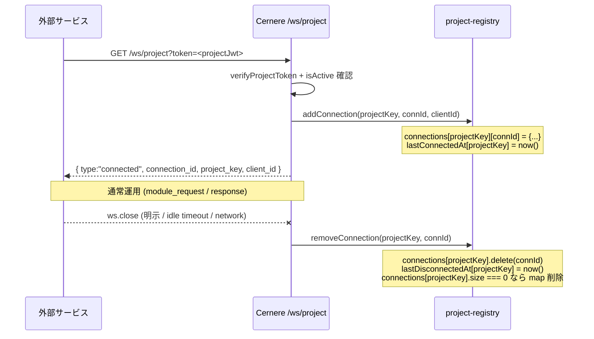
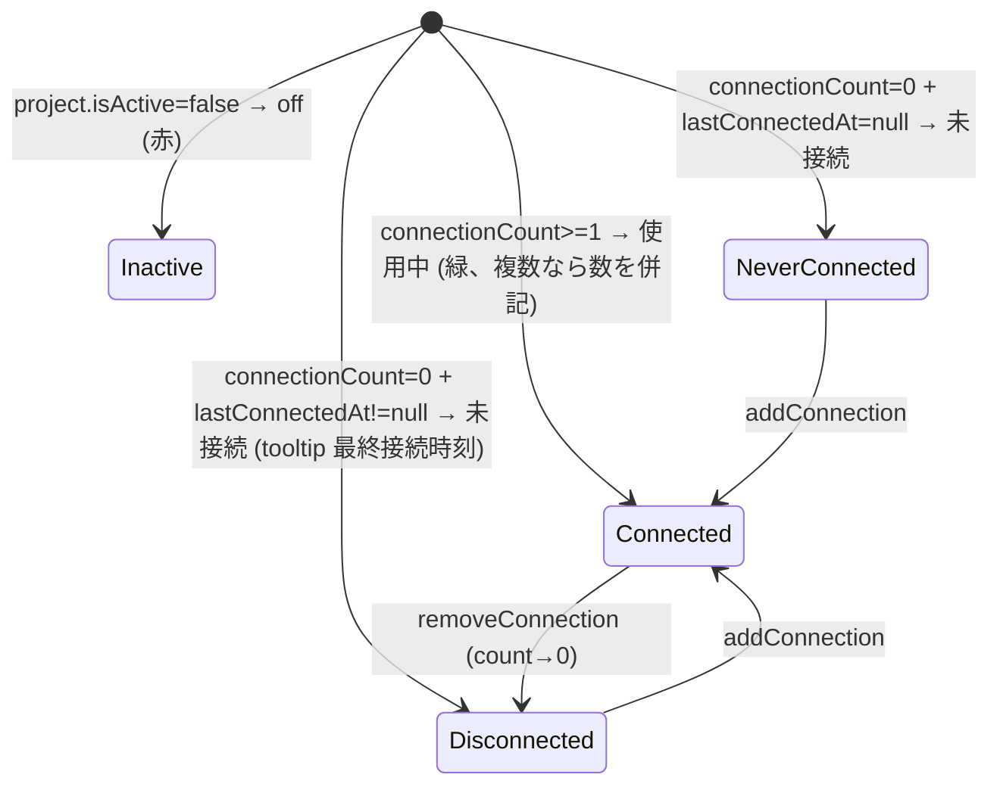

# プロジェクト接続レジストリ

`/ws/project` で project_credentials 認証して接続中の外部サービス (Schedula, Actio, Imperativus 等) を **in-memory** で追跡する仕組み。ダッシュボードの「使用中」バッジと将来の死活監視 / pub-sub のソース。

## 目的

- 「どのサービスが今 Cernere に繋いでいるか」を user / admin が一目で見える
- バッジを「データを持っているか (filledColumns)」と「現在接続しているか (connectionCount)」で分離
- マルチ接続 (同一プロジェクトから複数インスタンス) もカウント

## レジストリ構造

```ts
// server/src/ws/project-registry.ts
const connections        = new Map<projectKey, Map<connectionId, { connectionId, clientId, connectedAt }>>();
const lastConnectedAt    = new Map<projectKey, Date>();
const lastDisconnectedAt = new Map<projectKey, Date>();

export function addConnection(projectKey, connectionId, clientId);
export function removeConnection(projectKey, connectionId);
export function getProjectStatus(projectKey): {
  connectionCount: number;
  lastConnectedAt: Date | null;
  lastDisconnectedAt: Date | null;
};
export function getAllProjectStatus(): Map<projectKey, ProjectStatus>;
export function getProjectConnections(projectKey): Array<{...}>;  // admin 詳細用
```

## ライフサイクル



## ダッシュボードへの露出

`managed_project.list` の戻り値を拡張:

```ts
{
  key, name, description, isActive, createdAt,
  connectionCount: number,         // ← NEW
  lastConnectedAt: Date | null,    // ← NEW
  lastDisconnectedAt: Date | null, // ← NEW
}
```

`managed_project.overview` (ユーザ視点の data 集計) にも `connectionCount` / `lastConnectedAt` を追加。

新コマンド `managed_project.connections` は admin 用に接続詳細を返す:

```ts
{
  connectionCount, lastConnectedAt, lastDisconnectedAt,
  connections: [
    { connectionId, clientId, connectedAt },
    ...
  ]
}
```

## バッジの意味



データ蓄積有無 (`filledColumns > 0`) は別バッジ「データあり/データなし」として並記する。

## 制限事項

- **プロセスローカル**: Cernere をマルチインスタンスで動かす場合、各インスタンスが自分の接続のみ追跡する。集約には Redis pub-sub への移行が必要 (将来課題)
- **サーバ再起動でリセット**: 起動直後は全プロジェクト connectionCount=0。サービス側の自動再接続で復元される
- **不正切断の検知**: idle timeout (uWS 120s) を経て初めて remove される。即時反映が必要なら application-level の close ハンドラを直接叩く

## ダッシュボードの自動更新

フロント (`DashboardPage.tsx`) は `managed_project.list` を **10 秒間隔** で再取得し、バッジを再描画する。

## 監査用途

`logProjectWsConnect` / `logProjectWsDisconnect` (`logging/auth-logger.ts`) で `auth-YYYY-MM-DD.log` に JSON 行で記録。レジストリは現在の状態、ログは時系列の履歴。
