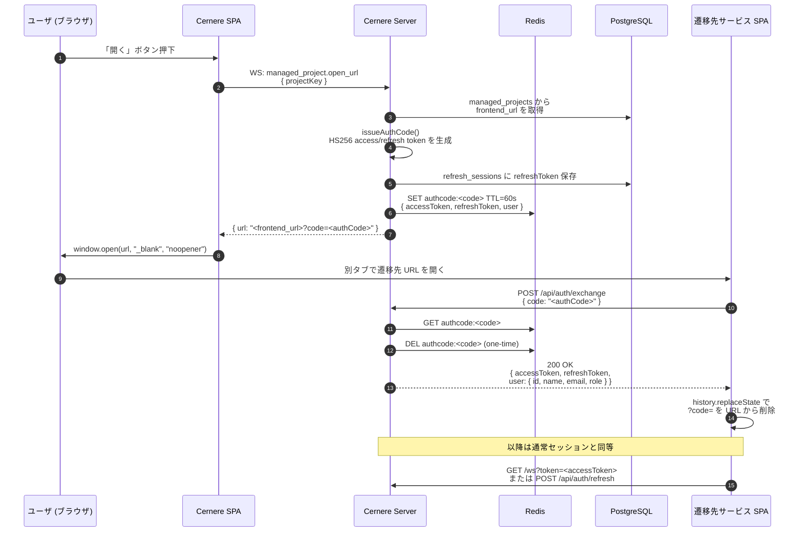
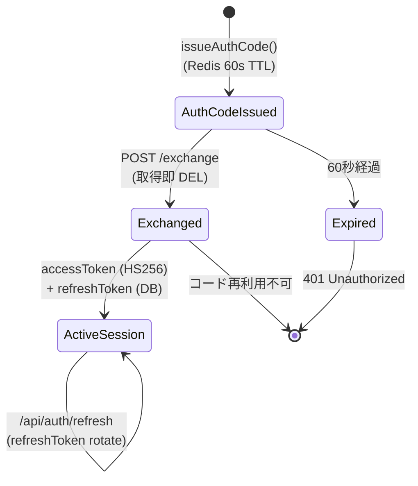

# ユーザ認証フロー — サービスを開く (Project Open)

Cernere ダッシュボードで「開く」ボタンを押してから、遷移先サービスでログインが完了するまでの一連の流れ。

ここで扱うのは **ユーザ向け** のフロー (HS256 user token + one-time auth code ハンドオフ) のみ。サービス間直接通信 (PeerAdapter, JWKS / RS256 project token) はこのフローに登場しない。

## シーケンス図

## ステップ詳細

| # | エンドポイント / 関数 | 守られる性質 |
|---|---|---|
| 1-2 | `managed_project.open_url` (WS) | 既ログイン user セッション経由 → 認可済み |
| 3-6 | `issueAuthCodeForUserId` (`server/src/auth/auth-code.ts:51`) | refresh token は DB、authCode は Redis に 60秒 TTL |
| 8 | `window.open(url, "_blank", "noopener")` | opener へのアクセスを切る |
| 10-12 | `exchange` (`server/src/http/auth-handler.ts:239`) | **取得即削除** で再利用不可 |
| 13 | `accessToken` | **HS256** で `JWT_SECRET` 署名 (60分有効) |
| 13 | `refreshToken` | UUID (30日、`refresh_sessions` 表に保存) |

## 状態遷移

## 設計上のポイント

- **publickey (RS256) はこのフローには登場しない**。
  RS256 / JWKS は `PeerAdapter` (サービス間直接 WS) 専用であり、ユーザ認証経路はすべて HS256 + Redis ハンドオフで完結する。
- authCode 単独では何もできない。
  - 60秒以内に exchange しないと失効
  - 一度 exchange したら破棄 (再利用試行は 401)
- 遷移先サービスは authCode を **保持してはいけない**。
  exchange 直後に `history.replaceState({}, "", location.pathname)` で URL から `?code=` を消すのが定石 (ログ汚染対策)。
- 遷移先 SPA で実際に handoff を実装している例:
  `frontend/src/contexts/AuthContext.tsx:88-91` の `accessToken` / `refreshToken` URL params 受け取り部分が同じ思想 (こちらは OAuth 経由で token を直接 URL に乗せているが、`exchange` 経由なら `?code=` だけが URL に乗る点で安全性が一段高い)。

## 関連ファイル

| ファイル | 役割 |
|---|---|
| `server/src/project/service.ts` `issueProjectOpenUrl()` | frontend_url + authCode を組み立てて返す |
| `server/src/auth/auth-code.ts` `issueAuthCode()` / `issueAuthCodeForUserId()` | token pair 生成 → Redis 格納 |
| `server/src/http/auth-handler.ts` `exchange()` | `/api/auth/exchange` の実体 (one-time GET+DEL) |
| `server/src/auth/jwt.ts` `generateTokenPair()` | HS256 access token + UUID refresh token |
| `server/src/commands.ts` `managedProjectCmd("open_url")` | WS コマンドのディスパッチ |
| `frontend/src/pages/DashboardPage.tsx` `handleOpen()` | `open_url` を呼び window.open する側 |
