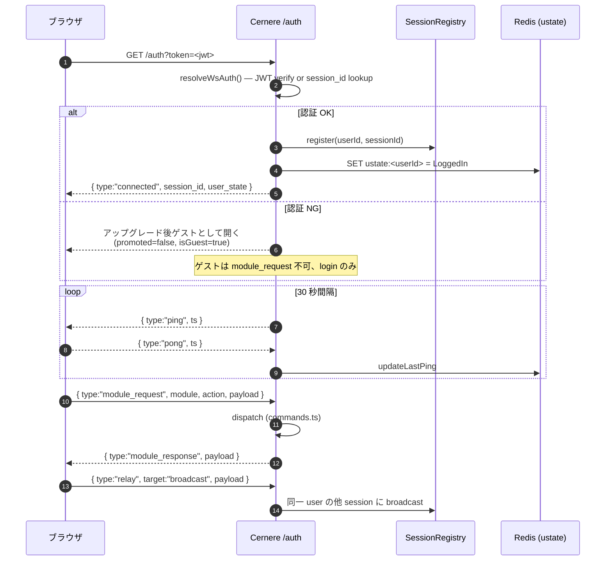
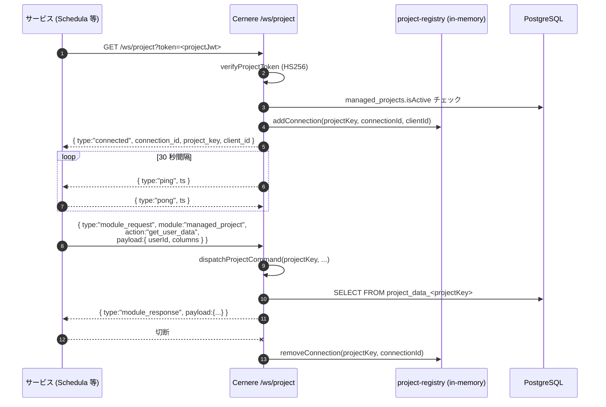
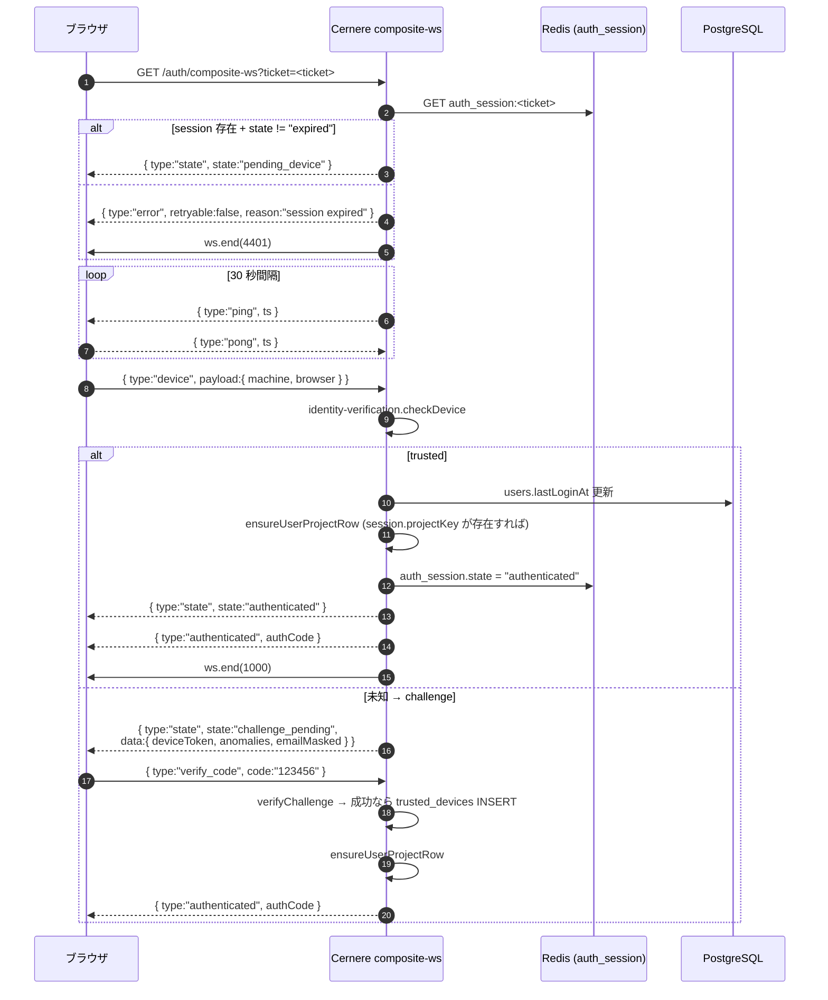

# WebSocket プロトコル

Cernere は **3 経路** の WebSocket を公開する。すべて uWebSockets.js ベースで、メッセージは JSON テキスト。

| パス | 認証 | 用途 |
|---|---|---|
| `/auth?token=<jwt>` または `?session_id=<id>` | user JWT or session | エンドユーザの常時接続 (操作の認可ゲート) |
| `/ws/project?token=<projectJwt>` | project token (HS256) | 外部サービスのサーバ ↔ Cernere |
| `/auth/composite-ws?ticket=<ticket>` | auth_session ticket | composite ログイン中のデバイス検証ハンドオフ |

## 共通メッセージ型

### Server → Client

```json
{ "type": "connected", "session_id": "...", "user_state": {...} }
{ "type": "ping",      "ts": 1234567890 }
{ "type": "module_response", "request_id": "uuid", "module": "...", "action": "...", "payload": {...} }
{ "type": "error",     "code": "command_error", "message": "...", "request_id": "uuid" }
{ "type": "relayed",   "from_session": "...", "payload": {...} }
```

### Client → Server

```json
{ "type": "pong", "ts": 1234567890 }
{ "type": "module_request", "request_id": "uuid", "module": "...", "action": "...", "payload": {...} }
{ "type": "relay",  "target": "broadcast" | { "user": "..." } | { "session": "..." }, "payload": {...} }
```

## 経路 1: `/auth` (ユーザ WS)



- ゲスト接続 (token なし) も許容するが、操作可能なコマンドは login 系のみ
- `promoted=true` になるとゲスト → 認証済みに昇格
- close 時に `ustate` を `SessionExpired` に遷移、SessionRegistry から削除

## 経路 2: `/ws/project` (プロジェクト WS)



- WS セッションに `projectKey` が bind される。コマンドの payload で他プロジェクトを指定して書き換える攻撃をブロック
- 接続レジストリは in-memory (プロセスローカル)。ダッシュボードの `connectionCount` / `lastConnectedAt` の供給源
- 詳細: [project-connection-registry.md](project-connection-registry.md)

### dispatch 対応コマンド (主要)

| `module.action` | 説明 |
|---|---|
| `profile.get` / `profile.update` | ユーザープロファイル (個人データ単一情報源) |
| `auth.login` / `auth.register` / `auth.mfa-verify` | composite 認証の relay (ブラウザ → サービス → Cernere) |
| `managed_project.get_user_data` / `set_user_data` / `delete_user_data` | 動的テーブルの user データ操作 |
| `managed_project.update_schema` | プロジェクト自身のスキーマ更新 |
| `managed_project.store_oauth_token` 他 | OAuth トークンを Cernere に預ける ([oauth-token-storage.md](oauth-token-storage.md)) |
| `managed_project.verify_token` | peer から渡された project token のリモート検証 ([peer-relay.md](peer-relay.md)) |
| `managed_relay.register_endpoint` 他 | サービス間直接通信の調停 ([peer-relay.md](peer-relay.md)) |

## 経路 3: `/auth/composite-ws` (composite 認証 WS)



- 1 ticket = 1 WS 接続。再接続は同じ ticket で可能
- `ticket` 自体は 10 分 TTL。完了 / 期限切れで Redis から削除
- 詳細: [identity-verification.md](identity-verification.md)

## エラー応答

REST はステータスコードを `400 / 401 / 403 / 404 / 429 / 500` で返す ([server/src/app.ts](../server/src/app.ts) の `classifyError`)。
WS は `{ type:"error", code, message, request_id? }` で返し、致命的エラーは `ws.end(4xxx, reason)` で切断する。

## ping/pong タイムアウト

| 経路 | 間隔 | timeout 動作 |
|---|---|---|
| `/auth` | 30s | uWS `idleTimeout: 120` → 切断、ustate=SessionExpired |
| `/ws/project` | 30s | uWS `idleTimeout: 120` → close → registry から削除 |
| `/auth/composite-ws` | 30s | uWS `idleTimeout: 60` → close (ticket は TTL まで残る) |
